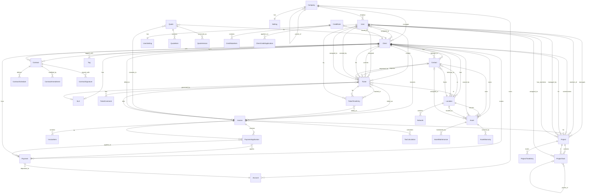
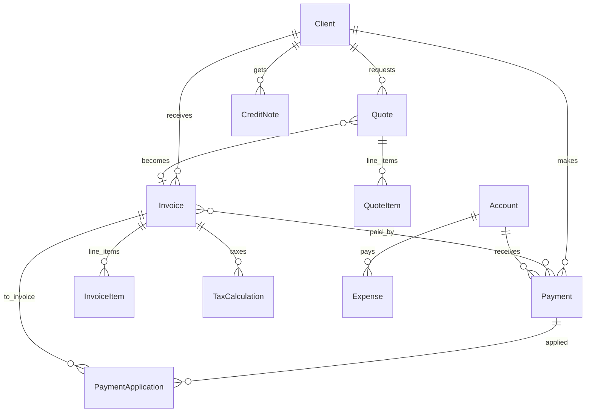
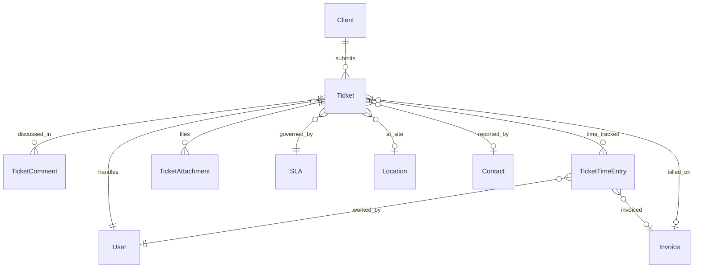
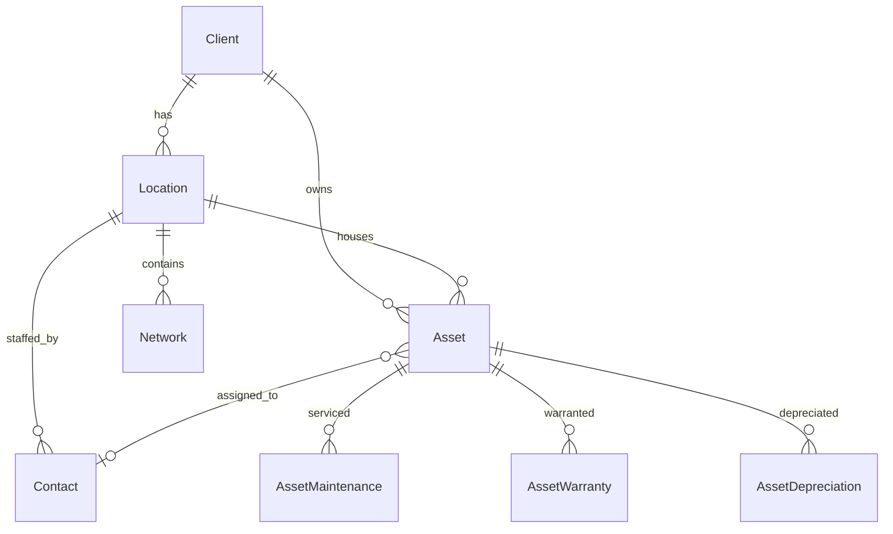
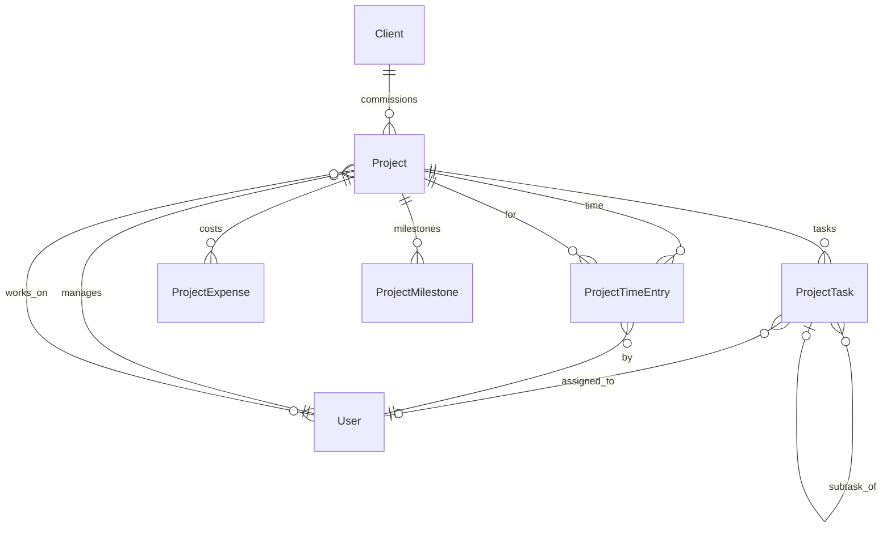
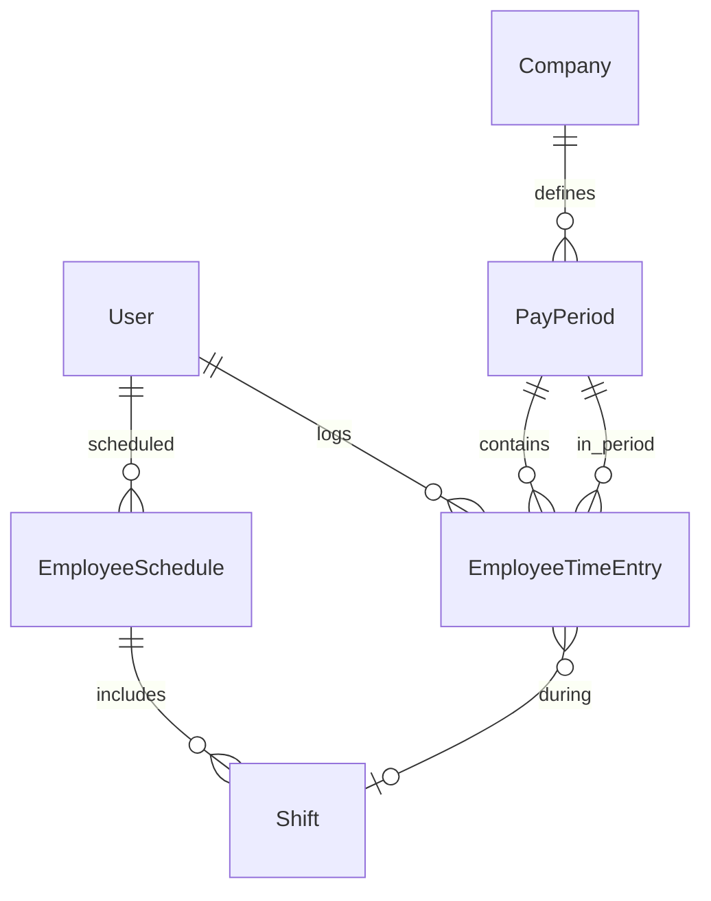
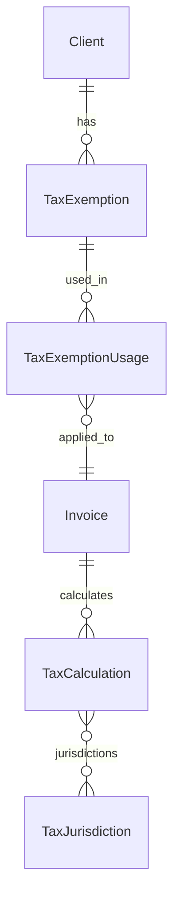
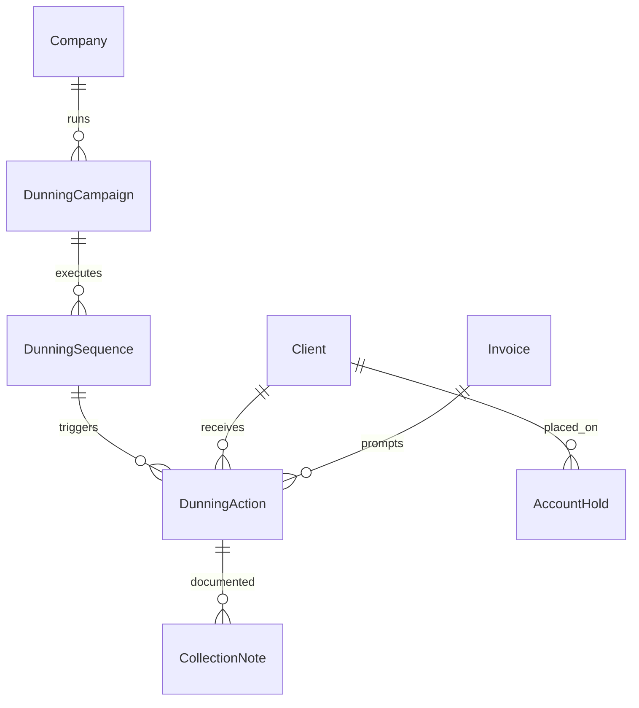

# Core Model Relationships - Mermaid Diagram

## Simplified Entity Relationship Diagram

This diagram shows the core relationships between the most important entities in the Nestogy ERP system.

## Domain-Specific Diagrams

### Financial Domain Focus

### Ticket Management Focus

### Asset Management Focus

### Project Management Focus

### HR & Time Tracking Focus

### Tax & Compliance Focus

### Collections & Dunning Focus

## Notes

- `||--o{` = One to Many
- `||--||` = One to One
- `}o--o{` = Many to Many
- `}o--||` = Many to One
- `||..o{` = One to Many (through/indirect)

## Usage

These diagrams can be rendered in any Mermaid-compatible viewer:
- GitHub Markdown
- GitLab
- Mermaid Live Editor (https://mermaid.live)
- VS Code with Mermaid extension
- Documentation sites (MkDocs, Docusaurus, etc.)

