# Database Seeding Dependency Diagram

This document shows the correct order for seeding the database based on foreign key dependencies and relationships between models.

## Seeding Dependency Flow

```mermaid
graph TD
    %% Level 0: Core System Configuration (No Dependencies)
    L0_Settings[Settings & Configurations]
    L0_Permissions[Permissions & Permission Groups]
    L0_Roles[Roles]
    L0_Tags[Tags]
    L0_Categories[Categories]
    L0_MailTemplates[Mail Templates]
    L0_Subscription[Subscription Plans]
    
    %% Level 1: Company & Base Setup
    L1_Company[Company]
    L1_CompanyHierarchy[Company Hierarchy]
    L1_CompanyCustomization[Company Customization]
    L1_CompanyMail[Company Mail Settings]
    L1_CompanySubscription[Company Subscription]
    L1_PayPeriod[Pay Periods]
    L1_PhysicalMail[Physical Mail Settings]
    
    %% Level 2: Users & Accounts
    L2_Users[Users]
    L2_UserSettings[User Settings]
    L2_NotificationPrefs[Notification Preferences]
    L2_Accounts[Accounts]
    L2_AccountHolds[Account Holds]
    L2_CrossCompanyUsers[Cross Company Users]
    
    %% Level 3: Shifts & Schedules
    L3_Shifts[Shifts]
    L3_EmployeeSchedule[Employee Schedules]
    
    %% Level 4: Clients & Vendors
    L4_Vendors[Vendors]
    L4_Clients[Clients]
    L4_SLA[SLA Levels]
    
    %% Level 5: Client Details
    L5_Contacts[Contacts]
    L5_Locations[Locations]
    L5_Addresses[Addresses]
    L5_Networks[Networks]
    L5_ClientDocs[Client Documents]
    L5_ClientPortalUsers[Client Portal Users]
    L5_ClientPortalSessions[Client Portal Sessions]
    L5_CommLogs[Communication Logs]
    
    %% Level 6: Products & Services
    L6_Products[Products]
    L6_Services[Services]
    L6_ProductBundles[Product Bundles]
    L6_PricingRules[Pricing Rules]
    L6_SubscriptionPlans[Service Subscription Plans]
    L6_ProductTaxData[Product Tax Data]
    
    %% Level 7: Usage Tracking
    L7_UsagePools[Usage Pools]
    L7_UsageBuckets[Usage Buckets]
    L7_UsageTiers[Usage Tiers]
    L7_UsageRecords[Usage Records]
    L7_UsageAlerts[Usage Alerts]
    
    %% Level 8: Tax Configuration
    L8_TaxProfiles[Tax Profiles]
    L8_TaxJurisdictions[Tax Jurisdictions]
    L8_TaxExemptions[Tax Exemptions]
    L8_TaxApiSettings[Tax API Settings]
    L8_ServiceTaxRates[Service Tax Rates]
    L8_VoIPTaxRates[VoIP Tax Rates]
    
    %% Level 9: Contract & Asset Setup
    L9_ContractTemplates[Contract Templates]
    L9_ContractConfig[Contract Configurations]
    L9_Contracts[Contracts]
    L9_Assets[Assets]
    L9_AssetWarranty[Asset Warranties]
    L9_Integrations[Integrations]
    
    %% Level 10: Projects & Tickets
    L10_Projects[Projects]
    L10_Tickets[Tickets]
    L10_TicketComments[Ticket Comments]
    L10_TicketRatings[Ticket Ratings]
    L10_TicketWatchers[Ticket Watchers]
    
    %% Level 11: Time Tracking
    L11_TimeEntries[Time Entries]
    L11_TicketTimeEntries[Ticket Time Entries]
    L11_EmployeeTimeEntries[Employee Time Entries]
    
    %% Level 12: Financial - Quotes
    L12_QuoteTemplates[Quote Templates]
    L12_Quotes[Quotes]
    L12_QuoteVersions[Quote Versions]
    L12_QuoteApprovals[Quote Approvals]
    
    %% Level 13: Financial - Invoices
    L13_Invoices[Invoices]
    L13_InvoiceItems[Invoice Items]
    L13_RecurringBilling[Recurring Billing]
    L13_RecurringInvoices[Recurring Invoices]
    L13_QuoteInvoiceConversion[Quote to Invoice Conversions]
    
    %% Level 14: Tax Calculations
    L14_TaxCalculations[Tax Calculations]
    L14_TaxApiCache[Tax API Query Cache]
    
    %% Level 15: Payments & Credits
    L15_PaymentMethods[Payment Methods]
    L15_Payments[Payments]
    L15_AutoPayments[Auto Payments]
    L15_PaymentPlans[Payment Plans]
    L15_ClientCredits[Client Credits]
    L15_CreditApplications[Credit Applications]
    
    %% Level 16: Credit Notes & Refunds
    L16_CreditNotes[Credit Notes]
    L16_CreditNoteItems[Credit Note Items]
    L16_CreditNoteApprovals[Credit Note Approvals]
    L16_RefundRequests[Refund Requests]
    L16_RefundTransactions[Refund Transactions]
    
    %% Level 17: Collections & Dunning
    L17_DunningCampaigns[Dunning Campaigns]
    L17_DunningSequences[Dunning Sequences]
    L17_DunningActions[Dunning Actions]
    L17_CollectionNotes[Collection Notes]
    
    %% Level 18: Financial Reports & Metrics
    L18_Expenses[Expenses]
    L18_RevenueMetrics[Revenue Metrics]
    L18_CashFlowProjections[Cash Flow Projections]
    L18_FinancialReports[Financial Reports]
    
    %% Level 19: Analytics & Advanced Features
    L19_AnalyticsSnapshots[Analytics Snapshots]
    L19_KpiCalculations[KPI Calculations]
    L19_DashboardWidgets[Dashboard Widgets]
    L19_CustomQuickActions[Custom Quick Actions]
    L19_QuickActionFavorites[Quick Action Favorites]
    
    %% Level 20: Documents & Notifications
    L20_Documents[Documents]
    L20_Files[Files]
    L20_InAppNotifications[In-App Notifications]
    L20_PortalNotifications[Portal Notifications]
    L20_MailQueue[Mail Queue]
    L20_AuditLogs[Audit Logs]
    
    %% Level 21: Compliance
    L21_ComplianceReqs[Compliance Requirements]
    L21_ComplianceChecks[Compliance Checks]
    L21_SubsidiaryPerms[Subsidiary Permissions]
    
    %% Dependencies - Level 0 to Level 1
    L0_Settings --> L1_Company
    L0_Permissions --> L0_Roles
    L0_Roles --> L1_Company
    L0_Tags --> L4_Clients
    L0_Categories --> L18_Expenses
    L0_MailTemplates --> L20_MailQueue
    L0_Subscription --> L1_CompanySubscription
    
    %% Dependencies - Level 1 to Level 2
    L1_Company --> L1_CompanyHierarchy
    L1_Company --> L1_CompanyCustomization
    L1_Company --> L1_CompanyMail
    L1_Company --> L1_CompanySubscription
    L1_Company --> L1_PayPeriod
    L1_Company --> L1_PhysicalMail
    L1_Company --> L2_Users
    L1_Company --> L2_Accounts
    L1_Company --> L4_Clients
    
    %% Dependencies - Level 2 to Level 3
    L2_Users --> L2_UserSettings
    L2_Users --> L2_NotificationPrefs
    L2_Users --> L3_Shifts
    L2_Users --> L3_EmployeeSchedule
    L2_Accounts --> L2_AccountHolds
    L2_Users --> L2_CrossCompanyUsers
    L1_Company --> L2_CrossCompanyUsers
    
    %% Dependencies - Level 3 to Level 4
    L1_Company --> L4_Vendors
    L1_Company --> L4_SLA
    
    %% Dependencies - Level 4 to Level 5
    L4_Clients --> L5_Contacts
    L4_Clients --> L5_Locations
    L4_Clients --> L5_Addresses
    L4_Clients --> L5_Networks
    L4_Clients --> L5_ClientDocs
    L4_Clients --> L5_ClientPortalUsers
    L5_ClientPortalUsers --> L5_ClientPortalSessions
    L4_Clients --> L5_CommLogs
    
    %% Dependencies - Level 5 to Level 6
    L1_Company --> L6_Products
    L6_Products --> L6_ProductBundles
    L6_Products --> L6_PricingRules
    L6_Products --> L6_Services
    L6_Services --> L6_SubscriptionPlans
    L6_Products --> L6_ProductTaxData
    
    %% Dependencies - Level 6 to Level 7
    L6_Services --> L7_UsagePools
    L7_UsagePools --> L7_UsageBuckets
    L7_UsageTiers --> L7_UsageRecords
    L4_Clients --> L7_UsageRecords
    L7_UsageRecords --> L7_UsageAlerts
    
    %% Dependencies - Level 6 to Level 8
    L1_Company --> L8_TaxProfiles
    L8_TaxProfiles --> L8_TaxJurisdictions
    L4_Clients --> L8_TaxExemptions
    L1_Company --> L8_TaxApiSettings
    L6_Services --> L8_ServiceTaxRates
    L6_Services --> L8_VoIPTaxRates
    
    %% Dependencies - Level 5 to Level 9
    L1_Company --> L9_ContractTemplates
    L1_Company --> L9_ContractConfig
    L4_Clients --> L9_Contracts
    L9_ContractTemplates --> L9_Contracts
    L4_Clients --> L9_Assets
    L5_Locations --> L9_Assets
    L9_Assets --> L9_AssetWarranty
    L1_Company --> L9_Integrations
    
    %% Dependencies - Level 9 to Level 10
    L4_Clients --> L10_Projects
    L2_Users --> L10_Projects
    L4_Clients --> L10_Tickets
    L2_Users --> L10_Tickets
    L4_SLA --> L10_Tickets
    L10_Tickets --> L10_TicketComments
    L10_Tickets --> L10_TicketRatings
    L10_Tickets --> L10_TicketWatchers
    
    %% Dependencies - Level 10 to Level 11
    L10_Tickets --> L11_TicketTimeEntries
    L2_Users --> L11_TimeEntries
    L2_Users --> L11_EmployeeTimeEntries
    L1_PayPeriod --> L11_EmployeeTimeEntries
    L3_Shifts --> L11_EmployeeTimeEntries
    
    %% Dependencies - Level 11 to Level 12
    L1_Company --> L12_QuoteTemplates
    L4_Clients --> L12_Quotes
    L12_Quotes --> L12_QuoteVersions
    L12_Quotes --> L12_QuoteApprovals
    
    %% Dependencies - Level 12 to Level 13
    L4_Clients --> L13_Invoices
    L13_Invoices --> L13_InvoiceItems
    L10_Tickets --> L13_Invoices
    L11_TimeEntries --> L13_Invoices
    L4_Clients --> L13_RecurringBilling
    L13_RecurringBilling --> L13_RecurringInvoices
    L12_Quotes --> L13_QuoteInvoiceConversion
    L13_Invoices --> L13_QuoteInvoiceConversion
    
    %% Dependencies - Level 13 to Level 14
    L13_Invoices --> L14_TaxCalculations
    L8_TaxJurisdictions --> L14_TaxCalculations
    L14_TaxCalculations --> L14_TaxApiCache
    
    %% Dependencies - Level 14 to Level 15
    L4_Clients --> L15_PaymentMethods
    L4_Clients --> L15_Payments
    L2_Accounts --> L15_Payments
    L15_Payments --> L15_AutoPayments
    L4_Clients --> L15_PaymentPlans
    L4_Clients --> L15_ClientCredits
    L4_Clients --> L15_CreditApplications
    
    %% Dependencies - Level 15 to Level 16
    L4_Clients --> L16_CreditNotes
    L16_CreditNotes --> L16_CreditNoteItems
    L16_CreditNotes --> L16_CreditNoteApprovals
    L4_Clients --> L16_RefundRequests
    L16_RefundRequests --> L16_RefundTransactions
    
    %% Dependencies - Level 15 to Level 17
    L1_Company --> L17_DunningCampaigns
    L17_DunningCampaigns --> L17_DunningSequences
    L17_DunningSequences --> L17_DunningActions
    L4_Clients --> L17_DunningActions
    L13_Invoices --> L17_DunningActions
    L17_DunningActions --> L17_CollectionNotes
    
    %% Dependencies - Level 13 to Level 18
    L1_Company --> L18_Expenses
    L4_Clients --> L18_Expenses
    L1_Company --> L18_RevenueMetrics
    L1_Company --> L18_CashFlowProjections
    L1_Company --> L18_FinancialReports
    
    %% Dependencies - Level 18 to Level 19
    L1_Company --> L19_AnalyticsSnapshots
    L1_Company --> L19_KpiCalculations
    L2_Users --> L19_DashboardWidgets
    L1_Company --> L19_CustomQuickActions
    L2_Users --> L19_QuickActionFavorites
    
    %% Dependencies - Level 19 to Level 20
    L1_Company --> L20_Documents
    L20_Documents --> L20_Files
    L2_Users --> L20_InAppNotifications
    L4_Clients --> L20_PortalNotifications
    L1_Company --> L20_MailQueue
    L1_Company --> L20_AuditLogs
    
    %% Dependencies - Level 20 to Level 21
    L1_Company --> L21_ComplianceReqs
    L21_ComplianceReqs --> L21_ComplianceChecks
    L1_Company --> L21_SubsidiaryPerms
    
    style L0_Settings fill:#e1f5ff
    style L0_Permissions fill:#e1f5ff
    style L0_Roles fill:#e1f5ff
    style L0_Tags fill:#e1f5ff
    style L0_Categories fill:#e1f5ff
    style L0_MailTemplates fill:#e1f5ff
    style L0_Subscription fill:#e1f5ff
    
    style L1_Company fill:#fff4e6
    style L2_Users fill:#fff4e6
    
    style L4_Clients fill:#e8f5e9
    
    style L13_Invoices fill:#fce4ec
    style L15_Payments fill:#fce4ec
```

## Seeding Order Summary

### Level 0: Core Configuration (No Dependencies)
Seeds first as they have no foreign key dependencies.

**Seeders:**
1. `SettingsSeeder` - System settings
2. `SettingsConfigurationSeeder` - Advanced configuration
3. `PermissionSeeder` - Individual permissions
4. `PermissionGroupSeeder` - Permission organization
5. `RolesAndPermissionsSeeder` - Roles with permissions
6. `TagSeeder` - Tagging system
7. `CategorySeeder` - Financial categories
8. `MailTemplateSeeder` - Email templates
9. `SubscriptionPlansSeeder` - Base subscription plans

### Level 1: Company & Infrastructure
Requires Level 0. Multi-tenancy foundation.

**Seeders:**
10. `CompanySeeder` - MSP companies
11. `CompanyHierarchySeeder` - Parent/subsidiary structure
12. `CompanyCustomizationSeeder` - Branding/settings
13. `CompanyMailSettingsSeeder` - Email configuration
14. `CompanySubscriptionSeeder` - SaaS subscriptions
15. `PayPeriodSeeder` - HR pay periods
16. `PhysicalMailSettingsSeeder` - Postal mail config

### Level 2: Users & Accounts
Requires Level 1 (company_id).

**Seeders:**
17. `UserSeeder` - Staff members
18. `UserSettingSeeder` - Personal preferences
19. `NotificationPreferenceSeeder` - Notification settings
20. `AccountSeeder` - Financial accounts
21. `AccountHoldSeeder` - Frozen accounts
22. `CrossCompanyUserSeeder` - Multi-company access

### Level 3: Shifts & Schedules
Requires Level 2 (users).

**Seeders:**
23. `ShiftSeeder` - Work shifts (**NEW - CREATE THIS**)
24. `EmployeeScheduleSeeder` - Shift assignments (**NEW - CREATE THIS**)

### Level 4: Clients, Vendors & SLA
Requires Level 1 (company_id).

**Seeders:**
25. `VendorSeeder` - Third-party vendors
26. `SLASeeder` - Service level agreements
27. `ClientSeeder` - Customers

### Level 5: Client Details
Requires Level 4 (client_id).

**Seeders:**
28. `ContactSeeder` - Client contacts
29. `LocationSeeder` - Service locations
30. `AddressSeeder` - Physical addresses
31. `NetworkSeeder` - Client networks
32. `ClientDocumentSeeder` - Client files
33. `ClientPortalUserSeeder` - Portal access
34. `ClientPortalSessionSeeder` - Login sessions
35. `CommunicationLogSeeder` - Call/email logs

### Level 6: Products & Services
Requires Level 1 (company_id).

**Seeders:**
36. `ProductSeeder` - Services you sell
37. `ServiceSeeder` - Managed services (**IMPLEMENT**)
38. `ProductBundleSeeder` - Package deals (**IMPLEMENT**)
39. `PricingRuleSeeder` - Dynamic pricing (**IMPLEMENT**)
40. `SubscriptionPlanSeeder` - Recurring plans (**IMPLEMENT**)
41. `ProductTaxDataSeeder` - Tax categories (**IMPLEMENT**)

### Level 7: Usage Tracking
Requires Level 6 (services).

**Seeders:**
42. `UsagePoolSeeder` - Shared usage buckets (**IMPLEMENT**)
43. `UsageBucketSeeder` - Individual usage tracking (**IMPLEMENT**)
44. `UsageTierSeeder` - Tiered pricing (**IMPLEMENT**)
45. `UsageRecordSeeder` - Actual usage data (**IMPLEMENT**)
46. `UsageAlertSeeder` - Overage alerts (**IMPLEMENT**)

### Level 8: Tax Configuration
Requires Level 1 (company_id), Level 4 (clients), Level 6 (services).

**Seeders:**
47. `TaxProfileSeeder` - Tax configuration (**IMPLEMENT**)
48. `TaxJurisdictionSeeder` - States/counties (**IMPLEMENT**)
49. `TaxExemptionSeeder` - Exempt customers (**IMPLEMENT**)
50. `TaxApiSettingsSeeder` - Tax service config (**IMPLEMENT**)
51. `ServiceTaxRateSeeder` - Service-specific rates (**IMPLEMENT**)
52. `VoIPTaxRateSeeder` - Telecom taxes (**IMPLEMENT**)

### Level 9: Contracts & Assets
Requires Level 4 (clients), Level 5 (locations).

**Seeders:**
53. `ContractTemplateSeeder` - MSA templates (exists)
54. `ContractConfigurationSeeder` - Contract settings (**IMPLEMENT**)
55. `ContractSeeder` - Active contracts
56. `AssetSeeder` - Managed devices
57. `AssetWarrantySeeder` - Warranties
58. `IntegrationSeeder` - RMM/PSA integrations

### Level 10: Projects & Tickets
Requires Level 4 (clients), Level 2 (users).

**Seeders:**
59. `ProjectSeeder` - Service projects
60. `TicketSeeder` - Support tickets
61. `TicketCommentSeeder` - Comments/updates
62. `TicketRatingSeeder` - CSAT scores
63. `TicketWatcherSeeder` - Subscribed users

### Level 11: Time Tracking
Requires Level 10 (tickets, projects), Level 3 (shifts), Level 1 (pay periods).

**Seeders:**
64. `TimeEntrySeeder` - General time tracking
65. `TicketTimeEntrySeeder` - Ticket time tracking
66. `EmployeeTimeEntrySeeder` - Clock in/out (**NEW - CREATE THIS**)

### Level 12: Quotes
Requires Level 4 (clients).

**Seeders:**
67. `QuoteTemplateSeeder` - Quote templates (**IMPLEMENT**)
68. `QuoteSeeder` - Sales quotes
69. `QuoteVersionSeeder` - Quote revisions (**IMPLEMENT**)
70. `QuoteApprovalSeeder` - Approval workflow (**IMPLEMENT**)

### Level 13: Invoices
Requires Level 4 (clients), Level 10 (tickets), Level 11 (time entries).

**Seeders:**
71. `InvoiceSeeder` - Customer invoices
72. `InvoiceItemSeeder` - Line items (**IMPLEMENT**)
73. `RecurringSeeder` - Auto-billing setups (**IMPLEMENT**)
74. `RecurringInvoiceSeeder` - Generated invoices
75. `QuoteInvoiceConversionSeeder` - Conversion tracking (**IMPLEMENT**)

### Level 14: Tax Calculations
Requires Level 13 (invoices), Level 8 (tax jurisdictions).

**Seeders:**
76. `TaxCalculationSeeder` - Computed taxes (**IMPLEMENT**)
77. `TaxApiQueryCacheSeeder` - Performance cache (**IMPLEMENT**)

### Level 15: Payments & Credits
Requires Level 13 (invoices), Level 4 (clients), Level 2 (accounts).

**Seeders:**
78. `PaymentMethodSeeder` - Stored payment methods
79. `PaymentSeeder` - Customer payments
80. `AutoPaymentSeeder` - ACH/CC auto-pay
81. `PaymentPlanSeeder` - Installment plans (**IMPLEMENT**)
82. `ClientCreditSeeder` - Store credits (part of Financial)
83. `CreditApplicationSeeder` - Credit applications (**IMPLEMENT**)

### Level 16: Credit Notes & Refunds
Requires Level 15 (payments), Level 4 (clients).

**Seeders:**
84. `CreditNoteSeeder` - Refund credits (**IMPLEMENT**)
85. `CreditNoteItemSeeder` - Credit line items (**IMPLEMENT**)
86. `CreditNoteApprovalSeeder` - Approval workflow (**IMPLEMENT**)
87. `RefundRequestSeeder` - Refund requests (**IMPLEMENT**)
88. `RefundTransactionSeeder` - Actual refunds (**IMPLEMENT**)

### Level 17: Collections & Dunning
Requires Level 13 (invoices), Level 4 (clients).

**Seeders:**
89. `DunningCampaignSeeder` - Collection campaigns (**IMPLEMENT**)
90. `DunningSequenceSeeder` - Follow-up sequences (**IMPLEMENT**)
91. `DunningActionSeeder` - Automated actions (**IMPLEMENT**)
92. `CollectionNoteSeeder` - Collection notes (**IMPLEMENT**)

### Level 18: Financial Reports & Metrics
Requires Level 13 (invoices), Level 15 (payments).

**Seeders:**
93. `ExpenseSeeder` - Business expenses
94. `RevenueMetricSeeder` - MRR/ARR tracking (**IMPLEMENT**)
95. `CashFlowProjectionSeeder` - Forecasting (**IMPLEMENT**)
96. `FinancialReportSeeder` - Generated reports (**IMPLEMENT**)

### Level 19: Analytics & Advanced Features
Requires most previous levels for context.

**Seeders:**
97. `AnalyticsSnapshotSeeder` - Metrics snapshots
98. `KpiCalculationSeeder` - Performance metrics (**IMPLEMENT**)
99. `DashboardWidgetSeeder` - Custom widgets
100. `CustomQuickActionSeeder` - User shortcuts (**IMPLEMENT**)
101. `QuickActionFavoriteSeeder` - Favorited actions (**IMPLEMENT**)

### Level 20: Documents & Notifications
Can run anytime after Level 1-4.

**Seeders:**
102. `DocumentSeeder` - File storage
103. `FileSeeder` - Uploaded files (**IMPLEMENT**)
104. `InAppNotificationSeeder` - User notifications
105. `PortalNotificationSeeder` - Client notifications (**IMPLEMENT**)
106. `MailQueueSeeder` - Outgoing emails (**IMPLEMENT**)
107. `AuditLogSeeder` - System audit trail

### Level 21: Compliance
Requires Level 1 (company_id).

**Seeders:**
108. `ComplianceRequirementSeeder` - Regulations (**IMPLEMENT**)
109. `ComplianceCheckSeeder` - Audit trails (**IMPLEMENT**)
110. `SubsidiaryPermissionSeeder` - Multi-company perms (**IMPLEMENT**)

## Total Seeders: 110

- **Existing & Working**: ~52
- **Exist but Need Implementation**: ~40 (stubs)
- **Need to Create**: ~18 (missing entirely)

## Critical Notes

1. **company_id is EVERYWHERE**: Almost all tables require a valid company_id
2. **Client is central**: 30+ relationships depend on clients existing first
3. **User dependencies**: Tickets, projects, time entries all need users
4. **Financial flow**: Invoices → Taxes → Payments → Credits → Refunds
5. **Collections depends on unpaid invoices**: Dunning needs invoice data
6. **HR needs Pay Periods first**: Can't have time entries without pay periods
7. **Tax calculations**: Should be separate from invoice creation for clarity

## Next Steps

See `DevDatabaseSeeder.php` for the implementation that follows this dependency order.
