# Model Dependency Flowchart - Nestogy ERP

This diagram shows all models organized by domain with their relationships and dependencies.

## Complete Model Relationship Diagram

```mermaid
flowchart TB
    subgraph Core["Core Domain - Foundation"]
        Setting[Setting]
        Permission[Permission]
        PermissionGroup[PermissionGroup]
        Role[Role]
        Tag[Tag]
        MailTemplate[MailTemplate]
        Document[Document]
        File[File]
        AuditLog[AuditLog]
        InAppNotification[InAppNotification]
        AnalyticsSnapshot[AnalyticsSnapshot]
        DashboardWidget[DashboardWidget]
        CustomQuickAction[CustomQuickAction]
        QuickActionFavorite[QuickActionFavorite]
    end

    subgraph Company["Company Domain - Multi-Tenancy"]
        Company[Company]
        CompanyHierarchy[CompanyHierarchy]
        CompanyCustomization[CompanyCustomization]
        CompanyMailSettings[CompanyMailSettings]
        CompanySubscription[CompanySubscription]
        Account[Account]
        AccountHold[AccountHold]
        PhysicalMailSettings[PhysicalMailSettings]
        SubsidiaryPermission[SubsidiaryPermission]
    end

    subgraph Users["User Domain"]
        User[User]
        UserSetting[UserSetting]
        NotificationPreference[NotificationPreference]
        CrossCompanyUser[CrossCompanyUser]
    end

    subgraph Client["Client Domain - Customer Management"]
        Client[Client]
        Contact[Contact]
        Location[Location]
        Address[Address]
        ClientNetwork[Network]
        ClientDocument[ClientDocument]
        ClientPortalUser[ClientPortalUser]
        ClientPortalSession[ClientPortalSession]
        CommunicationLog[CommunicationLog]
        ClientCredit[ClientCredit]
        SLA[SLA]
    end

    subgraph Product["Product Domain - Services & Catalog"]
        Product[Product]
        Service[Service]
        ProductBundle[ProductBundle]
        PricingRule[PricingRule]
        SubscriptionPlan[SubscriptionPlan]
        ProductTaxData[ProductTaxData]
        UsagePool[UsagePool]
        UsageBucket[UsageBucket]
        UsageTier[UsageTier]
        UsageRecord[UsageRecord]
        UsageAlert[UsageAlert]
    end

    subgraph Tax["Tax Domain - Compliance"]
        TaxProfile[TaxProfile]
        TaxJurisdiction[TaxJurisdiction]
        Tax[Tax]
        TaxCalculation[TaxCalculation]
        TaxExemption[TaxExemption]
        TaxApiSettings[TaxApiSettings]
        TaxApiQueryCache[TaxApiQueryCache]
        ServiceTaxRate[ServiceTaxRate]
        VoIPTaxRate[VoIPTaxRate]
        ComplianceRequirement[ComplianceRequirement]
        ComplianceCheck[ComplianceCheck]
    end

    subgraph Financial["Financial Domain - Billing & Payments"]
        Category[Category]
        Quote[Quote]
        QuoteItem[QuoteItem]
        QuoteVersion[QuoteVersion]
        QuoteApproval[QuoteApproval]
        QuoteTemplate[QuoteTemplate]
        Invoice[Invoice]
        InvoiceItem[InvoiceItem]
        RecurringBilling[RecurringBilling]
        RecurringInvoice[RecurringInvoice]
        QuoteInvoiceConversion[QuoteInvoiceConversion]
        PaymentMethod[PaymentMethod]
        Payment[Payment]
        PaymentApplication[PaymentApplication]
        AutoPayment[AutoPayment]
        PaymentPlan[PaymentPlan]
        CreditNote[CreditNote]
        CreditNoteItem[CreditNoteItem]
        CreditNoteApproval[CreditNoteApproval]
        CreditApplication[CreditApplication]
        RefundRequest[RefundRequest]
        RefundTransaction[RefundTransaction]
        Expense[Expense]
        RevenueMetric[RevenueMetric]
        CashFlowProjection[CashFlowProjection]
        FinancialReport[FinancialReport]
    end

    subgraph Contract["Contract Domain"]
        ContractTemplate[ContractTemplate]
        ContractConfiguration[ContractConfiguration]
        Contract[Contract]
        ContractSchedule[ContractSchedule]
        ContractAmendment[ContractAmendment]
        ContractSignature[ContractSignature]
    end

    subgraph Asset["Asset Domain - Equipment Management"]
        Asset[Asset]
        AssetMaintenance[AssetMaintenance]
        AssetWarranty[AssetWarranty]
        AssetDepreciation[AssetDepreciation]
    end

    subgraph Ticket["Ticket Domain - Support"]
        Ticket[Ticket]
        TicketComment[TicketComment]
        TicketTimeEntry[TicketTimeEntry]
        TicketRating[TicketRating]
        TicketWatcher[TicketWatcher]
        TimeEntry[TimeEntry]
    end

    subgraph Project["Project Domain"]
        Vendor[Vendor]
        Project[Project]
        ProjectTask[ProjectTask]
        ProjectMember[ProjectMember]
        ProjectTimeEntry[ProjectTimeEntry]
        ProjectExpense[ProjectExpense]
    end

    subgraph HR["HR Domain - Time & Payroll"]
        PayPeriod[PayPeriod]
        Shift[Shift]
        EmployeeSchedule[EmployeeSchedule]
        EmployeeTimeEntry[EmployeeTimeEntry]
    end

    subgraph Collections["Collections Domain - Dunning"]
        DunningCampaign[DunningCampaign]
        DunningSequence[DunningSequence]
        DunningAction[DunningAction]
        CollectionNote[CollectionNote]
    end

    subgraph Integration["Integration Domain"]
        RmmIntegration[RmmIntegration]
        RmmClientMapping[RmmClientMapping]
        RmmAlert[RmmAlert]
    end

    subgraph Communication["Communication Domain"]
        MailQueue[MailQueue]
        PortalNotification[PortalNotification]
    end

    %% Core Dependencies
    Permission --> PermissionGroup
    Permission --> Role
    Role --> User
    Setting --> Company
    Tag --> Client

    %% Company Dependencies
    Company --> CompanyHierarchy
    Company --> CompanyCustomization
    Company --> CompanyMailSettings
    Company --> CompanySubscription
    Company --> Account
    Company --> PhysicalMailSettings
    Company --> SubsidiaryPermission
    Company --> User
    Company --> Client
    Company --> Product
    Company --> PayPeriod
    Company --> DunningCampaign
    Account --> AccountHold
    Account --> Payment

    %% User Dependencies
    User --> UserSetting
    User --> NotificationPreference
    User --> CrossCompanyUser
    User --> Shift
    User --> EmployeeSchedule
    User --> Ticket
    User --> Project
    User --> TimeEntry
    User --> EmployeeTimeEntry
    User --> DashboardWidget
    User --> QuickActionFavorite
    User --> InAppNotification

    %% Client Dependencies - Hub
    Client --> Contact
    Client --> Location
    Client --> Address
    Client --> ClientNetwork
    Client --> ClientDocument
    Client --> ClientPortalUser
    Client --> CommunicationLog
    Client --> ClientCredit
    Client --> Asset
    Client --> Contract
    Client --> Ticket
    Client --> Project
    Client --> Quote
    Client --> Invoice
    Client --> Payment
    Client --> CreditNote
    Client --> TaxExemption
    Client --> UsageRecord
    Client --> DunningAction
    Client --> PortalNotification
    
    Location --> Asset
    Location --> ClientNetwork
    Contact --> Asset
    Contact --> Ticket
    ClientPortalUser --> ClientPortalSession
    Client --> SLA
    SLA --> Ticket

    %% Product Dependencies
    Product --> ProductBundle
    Product --> PricingRule
    Product --> ProductTaxData
    Product --> Service
    Service --> SubscriptionPlan
    Service --> UsagePool
    Service --> ServiceTaxRate
    Service --> VoIPTaxRate
    UsagePool --> UsageBucket
    UsageBucket --> UsageTier
    UsageTier --> UsageRecord
    UsageRecord --> UsageAlert

    %% Tax Dependencies
    Company --> TaxProfile
    Company --> TaxApiSettings
    TaxProfile --> TaxJurisdiction
    TaxJurisdiction --> TaxCalculation
    TaxJurisdiction --> Tax
    TaxCalculation --> TaxApiQueryCache
    Client --> TaxExemption
    Company --> ComplianceRequirement
    ComplianceRequirement --> ComplianceCheck

    %% Contract Dependencies
    Company --> ContractTemplate
    Company --> ContractConfiguration
    Client --> Contract
    ContractTemplate --> Contract
    Contract --> ContractSchedule
    Contract --> ContractAmendment
    Contract --> ContractSignature

    %% Asset Dependencies
    Client --> Asset
    Location --> Asset
    Asset --> AssetMaintenance
    Asset --> AssetWarranty
    Asset --> AssetDepreciation

    %% Ticket Dependencies
    Client --> Ticket
    User --> Ticket
    SLA --> Ticket
    Ticket --> TicketComment
    Ticket --> TicketTimeEntry
    Ticket --> TicketRating
    Ticket --> TicketWatcher
    Ticket --> Invoice

    %% Project Dependencies
    Company --> Vendor
    Client --> Project
    User --> Project
    Project --> ProjectTask
    Project --> ProjectMember
    Project --> ProjectTimeEntry
    Project --> ProjectExpense

    %% Financial - Quote Flow
    Company --> QuoteTemplate
    Client --> Quote
    Quote --> QuoteItem
    Quote --> QuoteVersion
    Quote --> QuoteApproval
    Quote --> QuoteInvoiceConversion

    %% Financial - Invoice Flow
    Client --> Invoice
    Quote --> Invoice
    QuoteInvoiceConversion --> Invoice
    Invoice --> InvoiceItem
    Invoice --> TaxCalculation
    Ticket --> Invoice
    TimeEntry --> Invoice
    TicketTimeEntry --> Invoice
    Client --> RecurringBilling
    RecurringBilling --> RecurringInvoice

    %% Financial - Payment Flow
    Client --> PaymentMethod
    Client --> Payment
    Account --> Payment
    Payment --> PaymentApplication
    PaymentApplication --> Invoice
    Payment --> AutoPayment
    Client --> PaymentPlan

    %% Financial - Credit & Refund Flow
    Client --> CreditNote
    Client --> CreditApplication
    CreditNote --> CreditNoteItem
    CreditNote --> CreditNoteApproval
    CreditNote --> CreditApplication
    CreditApplication --> Invoice
    Client --> RefundRequest
    RefundRequest --> RefundTransaction

    %% Financial - Reports & Metrics
    Category --> Expense
    Company --> Expense
    Company --> RevenueMetric
    Company --> CashFlowProjection
    Company --> FinancialReport

    %% HR Dependencies
    Company --> PayPeriod
    User --> Shift
    User --> EmployeeSchedule
    Shift --> EmployeeSchedule
    PayPeriod --> EmployeeTimeEntry
    Shift --> EmployeeTimeEntry
    User --> EmployeeTimeEntry

    %% Collections Dependencies
    Company --> DunningCampaign
    DunningCampaign --> DunningSequence
    DunningSequence --> DunningAction
    Client --> DunningAction
    Invoice --> DunningAction
    DunningAction --> CollectionNote

    %% Integration Dependencies
    Company --> RmmIntegration
    Client --> RmmClientMapping
    RmmIntegration --> RmmClientMapping
    RmmClientMapping --> RmmAlert

    %% Communication Dependencies
    Company --> MailQueue
    Client --> PortalNotification
    MailTemplate --> MailQueue

    %% Advanced Features
    Company --> Document
    Document --> File
    Company --> AnalyticsSnapshot
    Company --> CustomQuickAction
    User --> QuickActionFavorite
    Company --> AuditLog

    %% Styling by domain
    classDef coreStyle fill:#e1f5ff,stroke:#0288d1,stroke-width:2px
    classDef companyStyle fill:#fff4e6,stroke:#f57c00,stroke-width:2px
    classDef userStyle fill:#f3e5f5,stroke:#7b1fa2,stroke-width:2px
    classDef clientStyle fill:#e8f5e9,stroke:#388e3c,stroke-width:3px
    classDef productStyle fill:#fff3e0,stroke:#f57f17,stroke-width:2px
    classDef taxStyle fill:#fce4ec,stroke:#c2185b,stroke-width:2px
    classDef financialStyle fill:#ffebee,stroke:#d32f2f,stroke-width:3px
    classDef contractStyle fill:#e0f2f1,stroke:#00796b,stroke-width:2px
    classDef assetStyle fill:#e3f2fd,stroke:#1976d2,stroke-width:2px
    classDef ticketStyle fill:#f1f8e9,stroke:#689f38,stroke-width:2px
    classDef projectStyle fill:#ede7f6,stroke:#512da8,stroke-width:2px
    classDef hrStyle fill:#fff9c4,stroke:#f9a825,stroke-width:2px
    classDef collectionsStyle fill:#ffcdd2,stroke:#e53935,stroke-width:2px
    classDef integrationStyle fill:#e0f7fa,stroke:#0097a7,stroke-width:2px
    classDef commStyle fill:#f5f5f5,stroke:#616161,stroke-width:2px

    %% Core Domain
    class Setting,Permission,PermissionGroup,Role,Tag coreStyle
    class MailTemplate,Document,File,AuditLog coreStyle
    class InAppNotification,AnalyticsSnapshot coreStyle
    class DashboardWidget,CustomQuickAction,QuickActionFavorite coreStyle
    
    %% Company Domain
    class Company,CompanyHierarchy,CompanyCustomization companyStyle
    class CompanyMailSettings,CompanySubscription companyStyle
    class Account,AccountHold,PhysicalMailSettings,SubsidiaryPermission companyStyle
    
    %% User Domain
    class User,UserSetting userStyle
    class NotificationPreference,CrossCompanyUser userStyle
    
    %% Client Domain
    class Client,Contact,Location,Address clientStyle
    class ClientNetwork,ClientDocument,ClientPortalUser clientStyle
    class ClientPortalSession,CommunicationLog,ClientCredit,SLA clientStyle
    
    %% Product Domain
    class Product,Service,ProductBundle,PricingRule productStyle
    class SubscriptionPlan,ProductTaxData productStyle
    class UsagePool,UsageBucket,UsageTier,UsageRecord,UsageAlert productStyle
    
    %% Tax Domain
    class TaxProfile,TaxJurisdiction,Tax,TaxCalculation taxStyle
    class TaxExemption,TaxApiSettings,TaxApiQueryCache taxStyle
    class ServiceTaxRate,VoIPTaxRate taxStyle
    class ComplianceRequirement,ComplianceCheck taxStyle
    
    %% Financial Domain
    class Category,Quote,QuoteItem,QuoteVersion,QuoteApproval,QuoteTemplate financialStyle
    class Invoice,InvoiceItem,RecurringBilling,RecurringInvoice financialStyle
    class QuoteInvoiceConversion,PaymentMethod,Payment,PaymentApplication financialStyle
    class AutoPayment,PaymentPlan,CreditNote,CreditNoteItem financialStyle
    class CreditNoteApproval,CreditApplication financialStyle
    class RefundRequest,RefundTransaction,Expense financialStyle
    class RevenueMetric,CashFlowProjection,FinancialReport financialStyle
    
    %% Contract Domain
    class ContractTemplate,ContractConfiguration,Contract contractStyle
    class ContractSchedule,ContractAmendment,ContractSignature contractStyle
    
    %% Asset Domain
    class Asset,AssetMaintenance,AssetWarranty,AssetDepreciation assetStyle
    
    %% Ticket Domain
    class Ticket,TicketComment,TicketTimeEntry ticketStyle
    class TicketRating,TicketWatcher,TimeEntry ticketStyle
    
    %% Project Domain
    class Vendor,Project,ProjectTask,ProjectMember projectStyle
    class ProjectTimeEntry,ProjectExpense projectStyle
    
    %% HR Domain
    class PayPeriod,Shift,EmployeeSchedule,EmployeeTimeEntry hrStyle
    
    %% Collections Domain
    class DunningCampaign,DunningSequence,DunningAction,CollectionNote collectionsStyle
    
    %% Integration Domain
    class RmmIntegration,RmmClientMapping,RmmAlert integrationStyle
    
    %% Communication Domain
    class MailQueue,PortalNotification commStyle
```

## Simplified Core Flow (High-Level)


## Key Relationship Patterns

### 1. Multi-Tenancy Pattern


### 2. Client-Centric Hub Pattern


### 3. Financial Flow Pattern

```mermaid
flowchart LR
    Quote[Quote] --> QApproval[Quote Approval]
    Quote --> QVersion[Quote Version]
    Quote --> Conversion[Quote → Invoice<br/>Conversion]
    Conversion --> Invoice[Invoice]
    Invoice --> InvItem[Invoice Items]
    Invoice --> TaxCalc[Tax Calculation]
    Invoice --> Payment[Payment]
    Payment --> PayApp[Payment<br/>Application]
    PayApp --> Invoice
    Invoice --> CreditNote[Credit Note]
    CreditNote --> Refund[Refund]
    
    style Quote fill:#ffebee,stroke:#d32f2f,stroke-width:2px
    style Invoice fill:#ffebee,stroke:#d32f2f,stroke-width:3px
    style Payment fill:#ffebee,stroke:#d32f2f,stroke-width:2px
```


### 4. Collections Workflow Pattern


### 5. Usage-Based Billing Pattern


### 6. HR Time Tracking Pattern


## Legend

| Color | Domain | Description |
|-------|--------|-------------|
| 🔵 Blue | Core | Foundation: Settings, Permissions, Tags |
| 🟠 Orange | Company | Multi-tenancy & Infrastructure |
| 🟣 Purple | Users | User Management & Settings |
| 🟢 Green | Client | **CENTRAL HUB** - Customer Data |
| 🟡 Yellow | Product | Catalog & Services |
| 🔴 Red | Financial | **CRITICAL** - Billing & Payments |
| 💗 Pink | Tax | Compliance & Calculations |
| 🌊 Teal | Contract | Agreements & Terms |
| 🔷 Light Blue | Asset | Equipment Management |
| 🌱 Lime | Ticket | Support & Service |
| 🟪 Violet | Project | Project Management |
| ⭐ Gold | HR | Time & Payroll |
| ❤️ Coral | Collections | Dunning & Collections |
| 🌐 Cyan | Integration | External Systems |
| ⚪ Gray | Communication | Notifications & Mail |

## Critical Foreign Keys

| Foreign Key | Found In Models | Criticality |
|-------------|-----------------|-------------|
| `company_id` | ~140 models | 🔴 CRITICAL - Multi-tenancy |
| `client_id` | ~45 models | 🔴 CRITICAL - Client hub |
| `user_id` | ~35 models | 🟠 HIGH - Assignments |
| `invoice_id` | ~20 models | 🟠 HIGH - Financial flow |
| `location_id` | ~15 models | 🟡 MEDIUM - Physical sites |
| `contact_id` | ~12 models | 🟡 MEDIUM - Communication |
| `ticket_id` | ~10 models | 🟡 MEDIUM - Support tracking |
| `project_id` | ~8 models | 🟡 MEDIUM - Project tracking |

## Usage Instructions

### For Viewing in GitHub/GitLab
These diagrams will render automatically when viewing this file in GitHub or GitLab.

### For Mermaid Live Editor
Copy any diagram section and paste it into https://mermaid.live for interactive viewing.

### For VS Code
Install the "Markdown Preview Mermaid Support" extension to view diagrams inline.

## Notes

- **Thick borders (stroke-width:3px)**: High-traffic or central models
- **Arrow direction**: Shows dependency direction (parent → child)
- **Subgraphs**: Organize models by domain for clarity
- **Colors**: Help identify which domain a model belongs to
