# Laravel Model Relationships Analysis

Analysis Date: 2025-10-30 14:37:41

## Domain Overview

### Core Domain

#### AnalyticsSnapshot

**Namespace:** `App\Domains\Core\Models`

**Foreign Keys:**
- `company_id`

---

#### AuditLog

**Namespace:** `App\Domains\Core\Models`

**Foreign Keys:**
- `user_id`
- `company_id`
- `model_id`
- `session_id`

**Relationships:**

| Method | Type | Related Model | Foreign Key |
|--------|------|---------------|-------------|
| `user()` | `belongsTo` | `User` | `-` |
| `company()` | `belongsTo` | `Company` | `-` |

---

#### CustomQuickAction

**Namespace:** `App\Domains\Core\Models`

**Foreign Keys:**
- `company_id`
- `user_id`

**Relationships:**

| Method | Type | Related Model | Foreign Key |
|--------|------|---------------|-------------|
| `company()` | `belongsTo` | `Company` | `-` |
| `user()` | `belongsTo` | `User` | `-` |
| `favoritedBy()` | `belongsToMany` | `User` | `-` |

---

#### DashboardWidget

**Namespace:** `App\Domains\Core\Models`

**Foreign Keys:**
- `company_id`
- `user_id`

**Relationships:**

| Method | Type | Related Model | Foreign Key |
|--------|------|---------------|-------------|
| `user()` | `belongsTo` | `User` | `-` |
| `creator()` | `belongsTo` | `User` | `-` |

---

#### Document

**Namespace:** `App\Domains\Core\Models`

**Foreign Keys:**
- `company_id`
- `documentable_id`

**Relationships:**

| Method | Type | Related Model | Foreign Key |
|--------|------|---------------|-------------|
| `uploader()` | `belongsTo` | `User` | `-` |

---

#### File

**Namespace:** `App\Domains\Core\Models`

**Foreign Keys:**
- `company_id`
- `fileable_id`

**Relationships:**

| Method | Type | Related Model | Foreign Key |
|--------|------|---------------|-------------|
| `uploader()` | `belongsTo` | `User` | `-` |

---

#### InAppNotification

**Namespace:** `App\Domains\Core\Models`

**Foreign Keys:**
- `company_id`
- `user_id`
- `ticket_id`

**Relationships:**

| Method | Type | Related Model | Foreign Key |
|--------|------|---------------|-------------|
| `company()` | `belongsTo` | `Company` | `-` |
| `user()` | `belongsTo` | `User` | `-` |
| `ticket()` | `belongsTo` | `App\Domains\Ticket\Models\Ticket` | `-` |

---

#### KpiCalculation

**Namespace:** `App\Domains\Core\Models`

**Foreign Keys:**
- `company_id`

---

#### MailQueue

**Namespace:** `App\Domains\Core\Models`

**Foreign Keys:**
- `company_id`
- `client_id`
- `contact_id`
- `user_id`
- `message_id`
- `related_id`

**Relationships:**

| Method | Type | Related Model | Foreign Key |
|--------|------|---------------|-------------|
| `client()` | `belongsTo` | `Client` | `-` |
| `contact()` | `belongsTo` | `Contact` | `-` |
| `user()` | `belongsTo` | `User` | `-` |

---

#### MailTemplate

**Namespace:** `App\Domains\Core\Models`

**Foreign Keys:**
- `company_id`

---

#### NotificationPreference

**Namespace:** `App\Domains\Core\Models`

**Foreign Keys:**
- `company_id`
- `user_id`

**Relationships:**

| Method | Type | Related Model | Foreign Key |
|--------|------|---------------|-------------|
| `user()` | `belongsTo` | `User` | `-` |

---

#### Permission

**Namespace:** `App\Domains\Core\Models`

**Foreign Keys:**
- `company_id`
- `entity_id`

---

#### PermissionGroup

**Namespace:** `App\Domains\Core\Models`

**Foreign Keys:**
- `company_id`

**Relationships:**

| Method | Type | Related Model | Foreign Key |
|--------|------|---------------|-------------|
| `permissions()` | `hasMany` | `Permission` | `group_id` |

---

#### PortalNotification

**Namespace:** `App\Domains\Core\Models`

**Foreign Keys:**
- `company_id`
- `client_id`
- `invoice_id`
- `payment_id`
- `ticket_id`
- `contract_id`
- `related_model_id`
- `parent_id`
- `campaign_id`
- `external_id`

**Relationships:**

| Method | Type | Related Model | Foreign Key |
|--------|------|---------------|-------------|
| `client()` | `belongsTo` | `Client` | `-` |
| `company()` | `belongsTo` | `Company` | `-` |
| `creator()` | `belongsTo` | `User` | `-` |
| `updater()` | `belongsTo` | `User` | `-` |
| `invoice()` | `belongsTo` | `Invoice` | `-` |
| `payment()` | `belongsTo` | `Payment` | `-` |
| `ticket()` | `belongsTo` | `Ticket` | `-` |
| `parent()` | `belongsTo` | `self` | `parent_id` |
| `children()` | `hasMany` | `self` | `parent_id` |
| `relatedModel()` | `morphTo` | `-` | `related_model_id` |

---

#### QuickActionFavorite

**Namespace:** `App\Domains\Core\Models`

**Foreign Keys:**
- `user_id`
- `custom_quick_action_id`

**Relationships:**

| Method | Type | Related Model | Foreign Key |
|--------|------|---------------|-------------|
| `user()` | `belongsTo` | `User` | `-` |
| `customQuickAction()` | `belongsTo` | `CustomQuickAction` | `-` |

---

#### Role

**Namespace:** `App\Domains\Core\Models`

**Foreign Keys:**
- `company_id`

---

#### Setting

**Namespace:** `App\Domains\Core\Models`

**Foreign Keys:**
- `company_id`
- `company_tax_id`
- `oauth_google_client_id`
- `oauth_microsoft_client_id`
- `saml_entity_id`

**Relationships:**

| Method | Type | Related Model | Foreign Key |
|--------|------|---------------|-------------|
| `company()` | `belongsTo` | `Company` | `-` |

---

#### SettingsConfiguration

**Namespace:** `App\Domains\Core\Models`

**Foreign Keys:**
- `company_id`

**Relationships:**

| Method | Type | Related Model | Foreign Key |
|--------|------|---------------|-------------|
| `lastModifiedBy()` | `belongsTo` | `User` | `-` |

---

#### Tag

**Namespace:** `App\Domains\Core\Models`

**Foreign Keys:**
- `company_id`

**Relationships:**

| Method | Type | Related Model | Foreign Key |
|--------|------|---------------|-------------|
| `company()` | `belongsTo` | `Company` | `-` |
| `clients()` | `belongsToMany` | `Client` | `tag_id` |

---

#### User

**Namespace:** `App\Domains\Core\Models`

**Foreign Keys:**
- `company_id`

**Relationships:**

| Method | Type | Related Model | Foreign Key |
|--------|------|---------------|-------------|
| `userSetting()` | `hasOne` | `UserSetting` | `-` |
| `company()` | `belongsTo` | `Company` | `-` |
| `assignedClients()` | `belongsToMany` | `Client` | `-` |
| `createdTickets()` | `hasMany` | `Ticket` | `-` |
| `assignedTickets()` | `hasMany` | `Ticket` | `-` |
| `closedTickets()` | `hasMany` | `Ticket` | `-` |
| `ticketReplies()` | `hasMany` | `TicketReply` | `-` |
| `managedProjects()` | `hasMany` | `Project` | `manager_id` |
| `projectMembers()` | `hasMany` | `App\Domains\Project\Models\ProjectMember` | `user_id` |
| `memberOfProjects()` | `belongsToMany` | `App\Domains\Project\Models\Project` | `user_id` |
| `favoriteClients()` | `belongsToMany` | `App\Domains\Client\Models\Client` | `user_id` |

---

#### UserSetting

**Namespace:** `App\Domains\Core\Models`

**Foreign Keys:**
- `user_id`
- `company_id`

**Relationships:**

| Method | Type | Related Model | Foreign Key |
|--------|------|---------------|-------------|
| `user()` | `belongsTo` | `User` | `-` |

---

### Company Domain

#### Account

**Namespace:** `App\Domains\Company\Models`

**Foreign Keys:**
- `company_id`
- `plaid_id`

**Relationships:**

| Method | Type | Related Model | Foreign Key |
|--------|------|---------------|-------------|
| `company()` | `belongsTo` | `Company` | `-` |
| `payments()` | `hasMany` | `Payment` | `-` |
| `expenses()` | `hasMany` | `Expense` | `-` |

---

#### AccountHold

**Namespace:** `App\Domains\Company\Models`

**Foreign Keys:**
- `company_id`
- `client_id`
- `invoice_id`
- `dunning_action_id`
- `payment_plan_id`

**Relationships:**

| Method | Type | Related Model | Foreign Key |
|--------|------|---------------|-------------|
| `client()` | `belongsTo` | `Client` | `client_id` |
| `invoice()` | `belongsTo` | `Invoice` | `invoice_id` |
| `dunningAction()` | `belongsTo` | `DunningAction` | `dunning_action_id` |
| `paymentPlan()` | `belongsTo` | `PaymentPlan` | `payment_plan_id` |
| `collectionNotes()` | `hasMany` | `CollectionNote` | `account_hold_id` |
| `creator()` | `belongsTo` | `User` | `-` |
| `approver()` | `belongsTo` | `User` | `-` |
| `lifter()` | `belongsTo` | `User` | `-` |

---

#### Company

**Namespace:** `App\Domains\Company\Models`

**Foreign Keys:**
- `client_record_id`
- `parent_company_id`
- `billing_parent_id`

**Relationships:**

| Method | Type | Related Model | Foreign Key |
|--------|------|---------------|-------------|
| `setting()` | `hasOne` | `Setting` | `-` |
| `subscription()` | `hasOne` | `CompanySubscription` | `-` |
| `users()` | `hasMany` | `User` | `-` |
| `clients()` | `hasMany` | `Client` | `-` |
| `customization()` | `hasOne` | `CompanyCustomization` | `-` |
| `contractConfigurations()` | `hasMany` | `App\Domains\Contract\Models\ContractConfiguration` | `-` |
| `mailSettings()` | `hasOne` | `CompanyMailSettings` | `-` |
| `clientRecord()` | `belongsTo` | `Client` | `client_record_id` |
| `parentCompany()` | `belongsTo` | `Company` | `parent_company_id` |
| `childCompanies()` | `hasMany` | `Company` | `parent_company_id` |
| `billingParent()` | `belongsTo` | `Company` | `billing_parent_id` |
| `billingChildren()` | `hasMany` | `Company` | `billing_parent_id` |
| `descendantHierarchies()` | `hasMany` | `CompanyHierarchy` | `ancestor_id` |
| `ancestorHierarchies()` | `hasMany` | `CompanyHierarchy` | `descendant_id` |
| `grantedPermissions()` | `hasMany` | `SubsidiaryPermission` | `granter_company_id` |
| `receivedPermissions()` | `hasMany` | `SubsidiaryPermission` | `grantee_company_id` |
| `crossCompanyUsers()` | `hasMany` | `CrossCompanyUser` | `company_id` |

---

#### CompanyCustomization

**Namespace:** `App\Domains\Company\Models`

**Foreign Keys:**
- `company_id`

**Relationships:**

| Method | Type | Related Model | Foreign Key |
|--------|------|---------------|-------------|
| `company()` | `belongsTo` | `Company` | `-` |

---

#### CompanyHierarchy

**Namespace:** `App\Domains\Company\Models`

**Foreign Keys:**
- `ancestor_id`
- `descendant_id`

**Relationships:**

| Method | Type | Related Model | Foreign Key |
|--------|------|---------------|-------------|
| `ancestor()` | `belongsTo` | `Company` | `ancestor_id` |
| `descendant()` | `belongsTo` | `Company` | `descendant_id` |

---

#### CompanyMailSettings

**Namespace:** `App\Domains\Company\Models`

**Foreign Keys:**
- `company_id`

**Relationships:**

| Method | Type | Related Model | Foreign Key |
|--------|------|---------------|-------------|
| `company()` | `belongsTo` | `Company` | `-` |

---

#### CompanySubscription

**Namespace:** `App\Domains\Company\Models`

**Foreign Keys:**
- `company_id`
- `subscription_plan_id`
- `stripe_subscription_id`
- `stripe_customer_id`

**Relationships:**

| Method | Type | Related Model | Foreign Key |
|--------|------|---------------|-------------|
| `company()` | `belongsTo` | `Company` | `-` |
| `subscriptionPlan()` | `belongsTo` | `SubscriptionPlan` | `-` |

---

#### CrossCompanyUser

**Namespace:** `App\Domains\Company\Models`

**Foreign Keys:**
- `user_id`
- `company_id`
- `primary_company_id`

**Relationships:**

| Method | Type | Related Model | Foreign Key |
|--------|------|---------------|-------------|
| `user()` | `belongsTo` | `User` | `-` |
| `company()` | `belongsTo` | `Company` | `-` |
| `primaryCompany()` | `belongsTo` | `Company` | `primary_company_id` |
| `authorizedByUser()` | `belongsTo` | `User` | `-` |
| `delegatedFromUser()` | `belongsTo` | `User` | `-` |
| `createdBy()` | `belongsTo` | `User` | `-` |
| `updatedBy()` | `belongsTo` | `User` | `-` |

---

#### SubsidiaryPermission

**Namespace:** `App\Domains\Company\Models`

**Foreign Keys:**
- `granter_company_id`
- `grantee_company_id`
- `user_id`

**Relationships:**

| Method | Type | Related Model | Foreign Key |
|--------|------|---------------|-------------|
| `company()` | `belongsTo` | `Company` | `-` |
| `granterCompany()` | `belongsTo` | `Company` | `granter_company_id` |
| `granteeCompany()` | `belongsTo` | `Company` | `grantee_company_id` |
| `user()` | `belongsTo` | `User` | `-` |
| `createdBy()` | `belongsTo` | `User` | `-` |
| `updatedBy()` | `belongsTo` | `User` | `-` |

---

#### CreditApplication

**Namespace:** `App\Domains\Company\Models`

**Foreign Keys:**
- `company_id`
- `credit_note_id`
- `invoice_id`
- `external_id`

**Relationships:**

| Method | Type | Related Model | Foreign Key |
|--------|------|---------------|-------------|
| `company()` | `belongsTo` | `Company` | `-` |
| `creditNote()` | `belongsTo` | `CreditNote` | `-` |
| `invoice()` | `belongsTo` | `Invoice` | `-` |
| `appliedBy()` | `belongsTo` | `User` | `-` |
| `reversedBy()` | `belongsTo` | `User` | `-` |
| `approvedBy()` | `belongsTo` | `User` | `-` |

---

### Client Domain

#### ClientAddress

**Namespace:** `App\Domains\Client\Models`

**Foreign Keys:**
- `company_id`
- `client_id`
- `contact_id`

**Relationships:**

| Method | Type | Related Model | Foreign Key |
|--------|------|---------------|-------------|
| `client()` | `belongsTo` | `Client` | `-` |
| `contact()` | `belongsTo` | `ClientContact` | `contact_id` |

---

#### ClientCalendarEvent

**Namespace:** `App\Domains\Client\Models`

**Foreign Keys:**
- `company_id`
- `client_id`

**Relationships:**

| Method | Type | Related Model | Foreign Key |
|--------|------|---------------|-------------|
| `client()` | `belongsTo` | `Client` | `-` |
| `creator()` | `belongsTo` | `App\Domains\Core\Models\User` | `-` |

---

#### ClientCertificate

**Namespace:** `App\Domains\Client\Models`

**Foreign Keys:**
- `company_id`
- `client_id`

**Relationships:**

| Method | Type | Related Model | Foreign Key |
|--------|------|---------------|-------------|
| `client()` | `belongsTo` | `Client` | `-` |

---

#### ClientFile

**Namespace:** `App\Domains\Client\Models`

**Foreign Keys:**
- `company_id`
- `client_id`

**Relationships:**

| Method | Type | Related Model | Foreign Key |
|--------|------|---------------|-------------|
| `client()` | `belongsTo` | `Client` | `-` |
| `uploader()` | `belongsTo` | `App\Domains\Core\Models\User` | `-` |

---

#### ClientNetwork

**Namespace:** `App\Domains\Client\Models`

**Foreign Keys:**
- `company_id`
- `client_id`
- `vlan_id`
- `circuit_id`

**Relationships:**

| Method | Type | Related Model | Foreign Key |
|--------|------|---------------|-------------|
| `client()` | `belongsTo` | `Client` | `-` |

---

#### ClientQuote

**Namespace:** `App\Domains\Client\Models`

**Foreign Keys:**
- `client_id`
- `invoice_id`

**Relationships:**

| Method | Type | Related Model | Foreign Key |
|--------|------|---------------|-------------|
| `client()` | `belongsTo` | `Client` | `-` |
| `creator()` | `belongsTo` | `App\Domains\Core\Models\User` | `-` |
| `approver()` | `belongsTo` | `App\Domains\Core\Models\User` | `-` |
| `invoice()` | `belongsTo` | `ClientInvoice` | `invoice_id` |

---

#### ClientRack

**Namespace:** `App\Domains\Client\Models`

**Foreign Keys:**
- `company_id`
- `client_id`

**Relationships:**

| Method | Type | Related Model | Foreign Key |
|--------|------|---------------|-------------|
| `client()` | `belongsTo` | `Client` | `-` |

---

#### ClientRecurringInvoice

**Namespace:** `App\Domains\Client\Models`

**Foreign Keys:**
- `client_id`

**Relationships:**

| Method | Type | Related Model | Foreign Key |
|--------|------|---------------|-------------|
| `client()` | `belongsTo` | `Client` | `-` |
| `creator()` | `belongsTo` | `App\Domains\Core\Models\User` | `-` |
| `invoices()` | `hasMany` | `ClientInvoice` | `recurring_invoice_id` |

---

#### ClientService

**Namespace:** `App\Domains\Client\Models`

**Foreign Keys:**
- `company_id`
- `client_id`
- `contract_id`
- `product_id`
- `recurring_billing_id`

**Relationships:**

| Method | Type | Related Model | Foreign Key |
|--------|------|---------------|-------------|
| `client()` | `belongsTo` | `Client` | `-` |
| `technician()` | `belongsTo` | `App\Domains\Core\Models\User` | `-` |
| `backupTechnician()` | `belongsTo` | `App\Domains\Core\Models\User` | `-` |
| `contract()` | `belongsTo` | `App\Domains\Contract\Models\Contract` | `-` |
| `product()` | `belongsTo` | `App\Domains\Product\Models\Product` | `-` |
| `recurringBilling()` | `belongsTo` | `App\Domains\Financial\Models\Recurring` | `recurring_billing_id` |

---

#### ClientTrip

**Namespace:** `App\Domains\Client\Models`

**Foreign Keys:**
- `client_id`

**Relationships:**

| Method | Type | Related Model | Foreign Key |
|--------|------|---------------|-------------|
| `client()` | `belongsTo` | `Client` | `-` |
| `creator()` | `belongsTo` | `App\Domains\Core\Models\User` | `-` |
| `approver()` | `belongsTo` | `App\Domains\Core\Models\User` | `-` |

---

#### ClientVendor

**Namespace:** `App\Domains\Client\Models`

**Foreign Keys:**
- `company_id`
- `client_id`
- `tax_id`

**Relationships:**

| Method | Type | Related Model | Foreign Key |
|--------|------|---------------|-------------|
| `client()` | `belongsTo` | `Client` | `-` |

---

#### Address

**Namespace:** `App\Domains\Client\Models`

**Foreign Keys:**
- `company_id`
- `client_id`

**Relationships:**

| Method | Type | Related Model | Foreign Key |
|--------|------|---------------|-------------|
| `client()` | `belongsTo` | `Client` | `-` |

---

#### Client

**Namespace:** `App\Domains\Client\Models`

**Foreign Keys:**
- `company_id`
- `sla_id`
- `rmm_id`
- `company_link_id`
- `stripe_customer_id`
- `stripe_subscription_id`
- `subscription_plan_id`

**Relationships:**

| Method | Type | Related Model | Foreign Key |
|--------|------|---------------|-------------|
| `contacts()` | `hasMany` | `Contact` | `-` |
| `primaryContact()` | `hasOne` | `Contact` | `-` |
| `assignedTechnicians()` | `belongsToMany` | `User` | `-` |
| `billingContact()` | `hasOne` | `Contact` | `-` |
| `technicalContact()` | `hasOne` | `Contact` | `-` |
| `locations()` | `hasMany` | `Location` | `-` |
| `primaryLocation()` | `hasOne` | `Location` | `-` |
| `addresses()` | `hasMany` | `Address` | `-` |
| `communicationLogs()` | `hasMany` | `CommunicationLog` | `-` |
| `tags()` | `belongsToMany` | `Tag` | `-` |
| `assets()` | `hasMany` | `Asset` | `-` |
| `rmmClientMappings()` | `hasMany` | `App\Domains\Integration\Models\RmmClientMapping` | `-` |
| `tickets()` | `hasMany` | `Ticket` | `-` |
| `ticketRatings()` | `hasMany` | `TicketRating` | `-` |
| `invoices()` | `hasMany` | `Invoice` | `-` |
| `payments()` | `hasMany` | `Payment` | `-` |
| `projects()` | `hasMany` | `Project` | `-` |
| `contracts()` | `hasMany` | `Contract` | `-` |
| `quotes()` | `hasMany` | `App\Domains\Financial\Models\Quote` | `-` |
| `activeContract()` | `hasOne` | `Contract` | `-` |
| `recurringInvoices()` | `hasMany` | `Recurring` | `-` |
| `subscriptionPlan()` | `belongsTo` | `SubscriptionPlan` | `subscription_plan_id` |
| `linkedCompany()` | `belongsTo` | `Company` | `company_link_id` |
| `paymentMethods()` | `hasMany` | `PaymentMethod` | `client_id` |
| `defaultPaymentMethod()` | `hasOne` | `PaymentMethod` | `client_id` |
| `favoritedByUsers()` | `belongsToMany` | `App\Domains\Core\Models\User` | `client_id` |
| `sla()` | `belongsTo` | `App\Domains\Ticket\Models\SLA` | `sla_id` |
| `rateCards()` | `hasMany` | `App\Domains\Financial\Models\RateCard` | `-` |
| `activeRateCards()` | `hasMany` | `App\Domains\Financial\Models\RateCard` | `-` |
| `services()` | `hasMany` | `ClientService` | `-` |

---

#### ClientITDocumentation

**Namespace:** `App\Domains\Client\Models`

**Foreign Keys:**
- `company_id`
- `client_id`
- `parent_document_id`

**Relationships:**

| Method | Type | Related Model | Foreign Key |
|--------|------|---------------|-------------|
| `client()` | `belongsTo` | `Client` | `-` |
| `author()` | `belongsTo` | `User` | `-` |
| `parentDocument()` | `belongsTo` | `self` | `parent_document_id` |
| `versions()` | `hasMany` | `self` | `parent_document_id` |

---

#### ClientPortalUser

**Namespace:** `App\Domains\Client\Models`

**Foreign Keys:**
- `company_id`
- `client_id`

**Relationships:**

| Method | Type | Related Model | Foreign Key |
|--------|------|---------------|-------------|
| `client()` | `belongsTo` | `Client` | `-` |
| `portalPermissions()` | `belongsToMany` | `PortalPermission` | `-` |

---

#### Contact

**Namespace:** `App\Domains\Client\Models`

**Foreign Keys:**
- `location_id`
- `vendor_id`
- `client_id`
- `company_id`
- `reports_to_id`
- `office_location_id`

**Relationships:**

| Method | Type | Related Model | Foreign Key |
|--------|------|---------------|-------------|
| `client()` | `belongsTo` | `Client` | `-` |
| `location()` | `belongsTo` | `Location` | `-` |
| `vendor()` | `belongsTo` | `Vendor` | `-` |
| `primaryLocations()` | `hasMany` | `Location` | `contact_id` |
| `assets()` | `hasMany` | `Asset` | `-` |
| `tickets()` | `hasMany` | `Ticket` | `-` |
| `reportsTo()` | `belongsTo` | `Contact` | `reports_to_id` |
| `directReports()` | `hasMany` | `Contact` | `reports_to_id` |
| `officeLocation()` | `belongsTo` | `Location` | `office_location_id` |
| `invitationSentBy()` | `belongsTo` | `User` | `-` |

---

#### Location

**Namespace:** `App\Domains\Client\Models`

**Foreign Keys:**
- `contact_id`
- `client_id`
- `company_id`

**Relationships:**

| Method | Type | Related Model | Foreign Key |
|--------|------|---------------|-------------|
| `client()` | `belongsTo` | `Client` | `-` |
| `contact()` | `belongsTo` | `Contact` | `-` |
| `contacts()` | `hasMany` | `Contact` | `-` |
| `assets()` | `hasMany` | `Asset` | `-` |
| `networks()` | `hasMany` | `Network` | `-` |
| `tickets()` | `hasMany` | `Ticket` | `-` |

---

#### Network

**Namespace:** `App\Domains\Client\Models`

**Foreign Keys:**
- `location_id`
- `client_id`

**Relationships:**

| Method | Type | Related Model | Foreign Key |
|--------|------|---------------|-------------|
| `client()` | `belongsTo` | `Client` | `-` |
| `location()` | `belongsTo` | `Location` | `-` |
| `assets()` | `hasMany` | `Asset` | `-` |

---

#### ClientCredential

**Namespace:** `App\Domains\Client\Models`

**Foreign Keys:**
- `company_id`
- `client_id`

**Relationships:**

| Method | Type | Related Model | Foreign Key |
|--------|------|---------------|-------------|
| `client()` | `belongsTo` | `Client` | `-` |
| `creator()` | `belongsTo` | `App\Domains\Core\Models\User` | `-` |

---

#### ClientLicense

**Namespace:** `App\Domains\Client\Models`

**Foreign Keys:**
- `company_id`
- `client_id`

**Relationships:**

| Method | Type | Related Model | Foreign Key |
|--------|------|---------------|-------------|
| `client()` | `belongsTo` | `Client` | `-` |

---

#### ClientDomain

**Namespace:** `App\Domains\Client\Models`

**Foreign Keys:**
- `company_id`
- `client_id`

**Relationships:**

| Method | Type | Related Model | Foreign Key |
|--------|------|---------------|-------------|
| `client()` | `belongsTo` | `Client` | `-` |

---

#### ClientContact

**Namespace:** `App\Domains\Client\Models`

**Foreign Keys:**
- `company_id`
- `client_id`

**Relationships:**

| Method | Type | Related Model | Foreign Key |
|--------|------|---------------|-------------|
| `client()` | `belongsTo` | `Client` | `-` |
| `addresses()` | `hasMany` | `ClientAddress` | `contact_id` |

---

#### ClientDocument

**Namespace:** `App\Domains\Client\Models`

**Foreign Keys:**
- `company_id`
- `client_id`
- `template_id`
- `parent_document_id`
- `invoice_id`
- `payment_id`
- `contract_id`
- `ticket_id`
- `project_id`
- `related_model_id`
- `external_id`

**Relationships:**

| Method | Type | Related Model | Foreign Key |
|--------|------|---------------|-------------|
| `client()` | `belongsTo` | `Client` | `-` |
| `company()` | `belongsTo` | `Company` | `-` |
| `uploader()` | `belongsTo` | `User` | `-` |
| `updater()` | `belongsTo` | `User` | `-` |
| `approver()` | `belongsTo` | `User` | `-` |
| `superseder()` | `belongsTo` | `User` | `-` |
| `parentDocument()` | `belongsTo` | `self` | `parent_document_id` |
| `childDocuments()` | `hasMany` | `self` | `parent_document_id` |
| `currentVersion()` | `belongsTo` | `self` | `parent_document_id` |
| `allVersions()` | `hasMany` | `self` | `parent_document_id` |
| `invoice()` | `belongsTo` | `Invoice` | `-` |
| `payment()` | `belongsTo` | `Payment` | `-` |
| `ticket()` | `belongsTo` | `Ticket` | `-` |
| `project()` | `belongsTo` | `Project` | `-` |
| `relatedModel()` | `morphTo` | `-` | `related_model_id` |

---

#### ClientPortalAccess

**Namespace:** `App\Domains\Client\Models`

**Foreign Keys:**
- `company_id`
- `client_id`

**Relationships:**

| Method | Type | Related Model | Foreign Key |
|--------|------|---------------|-------------|
| `client()` | `belongsTo` | `Client` | `-` |
| `company()` | `belongsTo` | `Company` | `-` |
| `creator()` | `belongsTo` | `User` | `-` |
| `updater()` | `belongsTo` | `User` | `-` |
| `sessions()` | `hasMany` | `ClientPortalSession` | `client_id` |

---

#### ClientPortalSession

**Namespace:** `App\Domains\Client\Models`

**Foreign Keys:**
- `company_id`
- `client_id`
- `device_id`

**Relationships:**

| Method | Type | Related Model | Foreign Key |
|--------|------|---------------|-------------|
| `client()` | `belongsTo` | `Client` | `-` |
| `company()` | `belongsTo` | `Company` | `-` |
| `accessLogs()` | `hasMany` | `PortalAccessLog` | `session_id` |

---

#### CommunicationLog

**Namespace:** `App\Domains\Client\Models`

**Foreign Keys:**
- `company_id`
- `client_id`
- `user_id`
- `contact_id`

**Relationships:**

| Method | Type | Related Model | Foreign Key |
|--------|------|---------------|-------------|
| `client()` | `belongsTo` | `Client` | `-` |
| `user()` | `belongsTo` | `User` | `-` |
| `contact()` | `belongsTo` | `Contact` | `-` |

---

### Product Domain

#### Subscription

**Namespace:** `App\Domains\Product\Models`

**Foreign Keys:**
- `client_id`
- `product_id`
- `bundle_id`

**Relationships:**

| Method | Type | Related Model | Foreign Key |
|--------|------|---------------|-------------|
| `client()` | `belongsTo` | `Client` | `-` |
| `product()` | `belongsTo` | `Product` | `-` |
| `bundle()` | `belongsTo` | `Bundle` | `-` |
| `invoices()` | `hasMany` | `Invoice` | `-` |

---

#### PricingRule

**Namespace:** `App\Domains\Product\Models`

**Foreign Keys:**
- `company_id`
- `product_id`
- `client_id`

**Relationships:**

| Method | Type | Related Model | Foreign Key |
|--------|------|---------------|-------------|
| `product()` | `belongsTo` | `Product` | `-` |
| `client()` | `belongsTo` | `Client` | `-` |

---

#### ProductBundle

**Namespace:** `App\Domains\Product\Models`

**Foreign Keys:**
- `company_id`

**Relationships:**

| Method | Type | Related Model | Foreign Key |
|--------|------|---------------|-------------|
| `products()` | `belongsToMany` | `Product` | `bundle_id` |
| `items()` | `hasMany` | `ProductBundleItem` | `bundle_id` |

---

#### SubscriptionPlan

**Namespace:** `App\Domains\Product\Models`

**Foreign Keys:**
- `stripe_price_id`

**Relationships:**

| Method | Type | Related Model | Foreign Key |
|--------|------|---------------|-------------|
| `clients()` | `hasMany` | `Client` | `subscription_plan_id` |

---

#### UsageAlert

**Namespace:** `App\Domains\Product\Models`

**Foreign Keys:**
- `company_id`
- `client_id`
- `usage_pool_id`
- `usage_bucket_id`
- `external_alert_id`

**Relationships:**

| Method | Type | Related Model | Foreign Key |
|--------|------|---------------|-------------|
| `client()` | `belongsTo` | `Client` | `-` |
| `usagePool()` | `belongsTo` | `UsagePool` | `-` |
| `usageBucket()` | `belongsTo` | `UsageBucket` | `-` |
| `creator()` | `belongsTo` | `User` | `-` |
| `updater()` | `belongsTo` | `User` | `-` |

---

#### UsageBucket

**Namespace:** `App\Domains\Product\Models`

**Foreign Keys:**
- `company_id`
- `client_id`
- `usage_pool_id`
- `parent_bucket_id`
- `overflow_bucket_id`
- `external_bucket_id`

**Relationships:**

| Method | Type | Related Model | Foreign Key |
|--------|------|---------------|-------------|
| `client()` | `belongsTo` | `Client` | `-` |
| `usagePool()` | `belongsTo` | `UsagePool` | `-` |
| `parentBucket()` | `belongsTo` | `UsageBucket` | `parent_bucket_id` |
| `childBuckets()` | `hasMany` | `UsageBucket` | `parent_bucket_id` |
| `overflowBucket()` | `belongsTo` | `UsageBucket` | `overflow_bucket_id` |
| `usageRecords()` | `hasMany` | `UsageRecord` | `-` |
| `creator()` | `belongsTo` | `User` | `-` |
| `updater()` | `belongsTo` | `User` | `-` |

---

#### UsagePool

**Namespace:** `App\Domains\Product\Models`

**Foreign Keys:**
- `company_id`
- `client_id`
- `parent_pool_id`
- `external_pool_id`

**Relationships:**

| Method | Type | Related Model | Foreign Key |
|--------|------|---------------|-------------|
| `client()` | `belongsTo` | `Client` | `-` |
| `parentPool()` | `belongsTo` | `UsagePool` | `parent_pool_id` |
| `childPools()` | `hasMany` | `UsagePool` | `parent_pool_id` |
| `usageRecords()` | `hasMany` | `UsageRecord` | `-` |
| `usageBuckets()` | `hasMany` | `UsageBucket` | `-` |
| `creator()` | `belongsTo` | `User` | `-` |
| `updater()` | `belongsTo` | `User` | `-` |

---

#### UsageRecord

**Namespace:** `App\Domains\Product\Models`

**Foreign Keys:**
- `company_id`
- `client_id`
- `invoice_id`
- `usage_pool_id`
- `usage_bucket_id`
- `transaction_id`
- `cdr_id`
- `external_id`
- `batch_id`

**Relationships:**

| Method | Type | Related Model | Foreign Key |
|--------|------|---------------|-------------|
| `client()` | `belongsTo` | `Client` | `-` |
| `invoice()` | `belongsTo` | `Invoice` | `-` |
| `usagePool()` | `belongsTo` | `UsagePool` | `-` |
| `usageBucket()` | `belongsTo` | `UsageBucket` | `-` |

---

#### UsageTier

**Namespace:** `App\Domains\Product\Models`

**Foreign Keys:**
- `company_id`
- `pricing_rule_id`
- `external_tier_id`

**Relationships:**

| Method | Type | Related Model | Foreign Key |
|--------|------|---------------|-------------|
| `pricingRule()` | `belongsTo` | `PricingRule` | `-` |
| `creator()` | `belongsTo` | `User` | `-` |
| `updater()` | `belongsTo` | `User` | `-` |

---

#### Product

**Namespace:** `App\Domains\Product\Models`

**Foreign Keys:**
- `company_id`
- `subcategory_id`
- `tax_id`
- `tax_profile_id`
- `category_id`
- `vendor_id`
- `supplier_id`

**Relationships:**

| Method | Type | Related Model | Foreign Key |
|--------|------|---------------|-------------|
| `tax()` | `belongsTo` | `App\Domains\Tax\Models\Tax` | `-` |
| `taxProfile()` | `belongsTo` | `App\Domains\Tax\Models\TaxProfile` | `-` |
| `category()` | `belongsTo` | `App\Domains\Financial\Models\Category` | `-` |
| `invoiceItems()` | `hasMany` | `App\Domains\Financial\Models\InvoiceItem` | `-` |

---

#### Service

**Namespace:** `App\Domains\Product\Models`

**Foreign Keys:**
- `product_id`
- `default_assignee_id`

**Relationships:**

| Method | Type | Related Model | Foreign Key |
|--------|------|---------------|-------------|
| `product()` | `belongsTo` | `Product` | `-` |
| `company()` | `belongsTo` | `Company` | `-` |
| `defaultAssignee()` | `belongsTo` | `User` | `default_assignee_id` |

---

### Financial Domain

#### RateCard

**Namespace:** `App\Domains\Financial\Models`

**Foreign Keys:**
- `company_id`
- `client_id`

**Relationships:**

| Method | Type | Related Model | Foreign Key |
|--------|------|---------------|-------------|
| `client()` | `belongsTo` | `Client` | `-` |

---

#### CashFlowProjection

**Namespace:** `App\Domains\Financial\Models`

**Foreign Keys:**
- `company_id`

**Relationships:**

| Method | Type | Related Model | Foreign Key |
|--------|------|---------------|-------------|
| `creator()` | `belongsTo` | `User` | `-` |
| `approver()` | `belongsTo` | `User` | `-` |

---

#### ClientCredit

**Namespace:** `App\Domains\Financial\Models`

**Foreign Keys:**
- `company_id`
- `client_id`
- `source_id`

**Relationships:**

| Method | Type | Related Model | Foreign Key |
|--------|------|---------------|-------------|
| `client()` | `belongsTo` | `Client` | `-` |
| `applications()` | `hasMany` | `ClientCreditApplication` | `client_credit_id` |
| `createdBy()` | `belongsTo` | `User` | `-` |

---

#### ClientCreditApplication

**Namespace:** `App\Domains\Financial\Models`

**Foreign Keys:**
- `company_id`
- `client_credit_id`
- `applicable_id`

**Relationships:**

| Method | Type | Related Model | Foreign Key |
|--------|------|---------------|-------------|
| `clientCredit()` | `belongsTo` | `ClientCredit` | `-` |
| `appliedBy()` | `belongsTo` | `User` | `-` |
| `unappliedBy()` | `belongsTo` | `User` | `-` |

---

#### FinancialReport

**Namespace:** `App\Domains\Financial\Models`

**Foreign Keys:**
- `company_id`

**Relationships:**

| Method | Type | Related Model | Foreign Key |
|--------|------|---------------|-------------|
| `creator()` | `belongsTo` | `User` | `-` |

---

#### InvoiceItem

**Namespace:** `App\Domains\Financial\Models`

**Foreign Keys:**
- `company_id`
- `tax_id`
- `quote_id`
- `recurring_id`
- `invoice_id`
- `category_id`
- `product_id`
- `tax_category_id`

**Relationships:**

| Method | Type | Related Model | Foreign Key |
|--------|------|---------------|-------------|
| `taxRate()` | `belongsTo` | `Tax` | `tax_id` |
| `quote()` | `belongsTo` | `Quote` | `-` |
| `recurring()` | `belongsTo` | `Recurring` | `-` |
| `invoice()` | `belongsTo` | `Invoice` | `-` |
| `category()` | `belongsTo` | `Category` | `-` |
| `product()` | `belongsTo` | `Product` | `-` |
| `taxExemptionUsage()` | `hasMany` | `TaxExemptionUsage` | `invoice_item_id` |

---

#### Payment

**Namespace:** `App\Domains\Financial\Models`

**Foreign Keys:**
- `company_id`
- `client_id`
- `gateway_transaction_id`

**Relationships:**

| Method | Type | Related Model | Foreign Key |
|--------|------|---------------|-------------|
| `account()` | `belongsTo` | `Account` | `-` |
| `client()` | `belongsTo` | `Client` | `-` |
| `processedBy()` | `belongsTo` | `User` | `-` |
| `applications()` | `hasMany` | `PaymentApplication` | `-` |
| `appliedInvoices()` | `belongsToMany` | `Invoice` | `payment_id` |

---

#### PaymentApplication

**Namespace:** `App\Domains\Financial\Models`

**Foreign Keys:**
- `company_id`
- `payment_id`
- `applicable_id`

**Relationships:**

| Method | Type | Related Model | Foreign Key |
|--------|------|---------------|-------------|
| `payment()` | `belongsTo` | `Payment` | `-` |
| `appliedBy()` | `belongsTo` | `User` | `-` |
| `unappliedBy()` | `belongsTo` | `User` | `-` |

---

#### PaymentPlan

**Namespace:** `App\Domains\Financial\Models`

**Foreign Keys:**
- `company_id`
- `client_id`
- `invoice_id`
- `dunning_action_id`

**Relationships:**

| Method | Type | Related Model | Foreign Key |
|--------|------|---------------|-------------|
| `client()` | `belongsTo` | `Client` | `client_id` |
| `invoice()` | `belongsTo` | `Invoice` | `invoice_id` |
| `dunningAction()` | `belongsTo` | `DunningAction` | `dunning_action_id` |
| `collectionNotes()` | `hasMany` | `CollectionNote` | `payment_plan_id` |
| `creator()` | `belongsTo` | `User` | `-` |
| `approver()` | `belongsTo` | `User` | `-` |
| `modifier()` | `belongsTo` | `User` | `-` |

---

#### QuoteInvoiceConversion

**Namespace:** `App\Domains\Financial\Models`

**Foreign Keys:**
- `company_id`
- `quote_id`
- `invoice_id`
- `contract_id`
- `batch_id`

**Relationships:**

| Method | Type | Related Model | Foreign Key |
|--------|------|---------------|-------------|
| `quote()` | `belongsTo` | `Quote` | `-` |
| `invoice()` | `belongsTo` | `Invoice` | `-` |
| `contract()` | `belongsTo` | `Contract` | `-` |
| `initiator()` | `belongsTo` | `User` | `-` |
| `completer()` | `belongsTo` | `User` | `-` |
| `approver()` | `belongsTo` | `User` | `-` |

---

#### QuoteTemplate

**Namespace:** `App\Domains\Financial\Models`

**Foreign Keys:**
- `company_id`

**Relationships:**

| Method | Type | Related Model | Foreign Key |
|--------|------|---------------|-------------|
| `creator()` | `belongsTo` | `User` | `-` |
| `quotes()` | `hasMany` | `Quote` | `-` |

---

#### QuoteVersion

**Namespace:** `App\Domains\Financial\Models`

**Foreign Keys:**
- `company_id`
- `quote_id`

**Relationships:**

| Method | Type | Related Model | Foreign Key |
|--------|------|---------------|-------------|
| `quote()` | `belongsTo` | `Quote` | `-` |
| `creator()` | `belongsTo` | `User` | `-` |

---

#### Recurring

**Namespace:** `App\Domains\Financial\Models`

**Foreign Keys:**
- `company_id`
- `client_id`
- `category_id`

**Relationships:**

| Method | Type | Related Model | Foreign Key |
|--------|------|---------------|-------------|
| `client()` | `belongsTo` | `Client` | `-` |
| `category()` | `belongsTo` | `Category` | `-` |
| `quote()` | `belongsTo` | `Quote` | `-` |
| `items()` | `hasMany` | `InvoiceItem` | `recurring_id` |
| `invoices()` | `hasMany` | `Invoice` | `recurring_id` |

---

#### RevenueMetric

**Namespace:** `App\Domains\Financial\Models`

**Foreign Keys:**
- `company_id`
- `client_id`

**Relationships:**

| Method | Type | Related Model | Foreign Key |
|--------|------|---------------|-------------|
| `client()` | `belongsTo` | `Client` | `-` |

---

#### Expense

**Namespace:** `App\Domains\Financial\Models`

**Foreign Keys:**
- `company_id`
- `client_id`
- `project_id`
- `category_id`
- `invoice_id`
- `parent_expense_id`

**Relationships:**

| Method | Type | Related Model | Foreign Key |
|--------|------|---------------|-------------|
| `client()` | `belongsTo` | `Client` | `-` |
| `project()` | `belongsTo` | `Project` | `-` |
| `submittedBy()` | `belongsTo` | `User` | `-` |
| `approvedBy()` | `belongsTo` | `User` | `-` |
| `rejectedBy()` | `belongsTo` | `User` | `-` |
| `category()` | `belongsTo` | `Category` | `category_id` |
| `parentExpense()` | `belongsTo` | `Expense` | `parent_expense_id` |
| `childExpenses()` | `hasMany` | `Expense` | `parent_expense_id` |
| `invoice()` | `belongsTo` | `App\Domains\Financial\Models\Invoice` | `-` |

---

#### Invoice

**Namespace:** `App\Domains\Financial\Models`

**Foreign Keys:**
- `company_id`
- `recurring_invoice_id`
- `category_id`
- `client_id`
- `project_id`

**Relationships:**

| Method | Type | Related Model | Foreign Key |
|--------|------|---------------|-------------|
| `client()` | `belongsTo` | `Client` | `-` |
| `category()` | `belongsTo` | `Category` | `-` |
| `project()` | `belongsTo` | `App\Domains\Project\Models\Project` | `-` |
| `items()` | `hasMany` | `InvoiceItem` | `-` |
| `recurringInvoice()` | `belongsTo` | `Recurring` | `recurring_invoice_id` |
| `paymentApplications()` | `morphMany` | `PaymentApplication` | `-` |
| `payments()` | `hasManyThrough` | `Payment` | `applicable_id` |
| `creditApplications()` | `morphMany` | `ClientCreditApplication` | `-` |
| `tickets()` | `hasMany` | `Ticket` | `-` |
| `timeEntries()` | `hasMany` | `App\Domains\Ticket\Models\TicketTimeEntry` | `-` |
| `taxExemptions()` | `hasMany` | `TaxExemption` | `client_id` |
| `taxExemptionUsage()` | `hasMany` | `TaxExemptionUsage` | `-` |
| `taxCalculations()` | `morphMany` | `TaxCalculation` | `-` |

---

#### AutoPayment

**Namespace:** `App\Domains\Financial\Models`

**Foreign Keys:**
- `company_id`
- `client_id`
- `payment_method_id`
- `external_reference_id`

**Relationships:**

| Method | Type | Related Model | Foreign Key |
|--------|------|---------------|-------------|
| `client()` | `belongsTo` | `Client` | `-` |
| `company()` | `belongsTo` | `Company` | `-` |
| `paymentMethod()` | `belongsTo` | `PaymentMethod` | `-` |
| `creator()` | `belongsTo` | `User` | `-` |
| `updater()` | `belongsTo` | `User` | `-` |
| `canceller()` | `belongsTo` | `User` | `-` |
| `payments()` | `hasMany` | `Payment` | `auto_payment_id` |

---

#### Category

**Namespace:** `App\Domains\Financial\Models`

**Foreign Keys:**
- `company_id`
- `parent_id`

**Relationships:**

| Method | Type | Related Model | Foreign Key |
|--------|------|---------------|-------------|
| `company()` | `belongsTo` | `Company` | `-` |
| `parent()` | `belongsTo` | `Category` | `parent_id` |
| `children()` | `hasMany` | `Category` | `parent_id` |
| `expenses()` | `hasMany` | `Expense` | `-` |
| `products()` | `hasMany` | `Product` | `-` |
| `invoices()` | `hasMany` | `Invoice` | `-` |
| `quotes()` | `hasMany` | `Quote` | `-` |
| `recurringInvoices()` | `hasMany` | `Recurring` | `-` |
| `invoiceItems()` | `hasMany` | `InvoiceItem` | `-` |

---

#### CreditNote

**Namespace:** `App\Domains\Financial\Models`

**Foreign Keys:**
- `company_id`
- `client_id`
- `invoice_id`
- `category_id`
- `contract_id`
- `recurring_invoice_id`
- `external_id`
- `gateway_refund_id`

**Relationships:**

| Method | Type | Related Model | Foreign Key |
|--------|------|---------------|-------------|
| `company()` | `belongsTo` | `Company` | `-` |
| `client()` | `belongsTo` | `Client` | `-` |
| `invoice()` | `belongsTo` | `Invoice` | `-` |
| `creator()` | `belongsTo` | `User` | `-` |
| `approver()` | `belongsTo` | `User` | `-` |
| `category()` | `belongsTo` | `Category` | `-` |
| `contract()` | `belongsTo` | `Contract` | `-` |
| `items()` | `hasMany` | `CreditNoteItem` | `-` |
| `applications()` | `hasMany` | `CreditApplication` | `-` |
| `approvals()` | `hasMany` | `CreditNoteApproval` | `-` |
| `refundRequests()` | `hasMany` | `RefundRequest` | `-` |

---

#### PaymentMethod

**Namespace:** `App\Domains\Financial\Models`

**Foreign Keys:**
- `company_id`
- `client_id`
- `provider_payment_method_id`
- `provider_customer_id`

**Relationships:**

| Method | Type | Related Model | Foreign Key |
|--------|------|---------------|-------------|
| `client()` | `belongsTo` | `Client` | `-` |
| `company()` | `belongsTo` | `Company` | `-` |
| `creator()` | `belongsTo` | `User` | `-` |
| `updater()` | `belongsTo` | `User` | `-` |
| `autoPayments()` | `hasMany` | `AutoPayment` | `-` |
| `payments()` | `hasMany` | `Payment` | `-` |

---

#### RecurringInvoice

**Namespace:** `App\Domains\Financial\Models`

**Foreign Keys:**
- `company_id`
- `client_id`
- `contract_id`

**Relationships:**

| Method | Type | Related Model | Foreign Key |
|--------|------|---------------|-------------|
| `company()` | `belongsTo` | `Company` | `-` |
| `client()` | `belongsTo` | `Client` | `-` |
| `contract()` | `belongsTo` | `Contract` | `-` |
| `creator()` | `belongsTo` | `User` | `-` |
| `invoices()` | `hasMany` | `Invoice` | `-` |

---

#### RefundTransaction

**Namespace:** `App\Domains\Financial\Models`

**Foreign Keys:**
- `company_id`
- `refund_request_id`
- `original_payment_id`
- `transaction_id`
- `external_transaction_id`
- `batch_id`
- `gateway_transaction_id`
- `paypal_transaction_id`
- `paypal_payer_id`
- `paypal_correlation_id`
- `stripe_charge_id`
- `stripe_refund_id`
- `stripe_payment_intent_id`
- `settlement_batch_id`
- `correlation_id`

**Relationships:**

| Method | Type | Related Model | Foreign Key |
|--------|------|---------------|-------------|
| `company()` | `belongsTo` | `Company` | `-` |
| `refundRequest()` | `belongsTo` | `RefundRequest` | `-` |
| `originalPayment()` | `belongsTo` | `Payment` | `original_payment_id` |
| `processor()` | `belongsTo` | `User` | `-` |

---

#### QuoteApproval

**Namespace:** `App\Domains\Financial\Models`

**Foreign Keys:**
- `company_id`
- `quote_id`
- `user_id`

**Relationships:**

| Method | Type | Related Model | Foreign Key |
|--------|------|---------------|-------------|
| `quote()` | `belongsTo` | `Quote` | `-` |
| `user()` | `belongsTo` | `User` | `-` |

---

#### RefundRequest

**Namespace:** `App\Domains\Financial\Models`

**Foreign Keys:**
- `company_id`
- `client_id`
- `credit_note_id`
- `invoice_id`
- `payment_id`
- `contract_id`
- `original_transaction_id`
- `refund_transaction_id`
- `audit_trail_id`

**Relationships:**

| Method | Type | Related Model | Foreign Key |
|--------|------|---------------|-------------|
| `company()` | `belongsTo` | `Company` | `-` |
| `client()` | `belongsTo` | `Client` | `-` |
| `creditNote()` | `belongsTo` | `CreditNote` | `-` |
| `invoice()` | `belongsTo` | `Invoice` | `-` |
| `payment()` | `belongsTo` | `Payment` | `-` |
| `requester()` | `belongsTo` | `User` | `-` |
| `approver()` | `belongsTo` | `User` | `-` |
| `processor()` | `belongsTo` | `User` | `-` |
| `contract()` | `belongsTo` | `Contract` | `-` |
| `transactions()` | `hasMany` | `RefundTransaction` | `-` |

---

#### CreditNoteItem

**Namespace:** `App\Domains\Financial\Models`

**Foreign Keys:**
- `company_id`
- `credit_note_id`
- `invoice_item_id`
- `product_id`
- `tax_category_id`

**Relationships:**

| Method | Type | Related Model | Foreign Key |
|--------|------|---------------|-------------|
| `company()` | `belongsTo` | `Company` | `-` |
| `creditNote()` | `belongsTo` | `CreditNote` | `-` |
| `invoiceItem()` | `belongsTo` | `InvoiceItem` | `-` |
| `product()` | `belongsTo` | `Product` | `-` |

---

#### CreditNoteApproval

**Namespace:** `App\Domains\Financial\Models`

**Foreign Keys:**
- `company_id`
- `credit_note_id`
- `approver_id`
- `external_approval_id`

**Relationships:**

| Method | Type | Related Model | Foreign Key |
|--------|------|---------------|-------------|
| `company()` | `belongsTo` | `Company` | `-` |
| `creditNote()` | `belongsTo` | `CreditNote` | `-` |
| `approver()` | `belongsTo` | `User` | `approver_id` |
| `requestedBy()` | `belongsTo` | `User` | `-` |
| `escalatedTo()` | `belongsTo` | `User` | `-` |
| `escalatedBy()` | `belongsTo` | `User` | `-` |
| `delegatedFrom()` | `belongsTo` | `User` | `-` |
| `delegatedTo()` | `belongsTo` | `User` | `-` |
| `bypassedBy()` | `belongsTo` | `User` | `-` |

---

#### Quote

**Namespace:** `App\Domains\Financial\Models`

**Foreign Keys:**
- `company_id`
- `category_id`
- `client_id`
- `parent_quote_id`
- `converted_invoice_id`

**Relationships:**

| Method | Type | Related Model | Foreign Key |
|--------|------|---------------|-------------|
| `client()` | `belongsTo` | `Client` | `-` |
| `category()` | `belongsTo` | `Category` | `-` |
| `items()` | `hasMany` | `InvoiceItem` | `-` |
| `approvals()` | `hasMany` | `QuoteApproval` | `-` |
| `versions()` | `hasMany` | `QuoteVersion` | `-` |
| `parentQuote()` | `belongsTo` | `Quote` | `parent_quote_id` |
| `revisions()` | `hasMany` | `Quote` | `parent_quote_id` |
| `convertedInvoice()` | `belongsTo` | `Invoice` | `converted_invoice_id` |
| `creator()` | `belongsTo` | `User` | `-` |
| `approver()` | `belongsTo` | `User` | `-` |
| `taxExemptions()` | `hasMany` | `TaxExemption` | `client_id` |
| `taxExemptionUsage()` | `hasMany` | `TaxExemptionUsage` | `-` |
| `taxCalculations()` | `morphMany` | `TaxCalculation` | `-` |

---

### Contract Domain

#### ContractActionButton

**Namespace:** `App\Domains\Contract\Models`

**Foreign Keys:**
- `company_id`

---

#### ContractAmendment

**Namespace:** `App\Domains\Contract\Models`

**Foreign Keys:**
- `contract_id`
- `company_id`

**Relationships:**

| Method | Type | Related Model | Foreign Key |
|--------|------|---------------|-------------|
| `contract()` | `belongsTo` | `Contract` | `-` |
| `creator()` | `belongsTo` | `User` | `-` |
| `applier()` | `belongsTo` | `User` | `-` |

---

#### ContractComment

**Namespace:** `App\Domains\Contract\Models`

**Foreign Keys:**
- `contract_id`
- `negotiation_id`
- `version_id`
- `parent_id`
- `user_id`

**Relationships:**

| Method | Type | Related Model | Foreign Key |
|--------|------|---------------|-------------|
| `contract()` | `belongsTo` | `App\Domains\Contract\Models\Contract` | `-` |
| `negotiation()` | `belongsTo` | `ContractNegotiation` | `-` |
| `version()` | `belongsTo` | `ContractVersion` | `version_id` |
| `author()` | `belongsTo` | `App\Domains\Core\Models\User` | `user_id` |
| `resolver()` | `belongsTo` | `App\Domains\Core\Models\User` | `-` |
| `parent()` | `belongsTo` | `self` | `parent_id` |
| `replies()` | `hasMany` | `self` | `parent_id` |

---

#### ContractComponent

**Namespace:** `App\Domains\Contract\Models`

**Foreign Keys:**
- `company_id`

**Relationships:**

| Method | Type | Related Model | Foreign Key |
|--------|------|---------------|-------------|
| `creator()` | `belongsTo` | `App\Domains\Core\Models\User` | `-` |
| `updater()` | `belongsTo` | `App\Domains\Core\Models\User` | `-` |
| `assignments()` | `hasMany` | `ContractComponentAssignment` | `component_id` |

---

#### ContractComponentAssignment

**Namespace:** `App\Domains\Contract\Models`

**Foreign Keys:**
- `contract_id`
- `component_id`

**Relationships:**

| Method | Type | Related Model | Foreign Key |
|--------|------|---------------|-------------|
| `contract()` | `belongsTo` | `App\Domains\Contract\Models\Contract` | `-` |
| `component()` | `belongsTo` | `ContractComponent` | `-` |
| `assignedBy()` | `belongsTo` | `App\Domains\Core\Models\User` | `-` |

---

#### ContractDetailConfiguration

**Namespace:** `App\Domains\Contract\Models`

**Foreign Keys:**
- `company_id`

---

#### ContractFieldDefinition

**Namespace:** `App\Domains\Contract\Models`

**Foreign Keys:**
- `company_id`

---

#### ContractFormSection

**Namespace:** `App\Domains\Contract\Models`

**Foreign Keys:**
- `company_id`

---

#### ContractListConfiguration

**Namespace:** `App\Domains\Contract\Models`

**Foreign Keys:**
- `company_id`

---

#### ContractNavigationItem

**Namespace:** `App\Domains\Contract\Models`

**Foreign Keys:**
- `company_id`

**Relationships:**

| Method | Type | Related Model | Foreign Key |
|--------|------|---------------|-------------|
| `children()` | `hasMany` | `self` | `-` |
| `parent()` | `belongsTo` | `self` | `-` |

---

#### ContractSchedule

**Namespace:** `App\Domains\Contract\Models`

**Foreign Keys:**
- `company_id`
- `contract_id`
- `parent_schedule_id`
- `template_id`

**Relationships:**

| Method | Type | Related Model | Foreign Key |
|--------|------|---------------|-------------|
| `contract()` | `belongsTo` | `Contract` | `-` |
| `parentSchedule()` | `belongsTo` | `ContractSchedule` | `parent_schedule_id` |
| `versions()` | `hasMany` | `ContractSchedule` | `parent_schedule_id` |
| `creator()` | `belongsTo` | `User` | `-` |
| `updater()` | `belongsTo` | `User` | `-` |
| `approver()` | `belongsTo` | `User` | `-` |
| `coveredAssets()` | `hasMany` | `Asset` | `supporting_schedule_id` |

---

#### ContractSignature

**Namespace:** `App\Domains\Contract\Models`

**Foreign Keys:**
- `contract_id`
- `company_id`
- `provider_reference_id`
- `envelope_id`
- `recipient_id`
- `certificate_id`

**Relationships:**

| Method | Type | Related Model | Foreign Key |
|--------|------|---------------|-------------|
| `contract()` | `belongsTo` | `Contract` | `-` |
| `creator()` | `belongsTo` | `User` | `-` |
| `processor()` | `belongsTo` | `User` | `-` |

---

#### ContractTypeDefinition

**Namespace:** `App\Domains\Contract\Models`

**Foreign Keys:**
- `company_id`

**Relationships:**

| Method | Type | Related Model | Foreign Key |
|--------|------|---------------|-------------|
| `contracts()` | `hasMany` | `Contract` | `-` |
| `formMappings()` | `hasMany` | `ContractTypeFormMapping` | `-` |

---

#### ContractTypeFormMapping

**Namespace:** `App\Domains\Contract\Models`

**Foreign Keys:**
- `company_id`

**Relationships:**

| Method | Type | Related Model | Foreign Key |
|--------|------|---------------|-------------|
| `contractType()` | `belongsTo` | `ContractTypeDefinition` | `-` |
| `section()` | `belongsTo` | `ContractFormSection` | `-` |

---

#### ContractVersion

**Namespace:** `App\Domains\Contract\Models`

**Foreign Keys:**
- `contract_id`
- `negotiation_id`

**Relationships:**

| Method | Type | Related Model | Foreign Key |
|--------|------|---------------|-------------|
| `contract()` | `belongsTo` | `App\Domains\Contract\Models\Contract` | `-` |
| `negotiation()` | `belongsTo` | `ContractNegotiation` | `-` |
| `creator()` | `belongsTo` | `App\Domains\Core\Models\User` | `-` |
| `approver()` | `belongsTo` | `App\Domains\Core\Models\User` | `-` |
| `comments()` | `hasMany` | `ContractComment` | `version_id` |

---

#### ContractViewDefinition

**Namespace:** `App\Domains\Contract\Models`

**Foreign Keys:**
- `company_id`

---

#### ContractMilestone

**Namespace:** `App\Domains\Contract\Models`

**Foreign Keys:**
- `contract_id`
- `company_id`

**Relationships:**

| Method | Type | Related Model | Foreign Key |
|--------|------|---------------|-------------|
| `contract()` | `belongsTo` | `Contract` | `-` |
| `creator()` | `belongsTo` | `User` | `-` |
| `assignee()` | `belongsTo` | `User` | `-` |
| `completer()` | `belongsTo` | `User` | `-` |
| `approver()` | `belongsTo` | `User` | `-` |

---

#### ContractNegotiation

**Namespace:** `App\Domains\Contract\Models`

**Foreign Keys:**
- `company_id`
- `contract_id`
- `client_id`
- `quote_id`
- `current_version_id`

**Relationships:**

| Method | Type | Related Model | Foreign Key |
|--------|------|---------------|-------------|
| `contract()` | `belongsTo` | `App\Domains\Contract\Models\Contract` | `-` |
| `client()` | `belongsTo` | `App\Domains\Client\Models\Client` | `-` |
| `quote()` | `belongsTo` | `App\Domains\Financial\Models\Quote` | `-` |
| `currentVersion()` | `belongsTo` | `ContractVersion` | `current_version_id` |
| `creator()` | `belongsTo` | `App\Domains\Core\Models\User` | `-` |
| `assignee()` | `belongsTo` | `App\Domains\Core\Models\User` | `-` |
| `versions()` | `hasMany` | `ContractVersion` | `negotiation_id` |
| `comments()` | `hasMany` | `ContractComment` | `negotiation_id` |

---

#### Contract

**Namespace:** `App\Domains\Contract\Models`

**Foreign Keys:**
- `company_id`
- `template_id`
- `client_id`
- `quote_id`

**Relationships:**

| Method | Type | Related Model | Foreign Key |
|--------|------|---------------|-------------|
| `client()` | `belongsTo` | `Client` | `-` |
| `quote()` | `belongsTo` | `Quote` | `-` |
| `template()` | `belongsTo` | `ContractTemplate` | `template_id` |
| `schedules()` | `hasMany` | `ContractSchedule` | `-` |
| `supportedAssets()` | `hasMany` | `Asset` | `supporting_contract_id` |
| `componentAssignments()` | `hasMany` | `App\Domains\Contract\Models\ContractComponentAssignment` | `-` |
| `assetAssignments()` | `hasMany` | `ContractAssetAssignment` | `-` |
| `contactAssignments()` | `hasMany` | `ContractContactAssignment` | `-` |
| `creator()` | `belongsTo` | `User` | `-` |
| `approver()` | `belongsTo` | `User` | `-` |
| `signer()` | `belongsTo` | `User` | `-` |
| `signatures()` | `hasMany` | `ContractSignature` | `-` |
| `activeSignatures()` | `hasMany` | `ContractSignature` | `-` |
| `approvals()` | `hasMany` | `ContractApproval` | `-` |
| `amendments()` | `hasMany` | `ContractAmendment` | `-` |
| `contractMilestones()` | `hasMany` | `ContractMilestone` | `-` |
| `invoices()` | `hasMany` | `Invoice` | `-` |
| `recurringInvoices()` | `hasMany` | `RecurringInvoice` | `-` |
| `billingCalculations()` | `hasMany` | `ContractBillingCalculation` | `-` |
| `complianceRecords()` | `hasMany` | `ComplianceRecord` | `-` |

---

#### ContractAssetAssignment

**Namespace:** `App\Domains\Contract\Models`

**Foreign Keys:**
- `company_id`
- `contract_id`
- `asset_id`

**Relationships:**

| Method | Type | Related Model | Foreign Key |
|--------|------|---------------|-------------|
| `contract()` | `belongsTo` | `Contract` | `-` |
| `asset()` | `belongsTo` | `Asset` | `-` |
| `assignedBy()` | `belongsTo` | `User` | `-` |
| `updatedBy()` | `belongsTo` | `User` | `-` |

---

#### ContractBillingCalculation

**Namespace:** `App\Domains\Contract\Models`

**Foreign Keys:**
- `company_id`
- `contract_id`
- `invoice_id`

**Relationships:**

| Method | Type | Related Model | Foreign Key |
|--------|------|---------------|-------------|
| `contract()` | `belongsTo` | `Contract` | `-` |
| `company()` | `belongsTo` | `Company` | `-` |
| `invoice()` | `belongsTo` | `Invoice` | `-` |
| `calculatedBy()` | `belongsTo` | `User` | `-` |
| `reviewedBy()` | `belongsTo` | `User` | `-` |
| `approvedBy()` | `belongsTo` | `User` | `-` |

---

#### ContractClause

**Namespace:** `App\Domains\Contract\Models`

**Foreign Keys:**
- `company_id`

**Relationships:**

| Method | Type | Related Model | Foreign Key |
|--------|------|---------------|-------------|
| `templates()` | `belongsToMany` | `ContractTemplate` | `clause_id` |
| `creator()` | `belongsTo` | `User` | `-` |
| `updater()` | `belongsTo` | `User` | `-` |

---

#### ContractContactAssignment

**Namespace:** `App\Domains\Contract\Models`

**Foreign Keys:**
- `company_id`
- `contract_id`
- `contact_id`

**Relationships:**

| Method | Type | Related Model | Foreign Key |
|--------|------|---------------|-------------|
| `contract()` | `belongsTo` | `Contract` | `-` |
| `contact()` | `belongsTo` | `Contact` | `-` |
| `assignedBy()` | `belongsTo` | `User` | `-` |
| `updatedBy()` | `belongsTo` | `User` | `-` |

---

#### ContractTemplate

**Namespace:** `App\Domains\Contract\Models`

**Foreign Keys:**
- `company_id`
- `parent_template_id`

**Relationships:**

| Method | Type | Related Model | Foreign Key |
|--------|------|---------------|-------------|
| `parentTemplate()` | `belongsTo` | `ContractTemplate` | `parent_template_id` |
| `versions()` | `hasMany` | `ContractTemplate` | `parent_template_id` |
| `contracts()` | `hasMany` | `Contract` | `template_id` |
| `clauses()` | `belongsToMany` | `ContractClause` | `template_id` |
| `creator()` | `belongsTo` | `User` | `-` |
| `updater()` | `belongsTo` | `User` | `-` |
| `approver()` | `belongsTo` | `User` | `-` |

---

#### ContractApproval

**Namespace:** `App\Domains\Contract\Models`

**Foreign Keys:**
- `company_id`
- `contract_id`
- `approver_user_id`

**Relationships:**

| Method | Type | Related Model | Foreign Key |
|--------|------|---------------|-------------|
| `company()` | `belongsTo` | `Company` | `-` |
| `contract()` | `belongsTo` | `Contract` | `-` |
| `approverUser()` | `belongsTo` | `User` | `approver_user_id` |
| `submittedByUser()` | `belongsTo` | `User` | `-` |
| `escalatedToUser()` | `belongsTo` | `User` | `-` |
| `escalatedFromApproval()` | `belongsTo` | `ContractApproval` | `-` |

---

#### ContractConfiguration

**Namespace:** `App\Domains\Contract\Models`

**Foreign Keys:**
- `company_id`

**Relationships:**

| Method | Type | Related Model | Foreign Key |
|--------|------|---------------|-------------|
| `company()` | `belongsTo` | `Company` | `-` |
| `creator()` | `belongsTo` | `User` | `-` |
| `updater()` | `belongsTo` | `User` | `-` |

---

#### ContractAuditLog

**Namespace:** `App\Domains\Contract\Models`

**Foreign Keys:**
- `company_id`
- `contract_id`
- `user_id`

**Relationships:**

| Method | Type | Related Model | Foreign Key |
|--------|------|---------------|-------------|
| `company()` | `belongsTo` | `Company` | `-` |
| `contract()` | `belongsTo` | `Contract` | `-` |
| `user()` | `belongsTo` | `User` | `-` |

---

### Ticket Domain

#### TicketCalendarEvent

**Namespace:** `App\Domains\Ticket\Models`

**Foreign Keys:**
- `ticket_id`
- `company_id`

**Relationships:**

| Method | Type | Related Model | Foreign Key |
|--------|------|---------------|-------------|
| `ticket()` | `belongsTo` | `Ticket` | `-` |

---

#### TicketPriorityQueue

**Namespace:** `App\Domains\Ticket\Models`

**Foreign Keys:**
- `ticket_id`
- `company_id`

**Relationships:**

| Method | Type | Related Model | Foreign Key |
|--------|------|---------------|-------------|
| `ticket()` | `belongsTo` | `Ticket` | `-` |

---

#### TicketStatusTransition

**Namespace:** `App\Domains\Ticket\Models`

**Foreign Keys:**
- `workflow_id`

**Relationships:**

| Method | Type | Related Model | Foreign Key |
|--------|------|---------------|-------------|
| `workflow()` | `belongsTo` | `TicketWorkflow` | `workflow_id` |

---

#### TicketWorkflow

**Namespace:** `App\Domains\Ticket\Models`

**Foreign Keys:**
- `company_id`

**Relationships:**

| Method | Type | Related Model | Foreign Key |
|--------|------|---------------|-------------|
| `statusTransitions()` | `hasMany` | `TicketStatusTransition` | `workflow_id` |
| `tickets()` | `hasMany` | `Ticket` | `workflow_id` |

---

#### TimeEntryTemplate

**Namespace:** `App\Domains\Ticket\Models`

**Foreign Keys:**
- `company_id`

---

#### RecurringTicket

**Namespace:** `App\Domains\Ticket\Models`

**Foreign Keys:**
- `company_id`
- `template_id`
- `client_id`

**Relationships:**

| Method | Type | Related Model | Foreign Key |
|--------|------|---------------|-------------|
| `template()` | `belongsTo` | `TicketTemplate` | `template_id` |
| `client()` | `belongsTo` | `Client` | `-` |
| `generatedTickets()` | `hasMany` | `Ticket` | `recurring_ticket_id` |

---

#### SLA

**Namespace:** `App\Domains\Ticket\Models`

**Foreign Keys:**
- `company_id`

**Relationships:**

| Method | Type | Related Model | Foreign Key |
|--------|------|---------------|-------------|
| `clients()` | `hasMany` | `Client` | `sla_id` |

---

#### TicketAssignment

**Namespace:** `App\Domains\Ticket\Models`

**Foreign Keys:**
- `ticket_id`
- `company_id`

**Relationships:**

| Method | Type | Related Model | Foreign Key |
|--------|------|---------------|-------------|
| `ticket()` | `belongsTo` | `Ticket` | `-` |
| `assignedTo()` | `belongsTo` | `User` | `-` |
| `assignedBy()` | `belongsTo` | `User` | `-` |

---

#### TicketCommentAttachment

**Namespace:** `App\Domains\Ticket\Models`

**Foreign Keys:**
- `ticket_comment_id`
- `company_id`

**Relationships:**

| Method | Type | Related Model | Foreign Key |
|--------|------|---------------|-------------|
| `comment()` | `belongsTo` | `TicketComment` | `ticket_comment_id` |
| `uploader()` | `belongsTo` | `User` | `-` |

---

#### TicketTemplate

**Namespace:** `App\Domains\Ticket\Models`

**Foreign Keys:**
- `company_id`
- `default_assignee_id`

**Relationships:**

| Method | Type | Related Model | Foreign Key |
|--------|------|---------------|-------------|
| `defaultAssignee()` | `belongsTo` | `User` | `default_assignee_id` |
| `tickets()` | `hasMany` | `Ticket` | `template_id` |
| `recurringTickets()` | `hasMany` | `RecurringTicket` | `template_id` |

---

#### TicketWatcher

**Namespace:** `App\Domains\Ticket\Models`

**Foreign Keys:**
- `ticket_id`
- `company_id`
- `user_id`

**Relationships:**

| Method | Type | Related Model | Foreign Key |
|--------|------|---------------|-------------|
| `ticket()` | `belongsTo` | `Ticket` | `-` |
| `user()` | `belongsTo` | `App\Domains\Core\Models\User` | `-` |

---

#### Ticket

**Namespace:** `App\Domains\Ticket\Models`

**Foreign Keys:**
- `company_id`
- `vendor_id`
- `client_id`
- `contact_id`
- `location_id`
- `asset_id`
- `invoice_id`
- `project_id`
- `template_id`
- `recurring_ticket_id`
- `workflow_id`

**Relationships:**

| Method | Type | Related Model | Foreign Key |
|--------|------|---------------|-------------|
| `client()` | `belongsTo` | `Client` | `-` |
| `creator()` | `belongsTo` | `User` | `-` |
| `assignee()` | `belongsTo` | `User` | `-` |
| `assignedTo()` | `belongsTo` | `User` | `-` |
| `closer()` | `belongsTo` | `User` | `-` |
| `contact()` | `belongsTo` | `Contact` | `-` |
| `requester()` | `belongsTo` | `Contact` | `contact_id` |
| `location()` | `belongsTo` | `Location` | `-` |
| `asset()` | `belongsTo` | `Asset` | `-` |
| `vendor()` | `belongsTo` | `Vendor` | `-` |
| `project()` | `belongsTo` | `Project` | `-` |
| `invoice()` | `belongsTo` | `Invoice` | `-` |
| `comments()` | `hasMany` | `TicketComment` | `-` |
| `watchers()` | `hasMany` | `TicketWatcher` | `-` |
| `template()` | `belongsTo` | `TicketTemplate` | `template_id` |
| `recurringTicket()` | `belongsTo` | `RecurringTicket` | `recurring_ticket_id` |
| `workflow()` | `belongsTo` | `TicketWorkflow` | `workflow_id` |
| `timeEntries()` | `hasMany` | `TicketTimeEntry` | `-` |
| `timeLogs()` | `hasMany` | `TicketTimeEntry` | `-` |
| `calendarEvents()` | `hasMany` | `TicketCalendarEvent` | `-` |
| `priorityQueue()` | `hasOne` | `TicketPriorityQueue` | `-` |
| `assignments()` | `hasMany` | `TicketAssignment` | `-` |
| `ratings()` | `hasMany` | `App\Domains\Ticket\Models\TicketRating` | `-` |
| `latestRating()` | `hasOne` | `App\Domains\Ticket\Models\TicketRating` | `-` |
| `resolver()` | `belongsTo` | `User` | `-` |
| `reopener()` | `belongsTo` | `User` | `-` |

---

#### TicketComment

**Namespace:** `App\Domains\Ticket\Models`

**Foreign Keys:**
- `ticket_id`
- `company_id`
- `author_id`
- `parent_id`
- `time_entry_id`

**Relationships:**

| Method | Type | Related Model | Foreign Key |
|--------|------|---------------|-------------|
| `ticket()` | `belongsTo` | `Ticket` | `-` |
| `author()` | `belongsTo` | `User` | `author_id` |
| `parent()` | `belongsTo` | `self` | `parent_id` |
| `replies()` | `hasMany` | `self` | `parent_id` |
| `timeEntry()` | `belongsTo` | `TicketTimeEntry` | `time_entry_id` |
| `attachments()` | `hasMany` | `TicketCommentAttachment` | `ticket_comment_id` |

---

#### TicketRating

**Namespace:** `App\Domains\Ticket\Models`

**Foreign Keys:**
- `ticket_id`
- `user_id`
- `client_id`
- `company_id`

**Relationships:**

| Method | Type | Related Model | Foreign Key |
|--------|------|---------------|-------------|
| `ticket()` | `belongsTo` | `Ticket` | `-` |
| `user()` | `belongsTo` | `User` | `-` |
| `client()` | `belongsTo` | `Client` | `-` |

---

#### TimeEntry

**Namespace:** `App\Domains\Ticket\Models`

**Foreign Keys:**
- `company_id`
- `user_id`
- `ticket_id`
- `project_id`
- `client_id`

**Relationships:**

| Method | Type | Related Model | Foreign Key |
|--------|------|---------------|-------------|
| `user()` | `belongsTo` | `User` | `-` |
| `ticket()` | `belongsTo` | `App\Domains\Ticket\Models\Ticket` | `-` |
| `project()` | `belongsTo` | `App\Domains\Project\Models\Project` | `-` |
| `client()` | `belongsTo` | `Client` | `-` |

---

#### TicketTimeEntry

**Namespace:** `App\Domains\Ticket\Models`

**Foreign Keys:**
- `ticket_id`
- `user_id`
- `company_id`
- `invoice_id`

**Relationships:**

| Method | Type | Related Model | Foreign Key |
|--------|------|---------------|-------------|
| `ticket()` | `belongsTo` | `Ticket` | `-` |
| `user()` | `belongsTo` | `User` | `-` |
| `approvedBy()` | `belongsTo` | `User` | `-` |
| `submittedBy()` | `belongsTo` | `User` | `-` |
| `rejectedBy()` | `belongsTo` | `User` | `-` |

---

### Asset Domain

#### Asset

**Namespace:** `App\Domains\Asset\Models`

**Foreign Keys:**
- `company_id`
- `client_id`
- `supporting_contract_id`
- `supporting_schedule_id`
- `vendor_id`
- `location_id`
- `contact_id`
- `network_id`
- `rmm_id`

**Relationships:**

| Method | Type | Related Model | Foreign Key |
|--------|------|---------------|-------------|
| `client()` | `belongsTo` | `Client` | `-` |
| `vendor()` | `belongsTo` | `Vendor` | `-` |
| `location()` | `belongsTo` | `Location` | `-` |
| `contact()` | `belongsTo` | `Contact` | `-` |
| `assignedTo()` | `belongsTo` | `Contact` | `contact_id` |
| `network()` | `belongsTo` | `Network` | `-` |
| `supportingContract()` | `belongsTo` | `Contract` | `supporting_contract_id` |
| `supportingSchedule()` | `belongsTo` | `ContractSchedule` | `supporting_schedule_id` |
| `supportAssignedBy()` | `belongsTo` | `User` | `-` |
| `tickets()` | `hasMany` | `Ticket` | `-` |
| `logins()` | `hasMany` | `Login` | `-` |
| `documents()` | `morphMany` | `Document` | `-` |
| `files()` | `morphMany` | `File` | `-` |
| `warranties()` | `hasMany` | `App\Domains\Asset\Models\AssetWarranty` | `-` |
| `maintenances()` | `hasMany` | `App\Domains\Asset\Models\AssetMaintenance` | `-` |
| `depreciations()` | `hasMany` | `App\Domains\Asset\Models\AssetDepreciation` | `-` |
| `deviceMappings()` | `hasMany` | `App\Domains\Integration\Models\DeviceMapping` | `-` |

---

#### AssetDepreciation

**Namespace:** `App\Domains\Asset\Models`

**Foreign Keys:**
- `company_id`
- `asset_id`

**Relationships:**

| Method | Type | Related Model | Foreign Key |
|--------|------|---------------|-------------|
| `asset()` | `belongsTo` | `Asset` | `-` |

---

#### AssetMaintenance

**Namespace:** `App\Domains\Asset\Models`

**Foreign Keys:**
- `company_id`
- `asset_id`
- `technician_id`
- `vendor_id`

**Relationships:**

| Method | Type | Related Model | Foreign Key |
|--------|------|---------------|-------------|
| `asset()` | `belongsTo` | `Asset` | `-` |
| `technician()` | `belongsTo` | `User` | `technician_id` |
| `vendor()` | `belongsTo` | `Vendor` | `-` |

---

#### AssetWarranty

**Namespace:** `App\Domains\Asset\Models`

**Foreign Keys:**
- `company_id`
- `asset_id`
- `vendor_id`

**Relationships:**

| Method | Type | Related Model | Foreign Key |
|--------|------|---------------|-------------|
| `asset()` | `belongsTo` | `Asset` | `-` |
| `vendor()` | `belongsTo` | `Vendor` | `-` |

---

### Tax Domain

#### ProductTaxData

**Namespace:** `App\Domains\Tax\Models`

**Foreign Keys:**
- `company_id`
- `product_id`
- `tax_profile_id`
- `jurisdiction_id`

**Relationships:**

| Method | Type | Related Model | Foreign Key |
|--------|------|---------------|-------------|
| `product()` | `belongsTo` | `Product` | `-` |
| `taxProfile()` | `belongsTo` | `TaxProfile` | `-` |
| `jurisdiction()` | `belongsTo` | `TaxJurisdiction` | `jurisdiction_id` |

---

#### ServiceTaxRate

**Namespace:** `App\Domains\Tax\Models`

**Foreign Keys:**
- `company_id`
- `tax_jurisdiction_id`
- `tax_category_id`
- `external_id`

**Relationships:**

| Method | Type | Related Model | Foreign Key |
|--------|------|---------------|-------------|
| `jurisdiction()` | `belongsTo` | `TaxJurisdiction` | `tax_jurisdiction_id` |
| `category()` | `belongsTo` | `TaxCategory` | `tax_category_id` |

---

#### TaxExemption

**Namespace:** `App\Domains\Tax\Models`

**Foreign Keys:**
- `company_id`
- `client_id`
- `tax_jurisdiction_id`
- `tax_category_id`

**Relationships:**

| Method | Type | Related Model | Foreign Key |
|--------|------|---------------|-------------|
| `client()` | `belongsTo` | `Client` | `-` |
| `jurisdiction()` | `belongsTo` | `TaxJurisdiction` | `tax_jurisdiction_id` |
| `category()` | `belongsTo` | `TaxCategory` | `tax_category_id` |
| `creator()` | `belongsTo` | `User` | `-` |
| `verifier()` | `belongsTo` | `User` | `-` |
| `usageRecords()` | `hasMany` | `TaxExemptionUsage` | `-` |

---

#### TaxExemptionUsage

**Namespace:** `App\Domains\Tax\Models`

**Foreign Keys:**
- `company_id`
- `tax_exemption_id`
- `client_id`
- `invoice_id`
- `quote_id`
- `invoice_item_id`

**Relationships:**

| Method | Type | Related Model | Foreign Key |
|--------|------|---------------|-------------|
| `taxExemption()` | `belongsTo` | `TaxExemption` | `-` |
| `client()` | `belongsTo` | `Client` | `-` |
| `invoice()` | `belongsTo` | `Invoice` | `-` |
| `quote()` | `belongsTo` | `Quote` | `-` |
| `invoiceItem()` | `belongsTo` | `InvoiceItem` | `-` |

---

#### TaxJurisdiction

**Namespace:** `App\Domains\Tax\Models`

**Foreign Keys:**
- `company_id`
- `parent_jurisdiction_id`

**Relationships:**

| Method | Type | Related Model | Foreign Key |
|--------|------|---------------|-------------|
| `parentJurisdiction()` | `belongsTo` | `TaxJurisdiction` | `parent_jurisdiction_id` |
| `childJurisdictions()` | `hasMany` | `TaxJurisdiction` | `parent_jurisdiction_id` |
| `taxExemptions()` | `hasMany` | `TaxExemption` | `tax_jurisdiction_id` |

---

#### TaxProfile

**Namespace:** `App\Domains\Tax\Models`

**Foreign Keys:**
- `company_id`
- `category_id`
- `tax_category_id`

**Relationships:**

| Method | Type | Related Model | Foreign Key |
|--------|------|---------------|-------------|
| `category()` | `belongsTo` | `Category` | `-` |
| `taxCategory()` | `belongsTo` | `TaxCategory` | `-` |
| `products()` | `hasMany` | `Product` | `tax_profile_id` |

---

#### TaxRateHistory

**Namespace:** `App\Domains\Tax\Models`

**Foreign Keys:**
- `company_id`
- `batch_id`

**Relationships:**

| Method | Type | Related Model | Foreign Key |
|--------|------|---------------|-------------|
| `changedByUser()` | `belongsTo` | `User` | `-` |

---

#### ComplianceCheck

**Namespace:** `App\Domains\Tax\Models`

**Foreign Keys:**
- `company_id`
- `contract_id`
- `compliance_requirement_id`

**Relationships:**

| Method | Type | Related Model | Foreign Key |
|--------|------|---------------|-------------|
| `company()` | `belongsTo` | `Company` | `-` |
| `contract()` | `belongsTo` | `Contract` | `-` |
| `complianceRequirement()` | `belongsTo` | `ComplianceRequirement` | `-` |
| `checkedBy()` | `belongsTo` | `User` | `-` |

---

#### ComplianceRequirement

**Namespace:** `App\Domains\Tax\Models`

**Foreign Keys:**
- `company_id`
- `contract_id`

**Relationships:**

| Method | Type | Related Model | Foreign Key |
|--------|------|---------------|-------------|
| `company()` | `belongsTo` | `Company` | `-` |
| `contract()` | `belongsTo` | `Contract` | `-` |
| `creator()` | `belongsTo` | `User` | `-` |
| `checks()` | `hasMany` | `ComplianceCheck` | `-` |
| `latestCheck()` | `hasOne` | `ComplianceCheck` | `-` |

---

#### Tax

**Namespace:** `App\Domains\Tax\Models`

**Foreign Keys:**
- `company_id`

**Relationships:**

| Method | Type | Related Model | Foreign Key |
|--------|------|---------------|-------------|
| `company()` | `belongsTo` | `Company` | `-` |
| `products()` | `hasMany` | `Product` | `-` |
| `invoiceItems()` | `hasMany` | `InvoiceItem` | `-` |

---

#### TaxApiQueryCache

**Namespace:** `App\Domains\Tax\Models`

**Foreign Keys:**
- `company_id`

**Relationships:**

| Method | Type | Related Model | Foreign Key |
|--------|------|---------------|-------------|
| `company()` | `belongsTo` | `Company` | `-` |

---

#### TaxApiSettings

**Namespace:** `App\Domains\Tax\Models`

**Foreign Keys:**
- `company_id`

**Relationships:**

| Method | Type | Related Model | Foreign Key |
|--------|------|---------------|-------------|
| `company()` | `belongsTo` | `Company` | `-` |

---

#### TaxCalculation

**Namespace:** `App\Domains\Tax\Models`

**Foreign Keys:**
- `company_id`
- `calculable_id`
- `calculation_id`

**Relationships:**

| Method | Type | Related Model | Foreign Key |
|--------|------|---------------|-------------|
| `company()` | `belongsTo` | `Company` | `-` |
| `creator()` | `belongsTo` | `User` | `-` |
| `updater()` | `belongsTo` | `User` | `-` |
| `validator()` | `belongsTo` | `User` | `-` |

---

### Collections Domain

#### CollectionNote

**Namespace:** `App\Domains\Collections\Models`

**Foreign Keys:**
- `company_id`
- `client_id`
- `invoice_id`
- `dunning_action_id`
- `payment_plan_id`
- `reviewed_by_attorney_id`

**Relationships:**

| Method | Type | Related Model | Foreign Key |
|--------|------|---------------|-------------|
| `client()` | `belongsTo` | `Client` | `client_id` |
| `invoice()` | `belongsTo` | `Invoice` | `invoice_id` |
| `dunningAction()` | `belongsTo` | `DunningAction` | `dunning_action_id` |
| `paymentPlan()` | `belongsTo` | `PaymentPlan` | `payment_plan_id` |
| `creator()` | `belongsTo` | `User` | `-` |
| `reviewingAttorney()` | `belongsTo` | `User` | `reviewed_by_attorney_id` |
| `qualityReviewer()` | `belongsTo` | `User` | `-` |

---

#### DunningAction

**Namespace:** `App\Domains\Collections\Models`

**Foreign Keys:**
- `company_id`
- `campaign_id`
- `sequence_id`
- `client_id`
- `invoice_id`
- `email_message_id`
- `sms_message_id`
- `call_session_id`
- `escalated_to_user_id`
- `next_action_id`

**Relationships:**

| Method | Type | Related Model | Foreign Key |
|--------|------|---------------|-------------|
| `campaign()` | `belongsTo` | `DunningCampaign` | `campaign_id` |
| `sequence()` | `belongsTo` | `DunningSequence` | `sequence_id` |
| `client()` | `belongsTo` | `Client` | `client_id` |
| `invoice()` | `belongsTo` | `Invoice` | `invoice_id` |
| `collectionNotes()` | `hasMany` | `CollectionNote` | `dunning_action_id` |
| `paymentPlans()` | `hasMany` | `PaymentPlan` | `dunning_action_id` |
| `accountHolds()` | `hasMany` | `AccountHold` | `dunning_action_id` |
| `creator()` | `belongsTo` | `User` | `-` |
| `processor()` | `belongsTo` | `User` | `-` |
| `escalatedTo()` | `belongsTo` | `User` | `escalated_to_user_id` |

---

#### DunningCampaign

**Namespace:** `App\Domains\Collections\Models`

**Foreign Keys:**
- `company_id`
- `escalation_campaign_id`

**Relationships:**

| Method | Type | Related Model | Foreign Key |
|--------|------|---------------|-------------|
| `sequences()` | `hasMany` | `DunningSequence` | `campaign_id` |
| `actions()` | `hasMany` | `DunningAction` | `campaign_id` |
| `creator()` | `belongsTo` | `User` | `-` |
| `updater()` | `belongsTo` | `User` | `-` |

---

#### DunningSequence

**Namespace:** `App\Domains\Collections\Models`

**Foreign Keys:**
- `company_id`
- `campaign_id`
- `email_template_id`
- `sms_template_id`
- `letter_template_id`

**Relationships:**

| Method | Type | Related Model | Foreign Key |
|--------|------|---------------|-------------|
| `campaign()` | `belongsTo` | `DunningCampaign` | `campaign_id` |
| `actions()` | `hasMany` | `DunningAction` | `sequence_id` |
| `creator()` | `belongsTo` | `User` | `-` |
| `updater()` | `belongsTo` | `User` | `-` |

---

### HR Domain

#### Shift

**Namespace:** `App\Domains\HR\Models`

**Foreign Keys:**
- `company_id`

**Relationships:**

| Method | Type | Related Model | Foreign Key |
|--------|------|---------------|-------------|
| `schedules()` | `hasMany` | `EmployeeSchedule` | `-` |
| `timeEntries()` | `hasMany` | `EmployeeTimeEntry` | `-` |

---

#### PayPeriod

**Namespace:** `App\Domains\HR\Models`

**Foreign Keys:**
- `company_id`

**Relationships:**

| Method | Type | Related Model | Foreign Key |
|--------|------|---------------|-------------|
| `timeEntries()` | `hasMany` | `EmployeeTimeEntry` | `-` |
| `approvedBy()` | `belongsTo` | `User` | `-` |

---

#### EmployeeTimeEntry

**Namespace:** `App\Domains\HR\Models`

**Foreign Keys:**
- `company_id`
- `user_id`
- `shift_id`
- `pay_period_id`
- `payroll_batch_id`

**Relationships:**

| Method | Type | Related Model | Foreign Key |
|--------|------|---------------|-------------|
| `user()` | `belongsTo` | `User` | `-` |
| `shift()` | `belongsTo` | `Shift` | `-` |
| `payPeriod()` | `belongsTo` | `PayPeriod` | `-` |
| `approvedBy()` | `belongsTo` | `User` | `-` |
| `rejectedBy()` | `belongsTo` | `User` | `-` |

---

#### EmployeeSchedule

**Namespace:** `App\Domains\HR\Models`

**Foreign Keys:**
- `company_id`
- `user_id`
- `shift_id`

**Relationships:**

| Method | Type | Related Model | Foreign Key |
|--------|------|---------------|-------------|
| `user()` | `belongsTo` | `User` | `-` |
| `shift()` | `belongsTo` | `Shift` | `-` |

---

#### TimeOffRequest

**Namespace:** `App\Domains\HR\Models`

**Foreign Keys:**
- `company_id`
- `user_id`

**Relationships:**

| Method | Type | Related Model | Foreign Key |
|--------|------|---------------|-------------|
| `user()` | `belongsTo` | `User` | `-` |
| `reviewedBy()` | `belongsTo` | `User` | `-` |

---

#### HRSettingsOverride

**Namespace:** `App\Domains\HR\Models`

**Foreign Keys:**
- `company_id`
- `overridable_id`

**Relationships:**

| Method | Type | Related Model | Foreign Key |
|--------|------|---------------|-------------|
| `company()` | `belongsTo` | `Company` | `-` |

---

### Project Domain

#### ProjectMember

**Namespace:** `App\Domains\Project\Models`

**Foreign Keys:**
- `project_id`
- `user_id`

**Relationships:**

| Method | Type | Related Model | Foreign Key |
|--------|------|---------------|-------------|
| `project()` | `belongsTo` | `Project` | `-` |
| `user()` | `belongsTo` | `App\Domains\Core\Models\User` | `-` |

---

#### ProjectMilestone

**Namespace:** `App\Domains\Project\Models`

**Foreign Keys:**
- `project_id`

**Relationships:**

| Method | Type | Related Model | Foreign Key |
|--------|------|---------------|-------------|
| `project()` | `belongsTo` | `Project` | `-` |
| `tasks()` | `hasMany` | `Task` | `milestone_id` |

---

#### ProjectTemplate

**Namespace:** `App\Domains\Project\Models`

**Foreign Keys:**
- `company_id`

**Relationships:**

| Method | Type | Related Model | Foreign Key |
|--------|------|---------------|-------------|
| `company()` | `belongsTo` | `App\Domains\Company\Models\Company` | `-` |
| `creator()` | `belongsTo` | `App\Domains\Core\Models\User` | `-` |
| `projects()` | `hasMany` | `Project` | `template_id` |

---

#### Task

**Namespace:** `App\Domains\Project\Models`

**Foreign Keys:**
- `project_id`
- `parent_task_id`

**Relationships:**

| Method | Type | Related Model | Foreign Key |
|--------|------|---------------|-------------|
| `project()` | `belongsTo` | `Project` | `-` |
| `assignedUser()` | `belongsTo` | `App\Domains\Core\Models\User` | `-` |
| `creator()` | `belongsTo` | `App\Domains\Core\Models\User` | `-` |
| `parentTask()` | `belongsTo` | `Task` | `parent_task_id` |
| `subtasks()` | `hasMany` | `Task` | `parent_task_id` |
| `dependencies()` | `belongsToMany` | `Task` | `task_id` |
| `dependentTasks()` | `belongsToMany` | `Task` | `depends_on_task_id` |
| `timeEntries()` | `hasMany` | `TaskTimeEntry` | `-` |
| `comments()` | `hasMany` | `TaskComment` | `-` |
| `attachments()` | `hasMany` | `TaskAttachment` | `-` |
| `checklistItems()` | `hasMany` | `TaskChecklistItem` | `-` |
| `watchers()` | `belongsToMany` | `App\Domains\Core\Models\User` | `task_id` |

---

#### ProjectFile

**Namespace:** `App\Domains\Project\Models`

**Foreign Keys:**
- `project_id`

**Relationships:**

| Method | Type | Related Model | Foreign Key |
|--------|------|---------------|-------------|
| `project()` | `belongsTo` | `Project` | `-` |

---

#### ProjectComment

**Namespace:** `App\Domains\Project\Models`

**Foreign Keys:**
- `project_id`
- `user_id`

**Relationships:**

| Method | Type | Related Model | Foreign Key |
|--------|------|---------------|-------------|
| `project()` | `belongsTo` | `Project` | `-` |
| `user()` | `belongsTo` | `App\Domains\Core\Models\User` | `-` |

---

#### ProjectTask

**Namespace:** `App\Domains\Project\Models`

**Foreign Keys:**
- `project_id`

**Relationships:**

| Method | Type | Related Model | Foreign Key |
|--------|------|---------------|-------------|
| `project()` | `belongsTo` | `Project` | `-` |
| `assignee()` | `belongsTo` | `User` | `-` |

---

#### Project

**Namespace:** `App\Domains\Project\Models`

**Foreign Keys:**
- `manager_id`
- `client_id`

**Relationships:**

| Method | Type | Related Model | Foreign Key |
|--------|------|---------------|-------------|
| `client()` | `belongsTo` | `Client` | `-` |
| `manager()` | `belongsTo` | `User` | `manager_id` |
| `tickets()` | `hasMany` | `Ticket` | `-` |
| `members()` | `hasMany` | `ProjectMember` | `-` |
| `tasks()` | `hasMany` | `ProjectTask` | `-` |
| `milestones()` | `hasMany` | `ProjectMilestone` | `-` |
| `timeEntries()` | `hasMany` | `ProjectTimeEntry` | `-` |
| `comments()` | `hasMany` | `ProjectComment` | `-` |
| `files()` | `hasMany` | `ProjectFile` | `-` |
| `expenses()` | `hasMany` | `ProjectExpense` | `-` |
| `notes()` | `hasMany` | `ProjectComment` | `-` |
| `invoices()` | `hasMany` | `App\Domains\Financial\Models\Invoice` | `-` |
| `activities()` | `morphMany` | `Spatie\Activitylog\Models\Activity` | `-` |

---

#### Vendor

**Namespace:** `App\Domains\Project\Models`

**Foreign Keys:**
- `company_id`
- `client_id`
- `template_id`

**Relationships:**

| Method | Type | Related Model | Foreign Key |
|--------|------|---------------|-------------|
| `company()` | `belongsTo` | `Company` | `-` |
| `client()` | `belongsTo` | `Client` | `-` |
| `template()` | `belongsTo` | `Vendor` | `template_id` |
| `instances()` | `hasMany` | `Vendor` | `template_id` |
| `contacts()` | `hasMany` | `Contact` | `-` |
| `assets()` | `hasMany` | `Asset` | `-` |
| `tickets()` | `hasMany` | `Ticket` | `-` |
| `expenses()` | `hasMany` | `Expense` | `-` |

---

#### ProjectExpense

**Namespace:** `App\Domains\Project\Models`

**Foreign Keys:**
- `project_id`
- `user_id`

**Relationships:**

| Method | Type | Related Model | Foreign Key |
|--------|------|---------------|-------------|
| `project()` | `belongsTo` | `Project` | `-` |
| `user()` | `belongsTo` | `User` | `-` |
| `approvedBy()` | `belongsTo` | `User` | `-` |

---

#### ProjectTimeEntry

**Namespace:** `App\Domains\Project\Models`

**Foreign Keys:**
- `project_id`
- `user_id`
- `task_id`

**Relationships:**

| Method | Type | Related Model | Foreign Key |
|--------|------|---------------|-------------|
| `project()` | `belongsTo` | `Project` | `-` |
| `user()` | `belongsTo` | `User` | `-` |
| `task()` | `belongsTo` | `Task` | `task_id` |

---

## Mermaid Entity Relationship Diagram

```mermaid
erDiagram
    Tag }o--|| Company : "company"
    Tag }o--o{ Client : "clients"
    User ||--|| UserSetting : "userSetting"
    User }o--|| Company : "company"
    User }o--o{ Client : "assignedClients"
    User ||--o{ Ticket : "createdTickets"
    User ||--o{ Ticket : "assignedTickets"
    User ||--o{ Ticket : "closedTickets"
    User ||--o{ TicketReply : "ticketReplies"
    User ||--o{ Project : "managedProjects"
    User ||--o{ ProjectMember : "projectMembers"
    User }o--o{ Project : "memberOfProjects"
    User }o--o{ Client : "favoriteClients"
    Company ||--|| Setting : "setting"
    Company ||--|| CompanySubscription : "subscription"
    Company ||--o{ User : "users"
    Company ||--o{ Client : "clients"
    Company ||--|| CompanyCustomization : "customization"
    Company ||--o{ ContractConfiguration : "contractConfigurations"
    Company ||--|| CompanyMailSettings : "mailSettings"
    Company }o--|| Client : "clientRecord"
    Company }o--|| Company : "parentCompany"
    Company ||--o{ Company : "childCompanies"
    Company }o--|| Company : "billingParent"
    Company ||--o{ Company : "billingChildren"
    Company ||--o{ CompanyHierarchy : "descendantHierarchies"
    Company ||--o{ CompanyHierarchy : "ancestorHierarchies"
    Company ||--o{ SubsidiaryPermission : "grantedPermissions"
    Company ||--o{ SubsidiaryPermission : "receivedPermissions"
    Company ||--o{ CrossCompanyUser : "crossCompanyUsers"
    Client ||--o{ Contact : "contacts"
    Client ||--|| Contact : "primaryContact"
    Client }o--o{ User : "assignedTechnicians"
    Client ||--|| Contact : "billingContact"
    Client ||--|| Contact : "technicalContact"
    Client ||--o{ Location : "locations"
    Client ||--|| Location : "primaryLocation"
    Client ||--o{ Address : "addresses"
    Client ||--o{ CommunicationLog : "communicationLogs"
    Client }o--o{ Tag : "tags"
    Client ||--o{ Asset : "assets"
    Client ||--o{ RmmClientMapping : "rmmClientMappings"
    Client ||--o{ Ticket : "tickets"
    Client ||--o{ TicketRating : "ticketRatings"
    Client ||--o{ Invoice : "invoices"
    Client ||--o{ Payment : "payments"
    Client ||--o{ Project : "projects"
    Client ||--o{ Contract : "contracts"
    Client ||--o{ Quote : "quotes"
    Client ||--|| Contract : "activeContract"
    Client ||--o{ Recurring : "recurringInvoices"
    Client }o--|| SubscriptionPlan : "subscriptionPlan"
    Client }o--|| Company : "linkedCompany"
    Client ||--o{ PaymentMethod : "paymentMethods"
    Client ||--|| PaymentMethod : "defaultPaymentMethod"
    Client }o--o{ User : "favoritedByUsers"
    Client }o--|| SLA : "sla"
    Client ||--o{ RateCard : "rateCards"
    Client ||--o{ RateCard : "activeRateCards"
    Client ||--o{ ClientService : "services"
    Payment }o--|| Account : "account"
    Payment }o--|| Client : "client"
    Payment }o--|| User : "processedBy"
    Payment ||--o{ PaymentApplication : "applications"
    Payment }o--o{ Invoice : "appliedInvoices"
    Invoice }o--|| Client : "client"
    Invoice }o--|| Category : "category"
    Invoice }o--|| Project : "project"
    Invoice ||--o{ InvoiceItem : "items"
    Invoice }o--|| Recurring : "recurringInvoice"
    Invoice ||--o{ PaymentApplication : "paymentApplications"
    Invoice ||..o{ Payment : "payments"
    Invoice ||--o{ ClientCreditApplication : "creditApplications"
    Invoice ||--o{ Ticket : "tickets"
    Invoice ||--o{ TicketTimeEntry : "timeEntries"
    Invoice ||--o{ TaxExemption : "taxExemptions"
    Invoice ||--o{ TaxExemptionUsage : "taxExemptionUsage"
    Invoice ||--o{ TaxCalculation : "taxCalculations"
    Contract }o--|| Client : "client"
    Contract }o--|| Quote : "quote"
    Contract }o--|| ContractTemplate : "template"
    Contract ||--o{ ContractSchedule : "schedules"
    Contract ||--o{ Asset : "supportedAssets"
    Contract ||--o{ ContractComponentAssignment : "componentAssignments"
    Contract ||--o{ ContractAssetAssignment : "assetAssignments"
    Contract ||--o{ ContractContactAssignment : "contactAssignments"
    Contract }o--|| User : "creator"
    Contract }o--|| User : "approver"
    Contract }o--|| User : "signer"
    Contract ||--o{ ContractSignature : "signatures"
    Contract ||--o{ ContractSignature : "activeSignatures"
    Contract ||--o{ ContractApproval : "approvals"
    Contract ||--o{ ContractAmendment : "amendments"
    Contract ||--o{ ContractMilestone : "contractMilestones"
    Contract ||--o{ Invoice : "invoices"
    Contract ||--o{ RecurringInvoice : "recurringInvoices"
    Contract ||--o{ ContractBillingCalculation : "billingCalculations"
    Contract ||--o{ ComplianceRecord : "complianceRecords"
    Ticket }o--|| Client : "client"
    Ticket }o--|| User : "creator"
    Ticket }o--|| User : "assignee"
    Ticket }o--|| User : "assignedTo"
    Ticket }o--|| User : "closer"
    Ticket }o--|| Contact : "contact"
    Ticket }o--|| Contact : "requester"
    Ticket }o--|| Location : "location"
    Ticket }o--|| Asset : "asset"
    Ticket }o--|| Vendor : "vendor"
    Ticket }o--|| Project : "project"
    Ticket }o--|| Invoice : "invoice"
    Ticket ||--o{ TicketComment : "comments"
    Ticket ||--o{ TicketWatcher : "watchers"
    Ticket }o--|| TicketTemplate : "template"
    Ticket }o--|| RecurringTicket : "recurringTicket"
    Ticket }o--|| TicketWorkflow : "workflow"
    Ticket ||--o{ TicketTimeEntry : "timeEntries"
    Ticket ||--o{ TicketTimeEntry : "timeLogs"
    Ticket ||--o{ TicketCalendarEvent : "calendarEvents"
    Ticket ||--|| TicketPriorityQueue : "priorityQueue"
    Ticket ||--o{ TicketAssignment : "assignments"
    Ticket ||--o{ TicketRating : "ratings"
    Ticket ||--|| TicketRating : "latestRating"
    Ticket }o--|| User : "resolver"
    Ticket }o--|| User : "reopener"
    Asset }o--|| Client : "client"
    Asset }o--|| Vendor : "vendor"
    Asset }o--|| Location : "location"
    Asset }o--|| Contact : "contact"
    Asset }o--|| Contact : "assignedTo"
    Asset }o--|| Network : "network"
    Asset }o--|| Contract : "supportingContract"
    Asset }o--|| ContractSchedule : "supportingSchedule"
    Asset }o--|| User : "supportAssignedBy"
    Asset ||--o{ Ticket : "tickets"
    Asset ||--o{ Login : "logins"
    Asset ||--o{ Document : "documents"
    Asset ||--o{ File : "files"
    Asset ||--o{ AssetWarranty : "warranties"
    Asset ||--o{ AssetMaintenance : "maintenances"
    Asset ||--o{ AssetDepreciation : "depreciations"
    Asset ||--o{ DeviceMapping : "deviceMappings"
    Project }o--|| Client : "client"
    Project }o--|| User : "manager"
    Project ||--o{ Ticket : "tickets"
    Project ||--o{ ProjectMember : "members"
    Project ||--o{ ProjectTask : "tasks"
    Project ||--o{ ProjectMilestone : "milestones"
    Project ||--o{ ProjectTimeEntry : "timeEntries"
    Project ||--o{ ProjectComment : "comments"
    Project ||--o{ ProjectFile : "files"
    Project ||--o{ ProjectExpense : "expenses"
    Project ||--o{ ProjectComment : "notes"
    Project ||--o{ Invoice : "invoices"
    Project ||--o{ Activity : "activities"
```

## Summary Statistics

- **Total Domains:** 12
- **Total Models Analyzed:** 176
- **Total Relationships:** 728

### Relationship Types Distribution

- **belongsTo:** 504
- **belongsToMany:** 16
- **hasMany:** 184
- **morphTo:** 2
- **hasOne:** 14
- **morphMany:** 7
- **hasManyThrough:** 1
