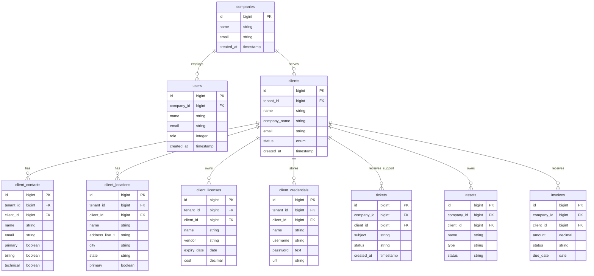

# Client Domain Architecture Diagrams

## 1. Client Domain Model Relationships


## 2. Cross-Domain Integration Architecture

```mermaid
graph TB
    subgraph "Client Domain"
        Client[Client]
        ClientContact[ClientContact]
        ClientLocation[ClientLocation]
        ClientLicense[ClientLicense]
        ClientCredential[ClientCredential]
        ClientDocument[ClientDocument]
        ClientCalendarEvent[ClientCalendarEvent]
        ClientTrip[ClientTrip]
        ClientRecurringTicket[ClientRecurringTicket]
    end
    
    subgraph "Ticket Domain"
        Ticket[Ticket]
        TicketReply[TicketReply]
    end
    
    subgraph "Asset Domain"
        Asset[Asset]
        Network[Network]
    end
    
    subgraph "Financial Domain"
        Invoice[Invoice]
        Payment[Payment]
        Quote[Quote]
        Recurring[Recurring]
        Expense[Expense]
    end
    
    subgraph "Project Domain"
        Project[Project]
    end
    
    subgraph "User Domain"
        User[User]
        Company[Company]
    end
    
    %% Client Domain Relationships
    Client --> ClientContact
    Client --> ClientLocation
    Client --> ClientLicense
    Client --> ClientCredential
    Client --> ClientDocument
    Client --> ClientCalendarEvent
    Client --> ClientTrip
    Client --> ClientRecurringTicket
    
    %% Cross-Domain Relationships
    Client --> Ticket : "has many"
    Client --> Asset : "owns"
    Client --> Invoice : "receives"
    Client --> Payment : "makes"
    Client --> Quote : "receives"
    Client --> Recurring : "subscribed to"
    Client --> Expense : "related to"
    Client --> Project : "has"
    
    %% Tenant Relationships
    Company --> Client : "tenant isolation"
    User --> ClientCalendarEvent : "schedules"
    User --> ClientTrip : "takes"
    
    %% Asset Integration
    Asset --> ClientLocation : "located at"
    Asset --> ClientCredential : "has credentials"
    Network --> ClientLocation : "deployed at"
    
    %% Ticket Integration
    Ticket --> ClientContact : "reported by"
    Ticket --> ClientLocation : "at location"
    Ticket --> Asset : "for asset"
    ClientRecurringTicket --> Ticket : "generates"
```

## 3. Service Layer Architecture


## 4. Security and Permission Flow


## 5. Data Flow and Event Architecture


## 6. Database Schema Overview



## 7. Implementation Phases


This comprehensive set of diagrams provides a visual representation of the entire Client domain expansion architecture, showing relationships, data flow, security considerations, and implementation phases. The diagrams help stakeholders understand the complexity and scope of the expansion while providing clear guidance for implementation.