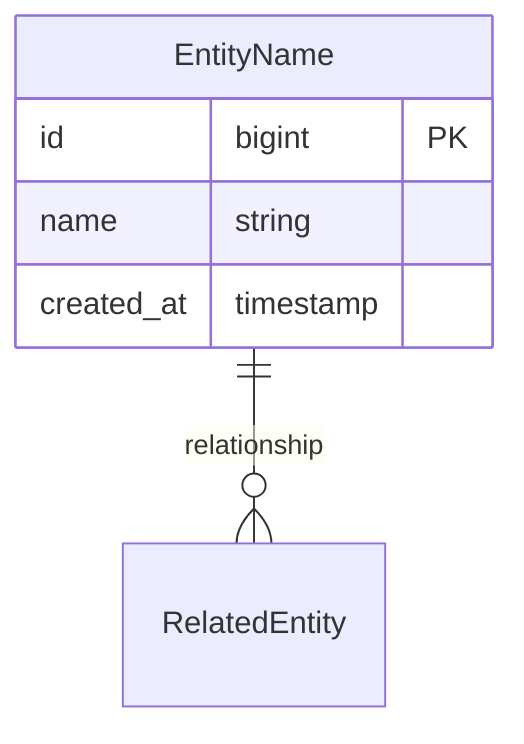

# Documentation Style Guide - Nestogy MSP Platform

This guide establishes consistent formatting, structure, and style standards for all Nestogy MSP Platform documentation.

## 📋 Document Structure Standards

### Header Format
All documents should follow this header pattern:

```markdown
# [Document Title] - Nestogy MSP Platform

[Brief description of the document's purpose]

## Table of Contents (for longer documents)

1. [Section 1](#section-1)
2. [Section 2](#section-2)
...

## [First Section]

Content...
```

### Footer Format
All documents should end with consistent metadata:

```markdown
---

**Version**: 1.0.0 | **Last Updated**: January 2024 | **Platform**: Laravel 11 + PHP 8.2+
```

## 🎯 Terminology Standards

### Primary Branding
- **Primary Name**: "Nestogy MSP Platform"
- **Short Form**: "Nestogy" (when context is clear)
- **Technical Reference**: "Nestogy MSP Platform" (in technical docs)
- **Database Name**: `nestogy_msp`

### Avoid These Terms
- ❌ "Nestogy ERP" 
- ❌ "Nestogy Laravel"
- ❌ "Nestogy ERP System"

### Domain References
- Client Domain
- Financial Domain  
- Ticket Domain
- Asset Domain
- User Domain
- Project Domain *(planned)*
- Integration Domain *(planned)*
- Report Domain *(planned)*

## 📝 Content Formatting

### Headings Hierarchy
```markdown
# Document Title (H1)
## Major Sections (H2)  
### Subsections (H3)
#### Details (H4)
##### Technical Notes (H5 - use sparingly)
```

### Code Examples
Always use fenced code blocks with language specification:

```markdown
```php
// PHP code example
class Example {
    // code here
}
```

```bash
# Command line examples
php artisan migrate
```

```sql
-- SQL examples
CREATE TABLE example (id bigint);
```
```

### Links and References
- **Internal Links**: Use relative paths: `[Configuration Guide](CONFIGURATION.md)`
- **Architecture Links**: `[System Overview](architecture/system-overview.md)`
- **Code References**: Use backticks for inline code: `User::class`
- **External Links**: Full URLs with descriptive text

### Lists and Bullets
- Use `-` for unordered lists
- Use `1.` for ordered lists
- Use `- [ ]` for task lists
- Use `- ✅` for completed items
- Use `- 📋` for planned items

### Emphasis and Styling
- **Bold** for important terms and UI elements
- *Italic* for emphasis and parameter names
- `Code formatting` for file names, commands, and code elements
- > Blockquotes for important notes and warnings

## 🗂️ File Organization

### Naming Conventions
- Use UPPERCASE for main documentation files: `README.md`, `QUICKSTART.md`
- Use kebab-case for architecture files: `system-overview.md`
- Use descriptive names: `client-domain.md` not `domain1.md`

### Directory Structure
```
docs/
├── README.md                    # Main documentation index
├── QUICKSTART.md               # Quick start guide
├── DEPLOYMENT.md               # Deployment instructions
├── CONFIGURATION.md            # Configuration guide
├── MARIADB_SETUP.md           # Database setup
├── STYLE_GUIDE.md             # This document
├── architecture/               # Architecture documentation
│   ├── README.md              # Architecture overview
│   ├── system-overview.md     # System architecture
│   ├── [domain]-domain.md     # Domain architecture
│   └── [topic]-architecture.md # Architecture topics
└── apache/                    # Configuration files
    └── nestogy.conf
```

## 🎨 Mermaid Diagram Standards

### Diagram Types and Usage
- **Entity Relationship**: Database schemas and data models
- **Sequence Diagrams**: Process flows and interactions
- **Graph Diagrams**: System architecture and relationships
- **State Diagrams**: Workflow and status transitions

### Formatting Standards
```markdown


### Style Guidelines
- Use PascalCase for entity names: `ClientContact`
- Use snake_case for field names: `created_at`
- Include data types: `id bigint PK`, `name string`
- Use descriptive relationship labels

## 📊 Table Standards

### Formatting
```markdown
| Column 1 | Column 2 | Column 3 |
|----------|----------|----------|
| Data 1   | Data 2   | Data 3   |
| Data 4   | Data 5   | Data 6   |
```

### Usage Guidelines
- Use tables for structured data comparison
- Include headers for all columns
- Keep table width reasonable
- Use consistent alignment

## ⚠️ Admonitions and Notices

### Standard Admonitions
```markdown
> **Note**: General information or tips

> **Warning**: Important cautions or potential issues

> **Important**: Critical information that must not be ignored

> **Tip**: Helpful suggestions or best practices
```

### Status Indicators
- ✅ **Complete**: Fully implemented and documented
- 📋 **Planned**: Defined but not yet implemented  
- 🚧 **In Progress**: Currently being developed
- ❌ **Deprecated**: No longer recommended

## 🔗 Cross-Reference Standards

### Link Patterns
- **Same Directory**: `[Configuration](CONFIGURATION.md)`
- **Architecture**: `[System Overview](architecture/system-overview.md)`
- **Code Reference**: [`User::class`](../app/Models/User.php)
- **Section Links**: `[Database Setup](#database-setup)`

### Navigation Aids
- Include "Table of Contents" for documents >500 lines
- Use "Quick Navigation" sections for overview documents
- Add "Related Documentation" sections where appropriate
- Include breadcrumb navigation in deep documents

## 📅 Version and Maintenance

### Version Information
- **Current Version**: 1.0.0
- **Last Updated**: January 2024
- **Platform Version**: Laravel 11 + PHP 8.2+

### Update Guidelines
1. Update "Last Updated" when making significant changes
2. Increment version for major documentation restructures
3. Maintain consistency across all documents
4. Review cross-references when updating

## 🎯 Writing Guidelines

### Tone and Voice
- **Professional** but approachable
- **Clear and concise** explanations
- **Action-oriented** instructions
- **Consistent** terminology

### Technical Writing Best Practices
1. Start with clear objectives
2. Use active voice where possible
3. Write scannable content with good headers
4. Include practical examples
5. Test all code examples and procedures
6. Keep sentences and paragraphs concise

### Code Documentation
- Include context and purpose
- Show complete, working examples
- Explain non-obvious logic
- Use meaningful variable and function names
- Include error handling examples

## 🔍 Quality Assurance

### Review Checklist
- [ ] Consistent terminology (Nestogy MSP Platform)
- [ ] Proper heading hierarchy
- [ ] Working links and references
- [ ] Consistent code formatting
- [ ] Up-to-date version information
- [ ] Clear navigation structure
- [ ] Proper grammar and spelling
- [ ] Tested procedures and examples

### Maintenance Schedule
- **Monthly**: Review for outdated information
- **Quarterly**: Update version information and cross-references  
- **Major Releases**: Comprehensive documentation review
- **Ongoing**: Fix broken links and formatting issues

---

**Version**: 1.0.0 | **Last Updated**: January 2024 | **Platform**: Laravel 11 + PHP 8.2+