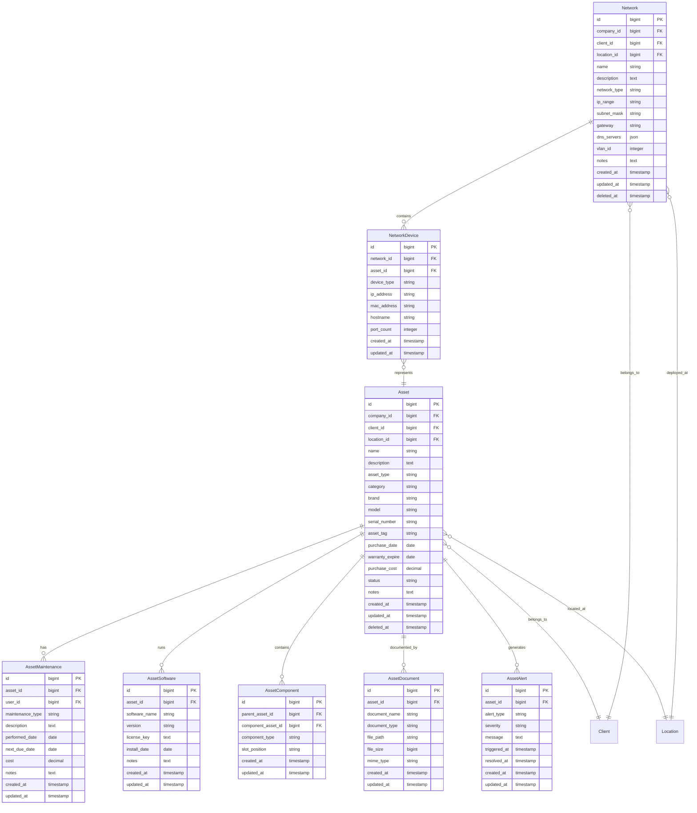

# Asset Domain Architecture

## Domain Overview

The Asset Domain manages IT infrastructure and equipment tracking for MSP clients. This domain handles asset lifecycle management, maintenance scheduling, warranty tracking, and network documentation. It provides comprehensive visibility into client IT environments and supports proactive maintenance strategies.

## Domain Boundaries

**Bounded Context**: IT asset lifecycle management and network documentation
**Core Responsibility**: Tracking client IT infrastructure, equipment, and network configurations

### Domain Models



## Core Components

### 1. Asset Management

#### Asset Model
```php
class Asset extends Model
{
    use HasFactory, SoftDeletes, BelongsToTenant;
    
    protected $fillable = [
        'company_id', 'client_id', 'location_id', 'name', 'description',
        'asset_type', 'category', 'brand', 'model', 'serial_number',
        'asset_tag', 'purchase_date', 'warranty_expire', 'purchase_cost',
        'status', 'notes', 'contact_id'
    ];
    
    protected $casts = [
        'purchase_date' => 'date',
        'warranty_expire' => 'date',
        'purchase_cost' => 'decimal:2'
    ];
    
    // Relationships
    public function client() { return $this->belongsTo(Client::class); }
    public function location() { return $this->belongsTo(ClientLocation::class, 'location_id'); }
    public function contact() { return $this->belongsTo(ClientContact::class, 'contact_id'); }
    public function maintenance() { return $this->hasMany(AssetMaintenance::class); }
    public function software() { return $this->hasMany(AssetSoftware::class); }
    public function documents() { return $this->hasMany(AssetDocument::class); }
    public function alerts() { return $this->hasMany(AssetAlert::class); }
    public function tickets() { return $this->hasMany(Ticket::class); }
    public function components() { return $this->hasMany(AssetComponent::class, 'parent_asset_id'); }
    public function parentAsset() { return $this->hasOneThrough(Asset::class, AssetComponent::class, 'component_asset_id', 'id', 'id', 'parent_asset_id'); }
    
    // Business Logic
    public function isUnderWarranty(): bool
    {
        return $this->warranty_expire && $this->warranty_expire->isFuture();
    }
    
    public function getWarrantyStatus(): string
    {
        if (!$this->warranty_expire) return 'Unknown';
        
        $daysUntilExpiry = now()->diffInDays($this->warranty_expire, false);
        
        if ($daysUntilExpiry < 0) return 'Expired';
        if ($daysUntilExpiry <= 30) return 'Expiring Soon';
        
        return 'Active';
    }
    
    public function getNextMaintenanceDue(): ?Carbon
    {
        return $this->maintenance()
            ->whereNotNull('next_due_date')
            ->where('next_due_date', '>=', now())
            ->min('next_due_date');
    }
    
    public function getTotalMaintenanceCost(): float
    {
        return $this->maintenance()->sum('cost') ?? 0;
    }
}
```

#### Asset Controller
```php
class AssetController extends Controller
{
    public function __construct(
        private AssetService $assetService,
        private AssetReportService $reportService
    ) {}
    
    public function index(Request $request)
    {
        $assets = $this->assetService->getAssets($request->all());
        $stats = $this->assetService->getAssetStatistics();
        
        return view('assets.index', compact('assets', 'stats'));
    }
    
    public function store(StoreAssetRequest $request)
    {
        $asset = $this->assetService->createAsset($request->validated());
        
        return redirect()->route('assets.show', $asset)
            ->with('success', 'Asset created successfully');
    }
    
    public function show(Asset $asset)
    {
        $this->authorize('view', $asset);
        
        $asset->load([
            'client', 'location', 'maintenance.user', 'software', 
            'documents', 'alerts', 'components.componentAsset'
        ]);
        
        return view('assets.show', compact('asset'));
    }
    
    public function addMaintenance(Asset $asset, StoreMaintenanceRequest $request)
    {
        $this->authorize('update', $asset);
        
        $maintenance = $this->assetService->addMaintenance($asset, $request->validated());
        
        return back()->with('success', 'Maintenance record added successfully');
    }
    
    public function warrantyReport()
    {
        $expiringAssets = $this->reportService->getWarrantyExpiringAssets();
        
        return view('assets.warranty-report', compact('expiringAssets'));
    }
}
```

### 2. Asset Service Layer

#### Asset Service
```php
class AssetService
{
    public function __construct(
        private Asset $assetModel,
        private NotificationService $notificationService
    ) {}
    
    public function createAsset(array $data): Asset
    {
        $asset = $this->assetModel->create($data);
        
        // Auto-generate asset tag if not provided
        if (empty($data['asset_tag'])) {
            $asset->update(['asset_tag' => $this->generateAssetTag($asset)]);
        }
        
        // Schedule warranty alerts
        if ($asset->warranty_expire) {
            $this->scheduleWarrantyAlerts($asset);
        }
        
        return $asset->fresh();
    }
    
    public function addMaintenance(Asset $asset, array $data): AssetMaintenance
    {
        $maintenance = $asset->maintenance()->create([
            'user_id' => auth()->id(),
            'maintenance_type' => $data['maintenance_type'],
            'description' => $data['description'],
            'performed_date' => $data['performed_date'] ?? now(),
            'next_due_date' => $data['next_due_date'] ?? null,
            'cost' => $data['cost'] ?? 0,
            'notes' => $data['notes'] ?? null
        ]);
        
        // Update asset status if needed
        if (isset($data['asset_status'])) {
            $asset->update(['status' => $data['asset_status']]);
        }
        
        return $maintenance;
    }
    
    public function getAssetStatistics(): array
    {
        $totalAssets = $this->assetModel->count();
        
        return [
            'total_assets' => $totalAssets,
            'by_status' => $this->assetModel->groupBy('status')->selectRaw('status, count(*) as count')->pluck('count', 'status'),
            'by_type' => $this->assetModel->groupBy('asset_type')->selectRaw('asset_type, count(*) as count')->pluck('count', 'asset_type'),
            'warranty_expiring' => $this->assetModel->where('warranty_expire', '<=', now()->addDays(30))->count(),
            'maintenance_due' => $this->getMaintenanceDueCount(),
            'total_value' => $this->assetModel->sum('purchase_cost') ?? 0
        ];
    }
    
    private function generateAssetTag(Asset $asset): string
    {
        $prefix = strtoupper(substr($asset->client->name, 0, 3));
        $number = str_pad($asset->id, 4, '0', STR_PAD_LEFT);
        
        return "{$prefix}-{$number}";
    }
    
    private function scheduleWarrantyAlerts(Asset $asset): void
    {
        // Schedule alerts at 90, 30, and 7 days before warranty expiry
        $alertDates = [90, 30, 7];
        
        foreach ($alertDates as $days) {
            $alertDate = $asset->warranty_expire->subDays($days);
            
            if ($alertDate->isFuture()) {
                // Schedule background job for warranty alert
                WarrantyExpiryAlert::dispatch($asset)->delay($alertDate);
            }
        }
    }
}
```

### 3. Network Management

#### Network Model
```php
class Network extends Model
{
    use HasFactory, SoftDeletes, BelongsToTenant;
    
    protected $fillable = [
        'company_id', 'client_id', 'location_id', 'name', 'description',
        'network_type', 'ip_range', 'subnet_mask', 'gateway',
        'dns_servers', 'vlan_id', 'notes'
    ];
    
    protected $casts = [
        'dns_servers' => 'array'
    ];
    
    // Relationships
    public function client() { return $this->belongsTo(Client::class); }
    public function location() { return $this->belongsTo(ClientLocation::class, 'location_id'); }
    public function devices() { return $this->hasMany(NetworkDevice::class); }
    
    // Business Logic
    public function getNetworkSize(): int
    {
        if (!$this->subnet_mask) return 0;
        
        // Calculate network size based on subnet mask
        $mask = ip2long($this->subnet_mask);
        return ~$mask + 1;
    }
    
    public function getUsedIPs(): Collection
    {
        return $this->devices()->whereNotNull('ip_address')->pluck('ip_address');
    }
    
    public function getAvailableIPs(): array
    {
        $networkBase = ip2long($this->ip_range);
        $networkSize = $this->getNetworkSize();
        $usedIPs = $this->getUsedIPs()->map(fn($ip) => ip2long($ip))->toArray();
        
        $availableIPs = [];
        for ($i = 1; $i < $networkSize - 1; $i++) {
            $ip = $networkBase + $i;
            if (!in_array($ip, $usedIPs)) {
                $availableIPs[] = long2ip($ip);
            }
        }
        
        return $availableIPs;
    }
}
```

## Asset Lifecycle Management

### Asset Status Workflow


### Maintenance Scheduling


## Integration Points

### 1. Client Domain Integration
- **Asset Ownership**: Assets belong to specific clients and locations
- **Asset Reporting**: Client-specific asset reports and dashboards
- **Service Delivery**: Asset information supports service delivery

### 2. Ticket Domain Integration
- **Asset Issues**: Tickets can be linked to specific assets
- **Maintenance Tickets**: Scheduled maintenance creates tickets
- **Asset History**: Support history tracked per asset

### 3. Financial Domain Integration
- **Asset Depreciation**: Track asset depreciation for financial reporting
- **Maintenance Costs**: Track maintenance expenses for profitability
- **Warranty Claims**: Financial impact of warranty claims

### 4. Project Domain Integration
- **Asset Deployment**: Projects can include asset deployment
- **Infrastructure Projects**: Network and hardware upgrade projects
- **Asset Migration**: Asset movement between locations or clients

## Performance Optimizations

### Database Optimizations
```sql
-- Critical indexes for asset queries
CREATE INDEX idx_assets_company_client ON assets(company_id, client_id);
CREATE INDEX idx_assets_status ON assets(status);
CREATE INDEX idx_assets_warranty_expire ON assets(warranty_expire) WHERE warranty_expire IS NOT NULL;
CREATE INDEX idx_assets_asset_type ON assets(asset_type);
CREATE INDEX idx_assets_location ON assets(location_id);
CREATE INDEX idx_networks_client_location ON networks(client_id, location_id);
CREATE INDEX idx_asset_maintenance_due ON asset_maintenance(next_due_date) WHERE next_due_date IS NOT NULL;
```

### Caching Strategy
1. **Asset Statistics**: Cache asset counts and statistics
2. **Client Asset Lists**: Cache frequently accessed asset lists
3. **Network Information**: Cache network configuration data
4. **Maintenance Schedules**: Cache upcoming maintenance schedules

### Background Processing
1. **Warranty Monitoring**: Check warranty expiration in background
2. **Maintenance Scheduling**: Process maintenance due dates
3. **Asset Discovery**: Auto-discover network assets
4. **Report Generation**: Generate asset reports asynchronously

## Security Considerations

### Asset Data Security
1. **Access Control**: Role-based access to asset information
2. **Sensitive Information**: Encrypt sensitive asset data (passwords, keys)
3. **Audit Trail**: Track all asset modifications and access
4. **Client Isolation**: Strict separation of client asset data

### Network Security
1. **Network Documentation**: Secure storage of network credentials
2. **IP Address Management**: Controlled access to network information  
3. **Device Access**: Secure storage of device credentials
4. **Network Diagrams**: Protected network topology information

## Testing Strategy

### Unit Testing
- **Asset Model**: Test business logic and calculations
- **Network Model**: Test IP address calculations and validations
- **Service Layer**: Test asset and network service operations
- **Maintenance Logic**: Test maintenance scheduling and tracking

### Integration Testing
- **Cross-Domain**: Test integration with Client, Ticket, and Project domains
- **File Uploads**: Test asset document and image uploads
- **Network Discovery**: Test automated network asset discovery
- **Maintenance Workflows**: Test end-to-end maintenance processes

### Performance Testing
- **Large Asset Lists**: Test performance with thousands of assets
- **Network Calculations**: Test IP address calculation performance
- **Report Generation**: Test asset reporting performance
- **Search Operations**: Test asset search and filtering performance

This Asset Domain architecture provides comprehensive IT asset management capabilities while maintaining integration with other MSP domains and ensuring security and performance requirements are met.

---

**Version**: 2.0.0 | **Last Updated**: August 2024 | **Platform**: Laravel 12 + PHP 8.2+ + Modern Base Class Architecture