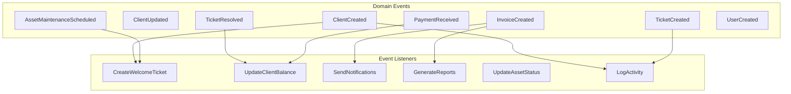
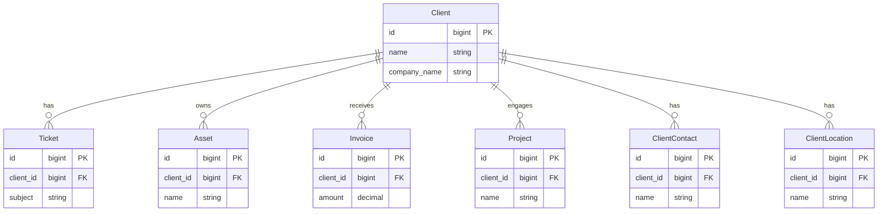
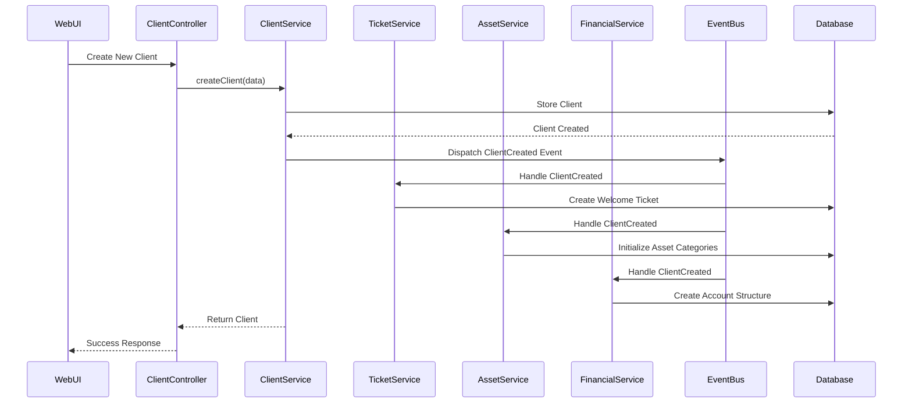

# Cross-Domain Integration Architecture

## Integration Overview

The Nestogy MSP platform uses event-driven architecture and service layer patterns to enable seamless communication and data sharing between domains while maintaining clear boundaries and responsibilities.

## Integration Patterns

### 1. Event-Driven Architecture

#### Domain Events



#### Event Implementation

```php
// Domain Event Example
namespace App\Domains\Client\Events;

class ClientCreated
{
    public function __construct(public Client $client) {}
}

// Event Listener Example
namespace App\Domains\Ticket\Listeners;

class CreateWelcomeTicket
{
    public function __construct(private TicketService $ticketService) {}
    
    public function handle(ClientCreated $event): void
    {
        $this->ticketService->createTicket([
            'client_id' => $event->client->id,
            'subject' => 'Welcome to our services',
            'body' => 'Welcome! This ticket will help us get you started.',
            'priority' => 'normal',
            'status' => 'open',
            'source' => 'system',
            'category' => 'onboarding'
        ]);
    }
}
```

### 2. Service Layer Integration

#### Cross-Domain Services

```php
// Client Dashboard Service - Aggregates data from multiple domains
class ClientDashboardService
{
    public function __construct(
        private ClientService $clientService,
        private TicketService $ticketService,
        private AssetService $assetService,
        private FinancialService $financialService,
        private ProjectService $projectService
    ) {}
    
    public function getClientDashboardData(Client $client): array
    {
        return [
            'client' => $this->clientService->getClientSummary($client),
            'tickets' => $this->ticketService->getClientTicketSummary($client),
            'assets' => $this->assetService->getClientAssetSummary($client),
            'financial' => $this->financialService->getClientFinancialSummary($client),
            'projects' => $this->projectService->getClientProjectSummary($client),
            'recent_activity' => $this->getRecentActivity($client)
        ];
    }
    
    private function getRecentActivity(Client $client): Collection
    {
        // Aggregate recent activities from all domains
        $activities = collect();
        
        // Recent tickets
        $activities = $activities->merge(
            $client->tickets()->latest()->limit(5)->get()
                ->map(fn($ticket) => [
                    'type' => 'ticket',
                    'action' => 'created',
                    'item' => $ticket,
                    'date' => $ticket->created_at
                ])
        );
        
        // Recent invoices
        $activities = $activities->merge(
            $client->invoices()->latest()->limit(5)->get()
                ->map(fn($invoice) => [
                    'type' => 'invoice',
                    'action' => 'created',
                    'item' => $invoice,
                    'date' => $invoice->created_at
                ])
        );
        
        return $activities->sortByDesc('date')->take(10);
    }
}
```

## Domain Integration Mappings

### Client Domain as Hub



### Integration Data Flow



## Specific Integration Scenarios

### 1. Ticket to Invoice Integration

#### Time Tracking to Billing

```php
class BillingIntegrationService
{
    public function generateInvoiceFromTickets(Client $client, array $ticketIds): Invoice
    {
        $tickets = Ticket::whereIn('id', $ticketIds)
            ->where('client_id', $client->id)
            ->with('timeEntries')
            ->get();
            
        $invoiceItems = [];
        $totalAmount = 0;
        
        foreach ($tickets as $ticket) {
            $billableTime = $ticket->timeEntries()
                ->where('billable', true)
                ->sum('time_spent');
                
            if ($billableTime > 0) {
                $hours = $billableTime / 60; // Convert minutes to hours
                $rate = $client->hourly_rate ?? 150.00;
                $amount = $hours * $rate;
                
                $invoiceItems[] = [
                    'description' => "Support: {$ticket->subject}",
                    'quantity' => $hours,
                    'price' => $rate,
                    'total' => $amount
                ];
                
                $totalAmount += $amount;
            }
        }
        
        return $this->financialService->createInvoice([
            'client_id' => $client->id,
            'subject' => 'Support Services',
            'items' => $invoiceItems,
            'amount' => $totalAmount,
            'total' => $totalAmount
        ]);
    }
}
```

### 2. Asset to Ticket Integration

#### Asset Issues Creating Tickets

```php
class AssetTicketIntegrationService
{
    public function createMaintenanceTicket(Asset $asset, array $maintenanceData): Ticket
    {
        $ticketData = [
            'client_id' => $asset->client_id,
            'asset_id' => $asset->id,
            'subject' => "Scheduled Maintenance: {$asset->name}",
            'body' => $maintenanceData['description'] ?? 'Scheduled maintenance required',
            'priority' => $maintenanceData['priority'] ?? 'normal',
            'status' => 'scheduled',
            'category' => 'maintenance',
            'due_date' => $maintenanceData['scheduled_date'] ?? now()->addDays(7)
        ];
        
        $ticket = $this->ticketService->createTicket($ticketData);
        
        // Link asset maintenance record to ticket
        $asset->maintenance()->create([
            'ticket_id' => $ticket->id,
            'maintenance_type' => $maintenanceData['type'] ?? 'preventive',
            'description' => $maintenanceData['description'],
            'scheduled_date' => $maintenanceData['scheduled_date']
        ]);
        
        return $ticket;
    }
}
```

### 3. Project to Financial Integration

#### Project Billing and Invoicing

```php
class ProjectBillingService
{
    public function generateProjectInvoice(Project $project): Invoice
    {
        // Get project time entries
        $timeEntries = $project->timeEntries()
            ->where('billable', true)
            ->where('invoiced', false)
            ->with('user', 'ticket')
            ->get();
            
        // Get project expenses
        $expenses = $project->expenses()
            ->where('billable', true)
            ->where('invoiced', false)
            ->get();
            
        $invoiceItems = [];
        
        // Add time entries
        $groupedEntries = $timeEntries->groupBy('user_id');
        foreach ($groupedEntries as $userId => $entries) {
            $user = $entries->first()->user;
            $totalHours = $entries->sum('hours');
            $rate = $user->hourly_rate ?? 150.00;
            
            $invoiceItems[] = [
                'description' => "Professional Services - {$user->name}",
                'quantity' => $totalHours,
                'price' => $rate,
                'total' => $totalHours * $rate
            ];
        }
        
        // Add expenses
        foreach ($expenses as $expense) {
            $invoiceItems[] = [
                'description' => "Expense: {$expense->description}",
                'quantity' => 1,
                'price' => $expense->amount,
                'total' => $expense->amount
            ];
        }
        
        $totalAmount = collect($invoiceItems)->sum('total');
        
        $invoice = $this->financialService->createInvoice([
            'client_id' => $project->client_id,
            'project_id' => $project->id,
            'subject' => "Project: {$project->name}",
            'items' => $invoiceItems,
            'amount' => $totalAmount,
            'total' => $totalAmount
        ]);
        
        // Mark time entries and expenses as invoiced
        $timeEntries->each(fn($entry) => $entry->update(['invoiced' => true]));
        $expenses->each(fn($expense) => $expense->update(['invoiced' => true]));
        
        return $invoice;
    }
}
```

## Data Consistency Patterns

### 1. Eventual Consistency

```php
// Event-driven updates that can be processed asynchronously
class UpdateClientBalanceListener
{
    public function handle(PaymentReceived $event): void
    {
        // Update client balance asynchronously
        UpdateClientBalance::dispatch($event->payment->client_id)
            ->delay(now()->addSeconds(5));
    }
}
```

### 2. Immediate Consistency

```php
// Critical operations that require immediate consistency
class InvoiceService
{
    public function markInvoiceAsPaid(Invoice $invoice, Payment $payment): void
    {
        DB::transaction(function () use ($invoice, $payment) {
            // Update invoice status
            $invoice->update(['status' => 'paid']);
            
            // Record payment
            $payment->update(['status' => 'completed']);
            
            // Update client balance immediately
            $this->updateClientBalance($invoice->client);
            
            // Dispatch event for other async operations
            event(new InvoicePaid($invoice, $payment));
        });
    }
}
```

## API Integration Contracts

### 1. Internal API Contracts

```php
// Service interface for cross-domain integration
interface ClientServiceInterface
{
    public function getClientSummary(Client $client): array;
    public function getClientBalance(Client $client): float;
    public function updateClientStatus(Client $client, string $status): bool;
}

interface TicketServiceInterface
{
    public function getClientTicketSummary(Client $client): array;
    public function createTicket(array $data): Ticket;
    public function assignTicket(Ticket $ticket, User $user): bool;
}
```

### 2. External API Integration

```php
// External PSA tool integration
class PSAIntegrationService
{
    public function syncTicketToPSA(Ticket $ticket): void
    {
        $psaTicket = [
            'external_id' => $ticket->id,
            'client_name' => $ticket->client->name,
            'subject' => $ticket->subject,
            'description' => $ticket->body,
            'priority' => $this->mapPriority($ticket->priority),
            'status' => $this->mapStatus($ticket->status)
        ];
        
        $response = Http::withToken($this->getPSAToken())
            ->post($this->getPSAEndpoint('/tickets'), $psaTicket);
            
        if ($response->successful()) {
            $ticket->update([
                'external_psa_id' => $response->json('id')
            ]);
        }
    }
}
```

## Performance Considerations

### 1. Query Optimization for Cross-Domain Operations

```sql
-- Optimized indexes for cross-domain queries
CREATE INDEX idx_tickets_client_status_updated ON tickets(client_id, status, updated_at DESC);
CREATE INDEX idx_assets_client_warranty ON assets(client_id, warranty_expire);
CREATE INDEX idx_invoices_client_status_total ON invoices(client_id, status, total);
CREATE INDEX idx_projects_client_status ON projects(client_id, status);
```

### 2. Caching Cross-Domain Data

```php
class ClientDashboardCache
{
    public function getClientSummary(Client $client): array
    {
        return Cache::tags(['client', "client.{$client->id}"])
            ->remember(
                "client.{$client->id}.summary",
                3600, // 1 hour
                fn() => $this->generateClientSummary($client)
            );
    }
    
    public function invalidateClientCache(Client $client): void
    {
        Cache::tags(["client.{$client->id}"])->flush();
    }
}
```

## Error Handling and Resilience

### 1. Circuit Breaker Pattern

```php
class ExternalServiceCircuitBreaker
{
    private int $failureThreshold = 5;
    private int $timeout = 30;
    
    public function call(string $service, callable $callback)
    {
        $failures = Cache::get("circuit.{$service}.failures", 0);
        $lastFailure = Cache::get("circuit.{$service}.last_failure");
        
        // Circuit is open
        if ($failures >= $this->failureThreshold) {
            if ($lastFailure && $lastFailure > now()->subSeconds($this->timeout)) {
                throw new ServiceUnavailableException("Circuit breaker is open for {$service}");
            }
            
            // Try to close circuit
            Cache::forget("circuit.{$service}.failures");
            Cache::forget("circuit.{$service}.last_failure");
        }
        
        try {
            return $callback();
        } catch (Exception $e) {
            Cache::increment("circuit.{$service}.failures");
            Cache::put("circuit.{$service}.last_failure", now(), 300);
            throw $e;
        }
    }
}
```

### 2. Saga Pattern for Distributed Transactions

```php
class CreateClientSaga
{
    private array $steps = [];
    private array $compensations = [];
    
    public function execute(array $clientData): Client
    {
        try {
            // Step 1: Create client
            $client = $this->clientService->createClient($clientData);
            $this->addCompensation(fn() => $this->clientService->deleteClient($client));
            
            // Step 2: Create welcome ticket
            $ticket = $this->ticketService->createWelcomeTicket($client);
            $this->addCompensation(fn() => $this->ticketService->deleteTicket($ticket));
            
            // Step 3: Initialize financial account
            $account = $this->financialService->createAccount($client);
            $this->addCompensation(fn() => $this->financialService->deleteAccount($account));
            
            return $client;
            
        } catch (Exception $e) {
            $this->compensate();
            throw $e;
        }
    }
    
    private function compensate(): void
    {
        foreach (array_reverse($this->compensations) as $compensation) {
            try {
                $compensation();
            } catch (Exception $e) {
                Log::error('Saga compensation failed', ['error' => $e->getMessage()]);
            }
        }
    }
}
```

This cross-domain integration architecture ensures that all domains work together seamlessly while maintaining their independence and enabling the MSP platform to function as a cohesive system.

---

**Version**: 1.0.0 | **Last Updated**: January 2024 | **Platform**: Laravel 11 + PHP 8.2+