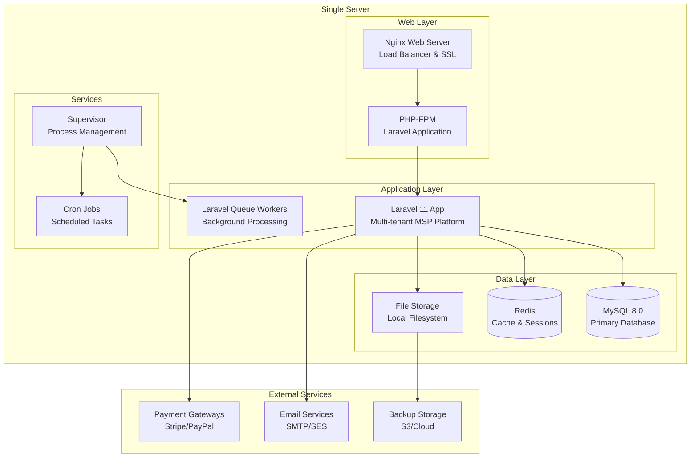
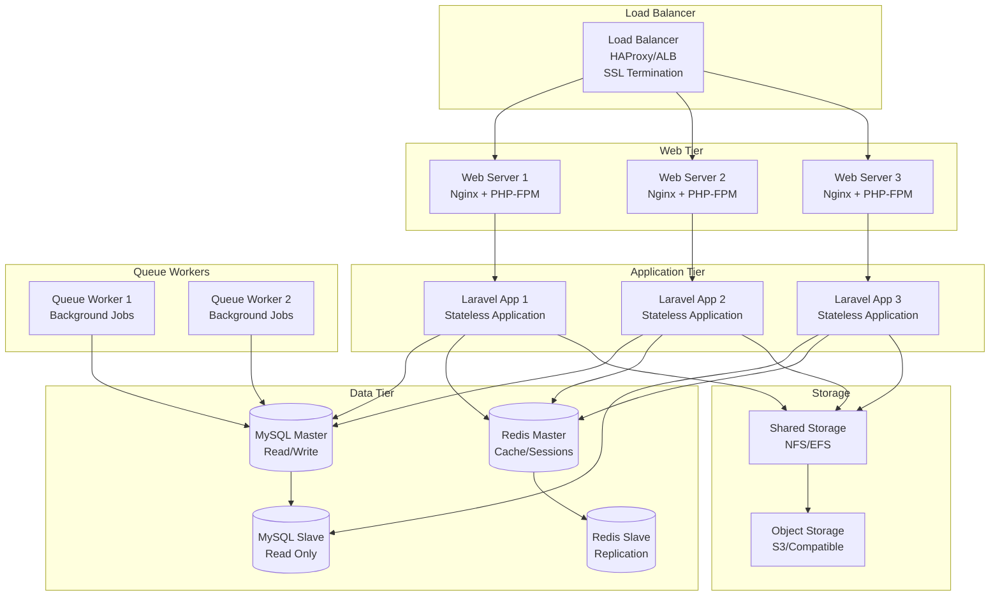
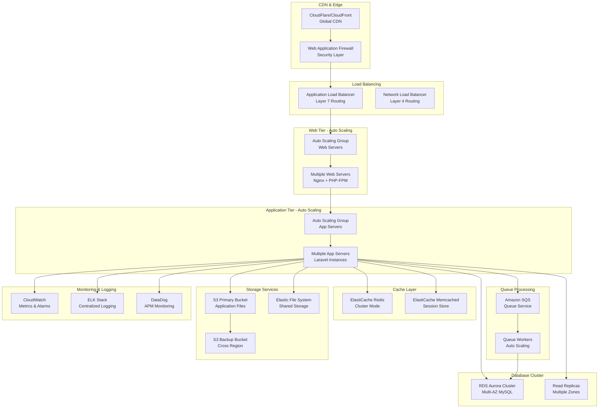
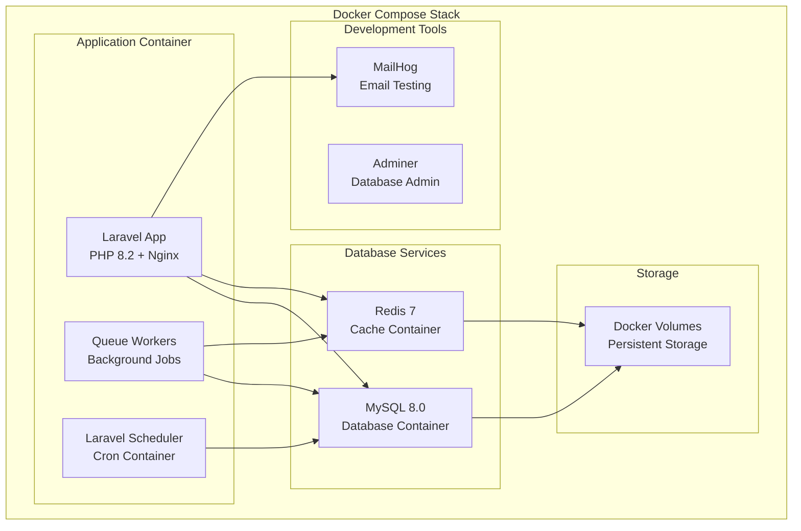
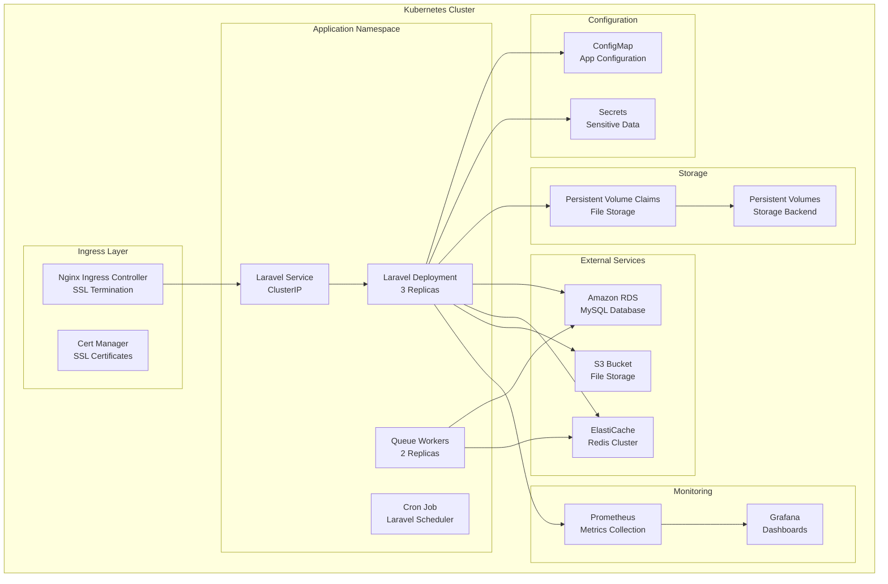
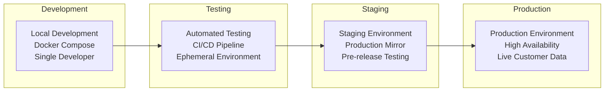
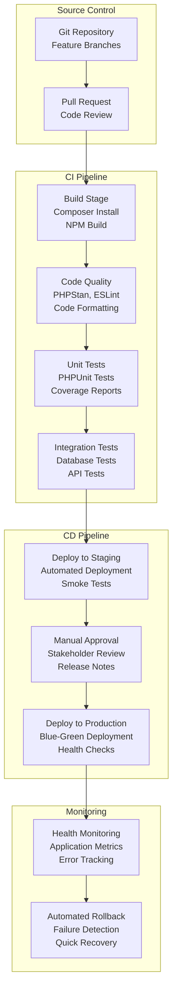
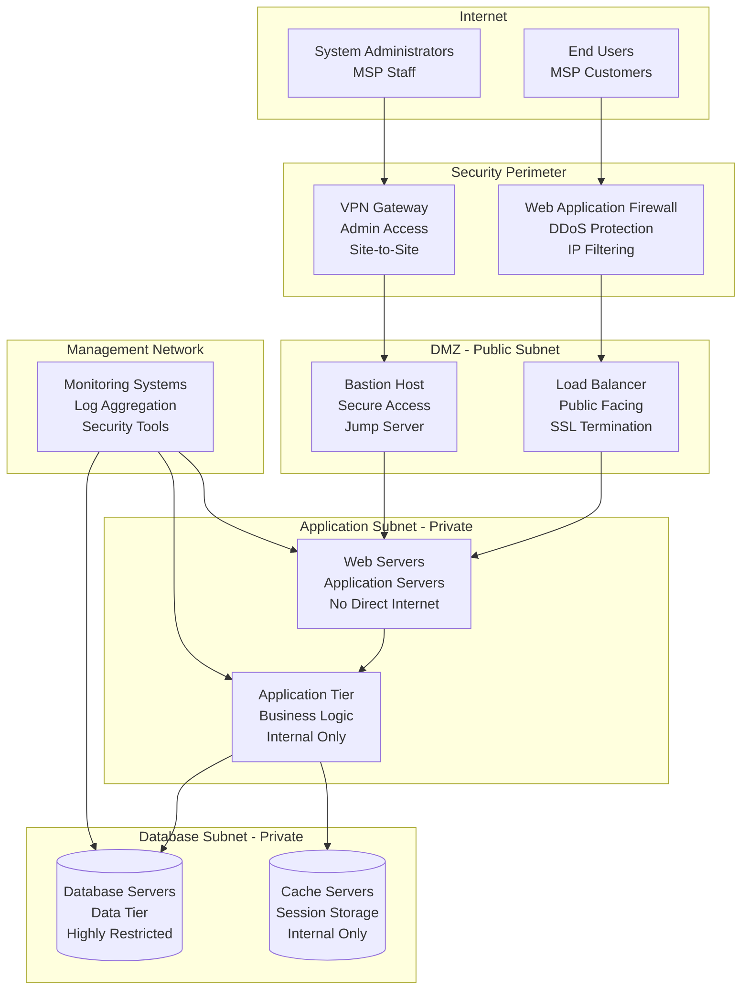

# Deployment Architecture

## Infrastructure Overview

The Nestogy MSP platform is designed for flexible deployment across various environments, from single-server setups for smaller MSPs to distributed, scalable architectures for enterprise deployments.

## Deployment Topologies

### 1. Single Server Deployment (Small MSP)

### 2. Multi-Server Deployment (Medium MSP)

### 3. Enterprise Deployment (Large MSP)

## Container Deployment (Docker/Kubernetes)

### Docker Compose Development

### Kubernetes Production

## Environment Configuration

### Environment Types

### CI/CD Pipeline

## Security Architecture

### Network Security

## Resource Requirements

### Hardware Specifications

| Environment | Web Servers | App Servers | Database | Cache | Storage |
|-------------|-------------|-------------|----------|-------|---------|
| **Development** | 2 CPU, 4GB RAM | 2 CPU, 4GB RAM | 2 CPU, 8GB RAM | 1 CPU, 2GB RAM | 100GB SSD |
| **Staging** | 2 CPU, 8GB RAM | 4 CPU, 8GB RAM | 4 CPU, 16GB RAM | 2 CPU, 4GB RAM | 500GB SSD |
| **Production** | 4 CPU, 16GB RAM | 8 CPU, 16GB RAM | 16 CPU, 64GB RAM | 4 CPU, 8GB RAM | 2TB SSD |
| **Enterprise** | 8 CPU, 32GB RAM | 16 CPU, 32GB RAM | 32 CPU, 128GB RAM | 8 CPU, 16GB RAM | 10TB SSD |

### Scaling Guidelines

- **Web Tier**: Scale based on concurrent user load (100-200 users per server)
- **App Tier**: Scale based on request processing (500-1000 requests/minute per server)
- **Database**: Vertical scaling for writes, horizontal scaling for reads
- **Queue Workers**: Scale based on job queue depth and processing time
- **Cache**: Scale based on memory usage and hit rates

This deployment architecture provides flexibility to start small and scale as the MSP business grows, while maintaining security, performance, and reliability requirements.

---

**Version**: 1.0.0 | **Last Updated**: January 2024 | **Platform**: Laravel 11 + PHP 8.2+