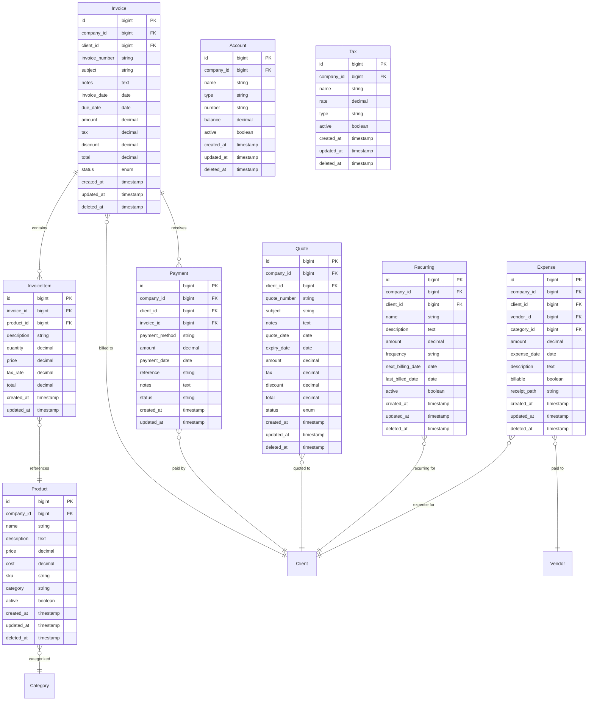
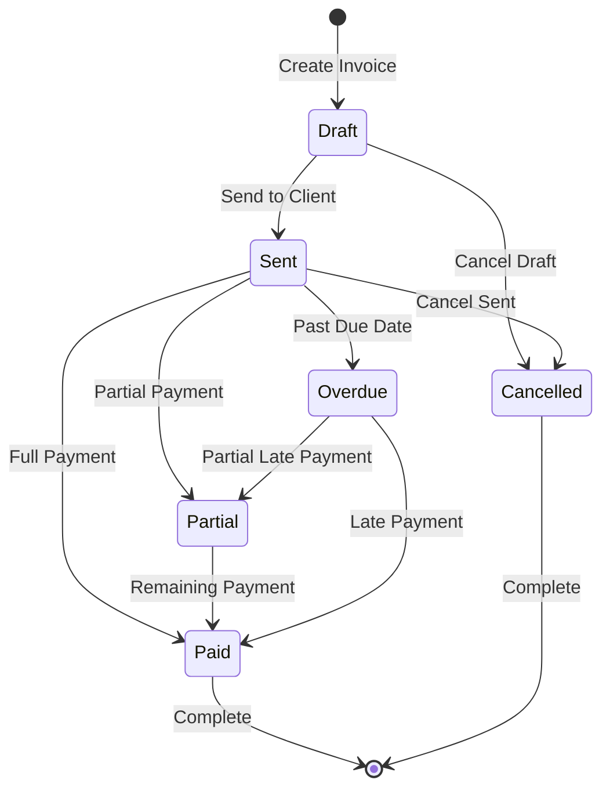
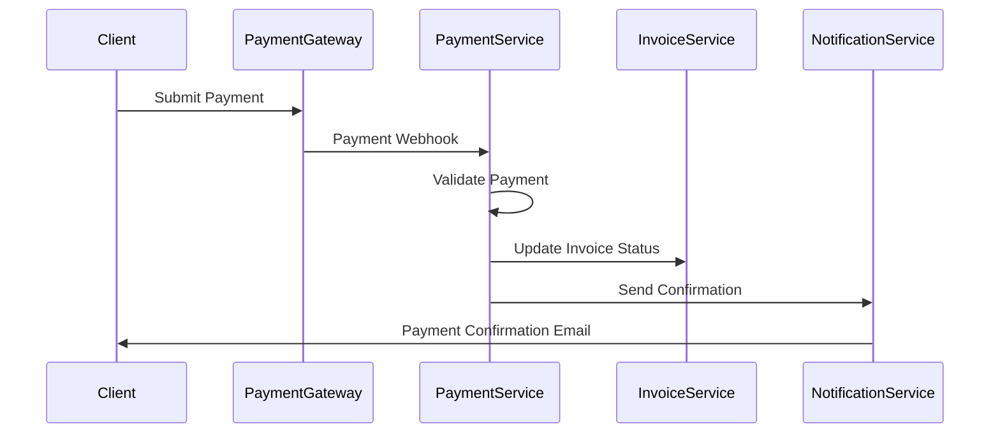

# Financial Domain Architecture

## Domain Overview

The Financial Domain is responsible for all monetary transactions, billing operations, and financial reporting within the Nestogy MSP platform. This domain handles invoice generation, payment processing, recurring billing, expense tracking, and financial analytics.

## Domain Boundaries

**Bounded Context**: Revenue management, billing operations, and financial data
**Core Responsibility**: Managing all financial transactions and billing processes for MSP services

### Domain Models



## Core Components

### 1. Invoice Management

#### Invoice Model
```php
class Invoice extends Model
{
    use HasFactory, SoftDeletes, BelongsToTenant;
    
    protected $fillable = [
        'company_id', 'client_id', 'invoice_number', 'subject', 'notes',
        'invoice_date', 'due_date', 'amount', 'tax', 'discount', 'total',
        'status', 'payment_terms', 'late_fee', 'currency'
    ];
    
    protected $casts = [
        'invoice_date' => 'date',
        'due_date' => 'date',
        'amount' => 'decimal:2',
        'tax' => 'decimal:2',
        'discount' => 'decimal:2',
        'total' => 'decimal:2'
    ];
    
    // Relationships
    public function client() { return $this->belongsTo(Client::class); }
    public function items() { return $this->hasMany(InvoiceItem::class); }
    public function payments() { return $this->hasMany(Payment::class); }
    
    // Business Logic Methods
    public function isOverdue(): bool
    {
        return $this->due_date->isPast() && $this->status === 'sent';
    }
    
    public function getRemainingBalance(): float
    {
        return $this->total - $this->payments->sum('amount');
    }
}
```

#### Invoice Controller
```php
class InvoiceController extends Controller
{
    public function __construct(
        private InvoiceService $invoiceService,
        private PaymentService $paymentService
    ) {}
    
    public function index(Request $request)
    {
        $invoices = $this->invoiceService->getInvoices($request->all());
        return view('invoices.index', compact('invoices'));
    }
    
    public function store(StoreInvoiceRequest $request)
    {
        $invoice = $this->invoiceService->createInvoice($request->validated());
        return redirect()->route('invoices.show', $invoice)
            ->with('success', 'Invoice created successfully');
    }
    
    public function show(Invoice $invoice)
    {
        $this->authorize('view', $invoice);
        return view('invoices.show', compact('invoice'));
    }
    
    public function sendInvoice(Invoice $invoice)
    {
        $this->authorize('update', $invoice);
        $this->invoiceService->sendInvoice($invoice);
        return back()->with('success', 'Invoice sent successfully');
    }
}
```

### 2. Payment Processing

#### Payment Service
```php
class PaymentService
{
    public function __construct(
        private Payment $paymentModel,
        private NotificationService $notificationService
    ) {}
    
    public function recordPayment(Invoice $invoice, array $paymentData): Payment
    {
        $payment = $invoice->payments()->create([
            'company_id' => $invoice->company_id,
            'client_id' => $invoice->client_id,
            'amount' => $paymentData['amount'],
            'payment_method' => $paymentData['method'],
            'payment_date' => $paymentData['date'] ?? now(),
            'reference' => $paymentData['reference'] ?? null,
            'notes' => $paymentData['notes'] ?? null,
            'status' => 'completed'
        ]);
        
        // Update invoice status
        $this->updateInvoiceStatus($invoice);
        
        // Send payment confirmation
        $this->notificationService->sendPaymentConfirmation($payment);
        
        return $payment;
    }
    
    private function updateInvoiceStatus(Invoice $invoice): void
    {
        $totalPaid = $invoice->payments()->sum('amount');
        
        if ($totalPaid >= $invoice->total) {
            $invoice->update(['status' => 'paid']);
        } elseif ($totalPaid > 0) {
            $invoice->update(['status' => 'partial']);
        }
    }
}
```

### 3. Recurring Billing

#### Recurring Billing Service
```php
class RecurringBillingService
{
    public function __construct(
        private InvoiceService $invoiceService,
        private Recurring $recurringModel
    ) {}
    
    public function processRecurringBilling(): void
    {
        $dueRecurring = $this->recurringModel
            ->where('active', true)
            ->where('next_billing_date', '<=', now())
            ->get();
            
        foreach ($dueRecurring as $recurring) {
            $this->createRecurringInvoice($recurring);
            $this->updateNextBillingDate($recurring);
        }
    }
    
    private function createRecurringInvoice(Recurring $recurring): Invoice
    {
        $invoiceData = [
            'client_id' => $recurring->client_id,
            'subject' => $recurring->name,
            'notes' => $recurring->description,
            'amount' => $recurring->amount,
            'invoice_date' => now(),
            'due_date' => now()->addDays(30),
            'status' => 'sent'
        ];
        
        return $this->invoiceService->createInvoice($invoiceData);
    }
}
```

## Business Rules & Workflows

### Invoice Lifecycle



### Payment Processing Flow



## Integration Points

### 1. Client Domain Integration
- **Invoice Generation**: Invoices belong to clients with billing contact information
- **Payment Tracking**: Client payment history and outstanding balances
- **Financial Reporting**: Client-specific financial analytics

### 2. Project Domain Integration
- **Project Billing**: Time and materials billing from project activities
- **Expense Allocation**: Project-related expenses and cost tracking
- **Budget Management**: Project budget vs actual cost analysis

### 3. User Domain Integration
- **Multi-Tenant Isolation**: All financial data scoped by company/tenant
- **Role-Based Access**: Financial data access based on user roles
- **Audit Logging**: Financial transaction audit trails

### 4. Integration Domain
- **Payment Gateways**: Stripe, PayPal, bank transfer processing
- **Accounting Systems**: QuickBooks, Xero synchronization
- **Tax Services**: Automated tax calculation and compliance

## Security Considerations

### Financial Data Protection
1. **Encryption**: Sensitive financial data encrypted at rest
2. **Access Control**: Strict role-based access to financial information
3. **Audit Logging**: Comprehensive logging of all financial transactions
4. **PCI Compliance**: Payment card industry compliance for card processing

### Multi-Tenant Security
1. **Data Isolation**: Complete separation of financial data between tenants
2. **API Security**: Secure API endpoints with proper authentication
3. **Input Validation**: Rigorous validation of all financial inputs
4. **Transaction Integrity**: ACID compliance for financial transactions

## Performance Optimizations

### Database Optimizations
```sql
-- Critical indexes for financial queries
CREATE INDEX idx_invoices_company_status ON invoices(company_id, status);
CREATE INDEX idx_invoices_due_date ON invoices(due_date) WHERE status IN ('sent', 'overdue');
CREATE INDEX idx_payments_company_date ON payments(company_id, payment_date);
CREATE INDEX idx_recurring_next_billing ON recurring(active, next_billing_date);
```

### Caching Strategy
1. **Invoice Totals**: Cache calculated totals and balances
2. **Client Balances**: Cache outstanding balance calculations
3. **Financial Reports**: Cache report data with appropriate TTL
4. **Tax Calculations**: Cache tax rate lookups

### Background Processing
1. **Recurring Billing**: Process recurring invoices via queue jobs
2. **Payment Processing**: Handle payment confirmations asynchronously
3. **Report Generation**: Generate complex financial reports in background
4. **Email Notifications**: Send invoice and payment emails via queues

## Testing Strategy

### Unit Testing
- **Model Validation**: Test business rules and calculations
- **Service Logic**: Test financial calculations and workflows
- **Payment Processing**: Mock external payment gateway interactions

### Integration Testing
- **Cross-Domain**: Test financial integration with Client and Project domains
- **External APIs**: Test payment gateway and accounting system integration
- **Database**: Test financial data integrity and transaction handling

### Feature Testing
- **Invoice Workflows**: End-to-end invoice creation and payment processing
- **Recurring Billing**: Automated recurring invoice generation
- **Financial Reporting**: Accurate financial report generation

This Financial Domain architecture provides a robust foundation for MSP billing operations while maintaining security, performance, and integration capabilities with other system domains.

---

**Version**: 1.0.0 | **Last Updated**: January 2024 | **Platform**: Laravel 11 + PHP 8.2+