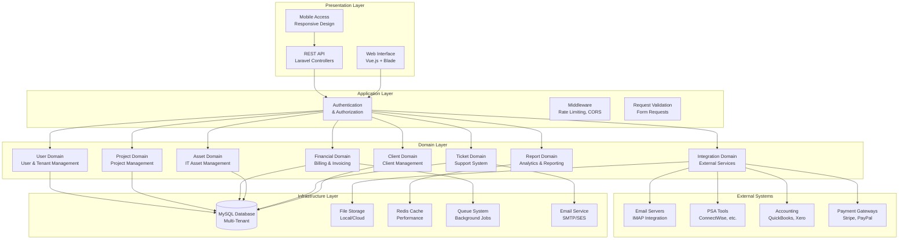
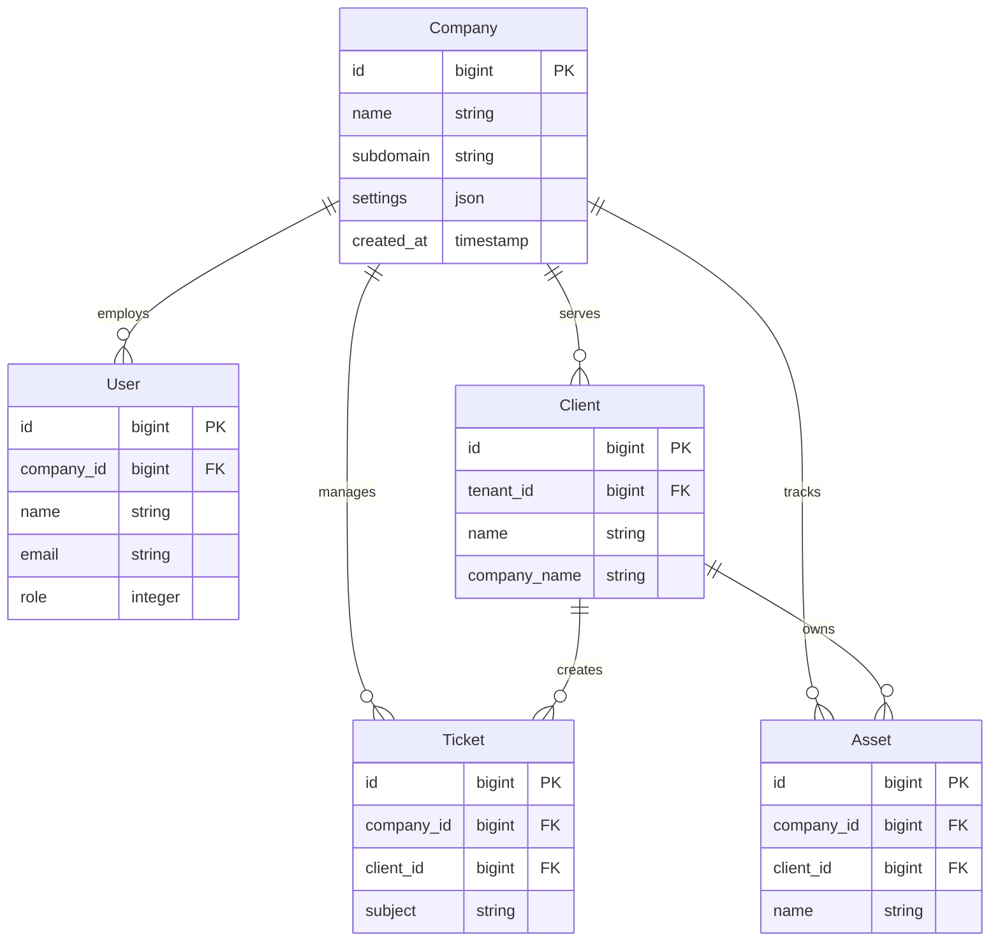

# Nestogy MSP Platform - System Architecture Overview

## Executive Summary

The Nestogy MSP Platform is a comprehensive managed service provider (MSP) enterprise resource planning system built on Laravel 11, designed to handle client management, IT asset tracking, ticket support, financial operations, and project management. The system employs domain-driven design principles with multi-tenant architecture to serve multiple MSP companies securely and efficiently.

## High-Level Architecture

## Domain Boundaries

### Core Business Domains

#### 1. Client Domain
**Bounded Context**: Client relationship management and client-specific data
- **Aggregate Roots**: Client, ClientContact, ClientLocation
- **Responsibilities**: Client profiles, contacts, locations, client-specific assets
- **Key Services**: ClientService, ClientDashboardService
- **Integration Points**: All other domains reference clients

#### 2. Ticket Domain  
**Bounded Context**: Support ticket management and customer service
- **Aggregate Roots**: Ticket, TicketReply
- **Responsibilities**: Ticket lifecycle, support workflows, SLA management
- **Key Services**: TicketService, NotificationService
- **Integration Points**: Client, Asset, User domains

#### 3. Asset Domain
**Bounded Context**: IT asset lifecycle management
- **Aggregate Roots**: Asset, Network
- **Responsibilities**: Asset tracking, maintenance schedules, warranties
- **Key Services**: AssetService, AssetReportingService
- **Integration Points**: Client, Ticket, Project domains

#### 4. Financial Domain
**Bounded Context**: Billing, invoicing, and financial operations
- **Aggregate Roots**: Invoice, Payment, Quote, Recurring
- **Responsibilities**: Revenue management, payment processing, financial reporting
- **Key Services**: InvoiceService, PaymentService, BillingService
- **Integration Points**: Client, Project, User domains

### Supporting Domains

#### 5. Project Domain
**Bounded Context**: Project management and delivery
- **Aggregate Roots**: Project
- **Responsibilities**: Project tracking, resource allocation, deliverables
- **Key Services**: ProjectService, ProjectReportingService
- **Integration Points**: Client, User, Financial domains

#### 6. User Domain
**Bounded Context**: User management and tenant operations
- **Aggregate Roots**: User, Company
- **Responsibilities**: Authentication, authorization, tenant management
- **Key Services**: UserService, CompanyService, AuthService
- **Integration Points**: Foundation for all other domains

#### 7. Integration Domain
**Bounded Context**: External system integration and data exchange
- **Aggregate Roots**: None (Service-oriented)
- **Responsibilities**: API integrations, data import/export, webhook processing
- **Key Services**: ImapService, EmailService, FileUploadService
- **Integration Points**: All domains for data synchronization

#### 8. Report Domain
**Bounded Context**: Analytics, reporting, and business intelligence
- **Aggregate Roots**: None (Service-oriented)  
- **Responsibilities**: Data aggregation, dashboard generation, custom reports
- **Key Services**: ReportService, DashboardService, AnalyticsService
- **Integration Points**: All domains for data consumption

## Technology Stack

### Backend Framework
- **Laravel 11**: PHP framework with modern features
- **PHP 8.2+**: Latest PHP version for performance and features
- **Composer**: Dependency management

### Database & Storage
- **MySQL 8.0+**: Primary database with multi-tenant support
- **Redis**: Caching and session storage
- **File Storage**: Local filesystem with cloud storage options (S3, etc.)

### Frontend Technologies
- **Vue.js 3**: Modern reactive frontend framework
- **Blade Templates**: Server-side rendering for SEO and performance
- **Tailwind CSS**: Utility-first CSS framework
- **Alpine.js**: Lightweight JavaScript framework for interactions

### Infrastructure & DevOps
- **Apache/Nginx**: Web server configuration
- **Supervisor**: Queue worker management  
- **Cron Jobs**: Scheduled task execution
- **Log Management**: Laravel logging with external log aggregation

### Third-Party Integrations
- **Email**: SMTP, AWS SES, Mailgun support
- **Payment Processing**: Stripe, PayPal integration
- **File Processing**: PDF generation, image manipulation
- **Monitoring**: Application performance monitoring

## Multi-Tenant Architecture

### Tenant Isolation Strategy

### Tenant Isolation Features
1. **Database Level**: `tenant_id`/`company_id` foreign keys on all tenant-scoped tables
2. **Application Level**: Global scopes automatically filter queries by tenant
3. **API Level**: JWT tokens contain tenant context for API requests
4. **File Storage**: Tenant-specific directories for file isolation
5. **Cache Isolation**: Tenant-prefixed cache keys

### Role-Based Access Control
- **Admin (Level 3)**: Full system access, user management, financial data
- **Tech (Level 2)**: Technical operations, tickets, assets, client data
- **Accountant (Level 1)**: Financial data, invoices, payments, reporting

## Performance Characteristics

### Scalability Targets
- **Concurrent Users**: 500+ concurrent users per server instance
- **Response Time**: <200ms average for standard operations
- **Database**: Support for 10,000+ clients per tenant
- **File Storage**: Unlimited file storage with efficient indexing

### Performance Optimizations
1. **Database Indexing**: Strategic indexes on frequently queried columns
2. **Query Optimization**: Eager loading and query result caching
3. **Application Caching**: Model caching, view caching, API response caching
4. **Background Processing**: Queue system for heavy operations
5. **CDN Integration**: Static asset delivery optimization

### Monitoring & Metrics
- **Application Metrics**: Response times, error rates, throughput
- **Database Metrics**: Query performance, connection pooling, deadlock detection
- **Infrastructure Metrics**: CPU, memory, disk usage, network performance
- **Business Metrics**: User activity, feature adoption, system health

## Security Architecture

### Authentication & Authorization
- **Multi-Factor Authentication**: TOTP-based 2FA support
- **Session Security**: Secure session management with timeout
- **API Authentication**: JWT tokens with proper expiration
- **Password Security**: Bcrypt hashing with complexity requirements

### Data Protection
- **Encryption at Rest**: Sensitive data encryption in database
- **Encryption in Transit**: HTTPS/TLS for all communications
- **Input Validation**: Comprehensive input sanitization and validation
- **SQL Injection Prevention**: Eloquent ORM with parameterized queries

### Security Monitoring
- **Audit Logging**: Comprehensive activity logging for compliance
- **Intrusion Detection**: Failed login attempt monitoring
- **Vulnerability Management**: Regular security updates and patches
- **Compliance**: GDPR, SOX, and industry-specific compliance features

## Integration Architecture

### Internal Integration Patterns
1. **Event-Driven Architecture**: Domain events for loose coupling
2. **Service Layer**: Dedicated services for cross-domain operations
3. **Repository Pattern**: Data access abstraction
4. **Command/Query Separation**: Clear read/write operation separation

### External Integration Capabilities
1. **REST APIs**: RESTful endpoints for external system integration
2. **Webhook Support**: Inbound webhook processing for real-time updates
3. **File Import/Export**: Bulk data operations with validation
4. **Email Integration**: IMAP for ticket creation, SMTP for notifications

## Development Principles

### Code Organization
- **Domain-Driven Design**: Clear domain boundaries and responsibilities
- **SOLID Principles**: Maintainable and extensible code architecture
- **Laravel Conventions**: Framework best practices and conventions
- **Test-Driven Development**: Comprehensive test coverage for reliability

### Quality Assurance
- **Automated Testing**: Unit, integration, and feature tests
- **Code Review Process**: Peer review for all code changes
- **Static Analysis**: Automated code quality and security scanning
- **Performance Testing**: Load testing and performance benchmarking

This system architecture provides a robust, scalable, and secure foundation for MSP operations while maintaining flexibility for future growth and feature expansion.

---

**Version**: 1.0.0 | **Last Updated**: January 2024 | **Platform**: Laravel 11 + PHP 8.2+