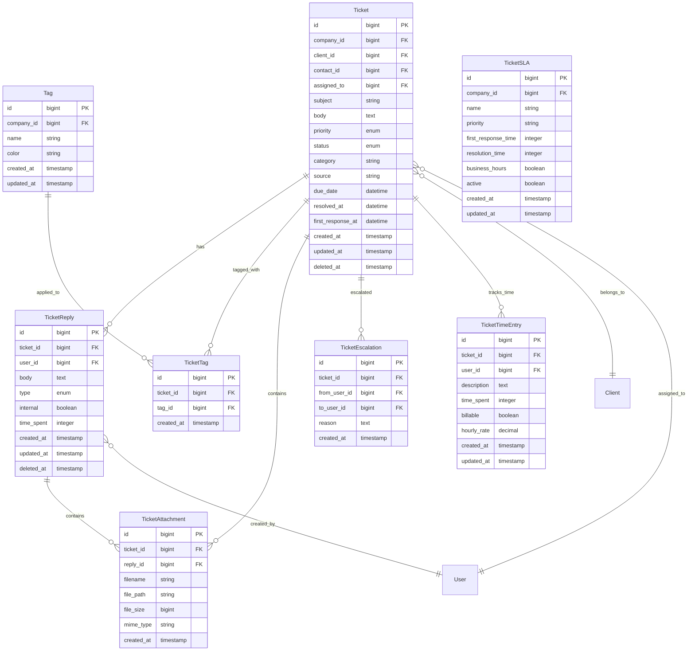
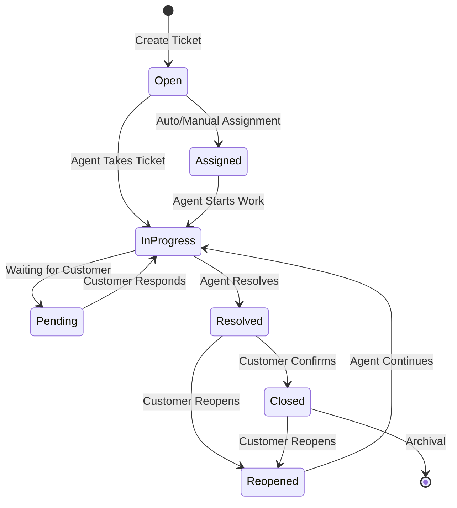
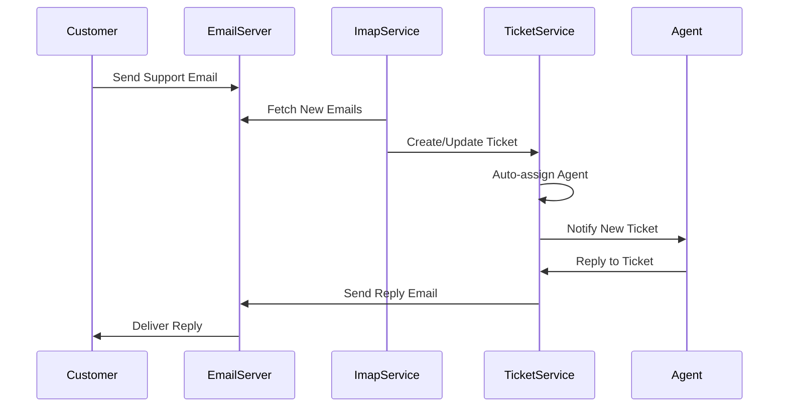

# Ticket Domain Architecture

## Domain Overview

The Ticket Domain is the heart of MSP customer service operations, managing support requests, service incidents, and customer communications. This domain handles the complete ticket lifecycle from creation through resolution, including SLA management, escalation rules, and automated workflows.

## Domain Boundaries

**Bounded Context**: Support ticket management and customer service operations
**Core Responsibility**: Managing customer support requests, incidents, and service delivery tracking

### Domain Models



## Core Components

### 1. Ticket Management

#### Ticket Model
```php
class Ticket extends Model
{
    use HasFactory, SoftDeletes, BelongsToTenant;
    
    protected $fillable = [
        'company_id', 'client_id', 'contact_id', 'assigned_to', 
        'subject', 'body', 'priority', 'status', 'category', 
        'source', 'due_date', 'asset_id', 'project_id'
    ];
    
    protected $casts = [
        'due_date' => 'datetime',
        'resolved_at' => 'datetime',
        'first_response_at' => 'datetime',
        'created_at' => 'datetime',
        'updated_at' => 'datetime'
    ];
    
    // Relationships
    public function client() { return $this->belongsTo(Client::class); }
    public function contact() { return $this->belongsTo(ClientContact::class, 'contact_id'); }
    public function assignedTo() { return $this->belongsTo(User::class, 'assigned_to'); }
    public function replies() { return $this->hasMany(TicketReply::class)->orderBy('created_at'); }
    public function timeEntries() { return $this->hasMany(TicketTimeEntry::class); }
    public function tags() { return $this->belongsToMany(Tag::class, 'ticket_tags'); }
    public function asset() { return $this->belongsTo(Asset::class); }
    public function project() { return $this->belongsTo(Project::class); }
    
    // Business Logic
    public function isOverdue(): bool
    {
        return $this->due_date && $this->due_date->isPast() && !$this->isResolved();
    }
    
    public function isResolved(): bool
    {
        return in_array($this->status, ['resolved', 'closed']);
    }
    
    public function getTotalTimeSpent(): int
    {
        return $this->timeEntries()->sum('time_spent');
    }
    
    public function getBillableTime(): int
    {
        return $this->timeEntries()->where('billable', true)->sum('time_spent');
    }
}
```

#### Ticket Controller
```php
class TicketController extends Controller
{
    public function __construct(
        private TicketService $ticketService,
        private NotificationService $notificationService
    ) {}
    
    public function index(Request $request)
    {
        $tickets = $this->ticketService->getTickets($request->all());
        return view('tickets.index', compact('tickets'));
    }
    
    public function store(StoreTicketRequest $request)
    {
        $ticket = $this->ticketService->createTicket($request->validated());
        
        return redirect()->route('tickets.show', $ticket)
            ->with('success', 'Ticket created successfully');
    }
    
    public function show(Ticket $ticket)
    {
        $this->authorize('view', $ticket);
        
        $ticket->load(['replies.user', 'timeEntries.user', 'tags']);
        
        return view('tickets.show', compact('ticket'));
    }
    
    public function update(Ticket $ticket, UpdateTicketRequest $request)
    {
        $this->authorize('update', $ticket);
        
        $updated = $this->ticketService->updateTicket($ticket, $request->validated());
        
        return back()->with('success', 'Ticket updated successfully');
    }
    
    public function addReply(Ticket $ticket, StoreReplyRequest $request)
    {
        $this->authorize('update', $ticket);
        
        $reply = $this->ticketService->addReply($ticket, $request->validated());
        
        return back()->with('success', 'Reply added successfully');
    }
}
```

### 2. Ticket Service Layer

#### Ticket Service
```php
class TicketService
{
    public function __construct(
        private Ticket $ticketModel,
        private NotificationService $notificationService,
        private SLAService $slaService
    ) {}
    
    public function createTicket(array $data): Ticket
    {
        $ticket = $this->ticketModel->create($data);
        
        // Auto-assign based on rules
        $this->autoAssignTicket($ticket);
        
        // Apply SLA rules
        $this->slaService->applySLA($ticket);
        
        // Send notifications
        $this->notificationService->notifyTicketCreated($ticket);
        
        return $ticket->fresh();
    }
    
    public function updateTicket(Ticket $ticket, array $data): Ticket
    {
        $originalStatus = $ticket->status;
        $originalAssignee = $ticket->assigned_to;
        
        $ticket->update($data);
        
        // Handle status changes
        if ($originalStatus !== $ticket->status) {
            $this->handleStatusChange($ticket, $originalStatus);
        }
        
        // Handle assignment changes
        if ($originalAssignee !== $ticket->assigned_to) {
            $this->notificationService->notifyTicketAssigned($ticket);
        }
        
        return $ticket;
    }
    
    public function addReply(Ticket $ticket, array $data): TicketReply
    {
        $reply = $ticket->replies()->create([
            'user_id' => auth()->id(),
            'body' => $data['body'],
            'type' => $data['type'] ?? 'reply',
            'internal' => $data['internal'] ?? false,
            'time_spent' => $data['time_spent'] ?? 0
        ]);
        
        // Update first response time
        if (!$ticket->first_response_at && !$data['internal']) {
            $ticket->update(['first_response_at' => now()]);
        }
        
        // Send notifications for external replies
        if (!$data['internal']) {
            $this->notificationService->notifyTicketReplied($ticket, $reply);
        }
        
        return $reply;
    }
    
    private function autoAssignTicket(Ticket $ticket): void
    {
        // Auto-assignment logic based on client, category, or round-robin
        $assignee = $this->getNextAvailableAgent($ticket);
        
        if ($assignee) {
            $ticket->update(['assigned_to' => $assignee->id]);
        }
    }
    
    private function handleStatusChange(Ticket $ticket, string $oldStatus): void
    {
        switch ($ticket->status) {
            case 'resolved':
                $ticket->update(['resolved_at' => now()]);
                $this->notificationService->notifyTicketResolved($ticket);
                break;
                
            case 'closed':
                if ($oldStatus !== 'closed') {
                    $this->notificationService->notifyTicketClosed($ticket);
                }
                break;
                
            case 'reopened':
                $ticket->update(['resolved_at' => null]);
                $this->notificationService->notifyTicketReopened($ticket);
                break;
        }
    }
}
```

### 3. SLA Management

#### SLA Service
```php
class SLAService
{
    public function applySLA(Ticket $ticket): void
    {
        $sla = $this->getSLAForTicket($ticket);
        
        if (!$sla) return;
        
        $dueDate = $this->calculateSLADueDate($sla, $ticket);
        $ticket->update(['due_date' => $dueDate]);
    }
    
    private function getSLAForTicket(Ticket $ticket): ?TicketSLA
    {
        return TicketSLA::where('company_id', $ticket->company_id)
            ->where('priority', $ticket->priority)
            ->where('active', true)
            ->first();
    }
    
    private function calculateSLADueDate(TicketSLA $sla, Ticket $ticket): Carbon
    {
        $responseTime = $sla->first_response_time; // minutes
        
        if ($sla->business_hours) {
            return $this->addBusinessMinutes($ticket->created_at, $responseTime);
        }
        
        return $ticket->created_at->addMinutes($responseTime);
    }
    
    public function checkSLABreaches(): Collection
    {
        return Ticket::whereNotNull('due_date')
            ->where('due_date', '<', now())
            ->whereNotIn('status', ['resolved', 'closed'])
            ->get();
    }
}
```

## Business Rules & Workflows

### Ticket Lifecycle



### Email Integration Workflow



## Integration Points

### 1. Client Domain Integration
- **Client Association**: Tickets belong to clients with contact information
- **Client History**: Complete ticket history for relationship management
- **Client Reporting**: Client-specific support metrics and analytics

### 2. Asset Domain Integration
- **Asset Issues**: Tickets can be linked to specific assets
- **Asset History**: Track support issues for asset lifecycle management
- **Maintenance Tickets**: Scheduled maintenance and service tickets

### 3. Project Domain Integration
- **Project Tasks**: Tickets can be converted to or linked with project tasks
- **Project Support**: Ongoing support for project deliverables
- **Resource Planning**: Ticket workload affects project resource allocation

### 4. Financial Domain Integration
- **Time Billing**: Billable time entries for service billing
- **Service Contracts**: SLA enforcement based on client contracts
- **Cost Tracking**: Support costs for profitability analysis

### 5. User Domain Integration
- **Agent Assignment**: Tickets assigned to specific agents
- **Team Management**: Support team structure and workload distribution
- **Performance Metrics**: Agent performance tracking and reporting

## Performance Optimizations

### Database Optimizations
```sql
-- Critical indexes for ticket queries
CREATE INDEX idx_tickets_company_status ON tickets(company_id, status);
CREATE INDEX idx_tickets_assigned_status ON tickets(assigned_to, status);
CREATE INDEX idx_tickets_client_created ON tickets(client_id, created_at DESC);
CREATE INDEX idx_tickets_due_date ON tickets(due_date) WHERE due_date IS NOT NULL;
CREATE INDEX idx_tickets_priority_created ON tickets(priority, created_at DESC);
CREATE INDEX idx_ticket_replies_ticket_created ON ticket_replies(ticket_id, created_at);
```

### Caching Strategy
1. **Ticket Counts**: Cache active ticket counts by status and agent
2. **SLA Metrics**: Cache SLA compliance statistics
3. **Agent Workload**: Cache agent assignment and workload data
4. **Client Metrics**: Cache client-specific support statistics

### Background Processing
1. **Email Processing**: Process inbound emails via queue jobs
2. **SLA Monitoring**: Check for SLA breaches in background jobs
3. **Auto-assignment**: Process ticket assignment rules asynchronously
4. **Notification Sending**: Send ticket notifications via queues

## Security Considerations

### Data Access Control
1. **Tenant Isolation**: Complete separation of ticket data between companies
2. **Client Privacy**: Agents can only access tickets for their company's clients
3. **Internal Notes**: Internal ticket communications hidden from clients
4. **Attachment Security**: Secure file upload and access controls

### Communication Security
1. **Email Security**: Secure email integration with encryption
2. **Web Portal**: Secure client portal for ticket access
3. **API Security**: Authenticated API access for integrations
4. **Audit Trail**: Complete audit log of ticket activities

## Testing Strategy

### Unit Testing
- **Ticket Model**: Test business logic and relationships
- **SLA Calculations**: Test SLA due date calculations
- **Assignment Rules**: Test auto-assignment logic
- **Status Transitions**: Test ticket status workflow rules

### Integration Testing
- **Email Integration**: Test IMAP ticket creation and replies
- **Cross-Domain**: Test integration with Client, Asset, and Project domains
- **Notification System**: Test ticket notification delivery
- **File Attachments**: Test secure file upload and retrieval

### Performance Testing
- **High Volume**: Test ticket creation under high load
- **Query Performance**: Test ticket list and search performance
- **Email Processing**: Test bulk email processing performance
- **Report Generation**: Test ticket reporting performance

This Ticket Domain architecture provides a comprehensive support system foundation that integrates seamlessly with other MSP operations while maintaining security, performance, and user experience standards.

---

**Version**: 1.0.0 | **Last Updated**: January 2024 | **Platform**: Laravel 11 + PHP 8.2+