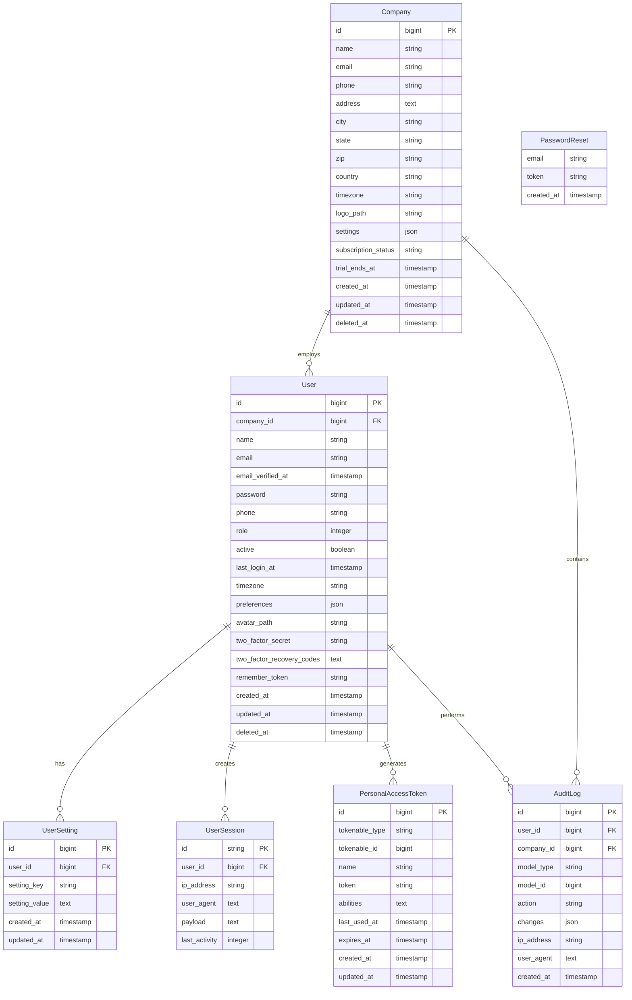
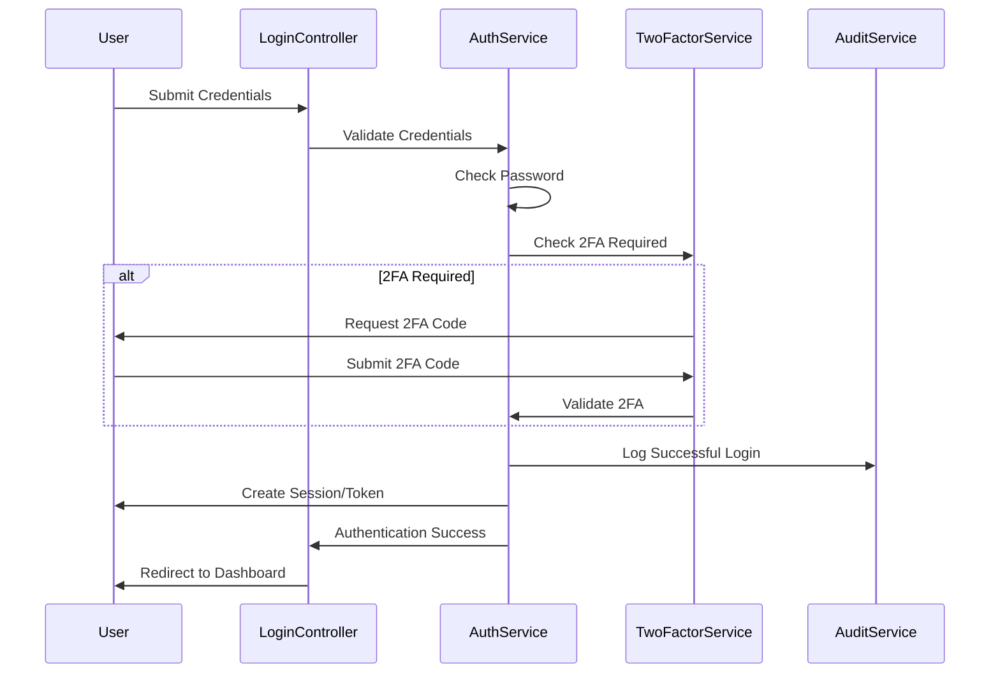
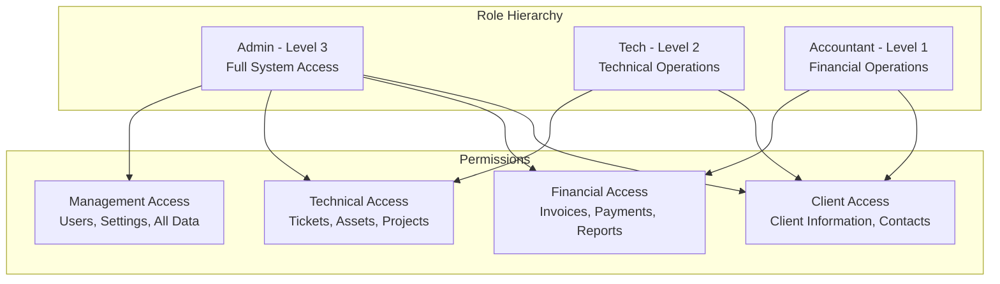

# User Domain Architecture

## Domain Overview

The User Domain is the foundational domain responsible for authentication, authorization, user management, and multi-tenant operations. This domain provides the security framework and tenant isolation that enables the entire MSP platform to serve multiple companies securely.

## Domain Boundaries

**Bounded Context**: User management, authentication, authorization, and tenant operations
**Core Responsibility**: Managing user accounts, company/tenant isolation, and access control across the entire platform

### Domain Models



## Core Components

### 1. User Management

#### User Model
```php
class User extends Authenticatable implements MustVerifyEmail
{
    use HasApiTokens, HasFactory, Notifiable, TwoFactorAuthenticatable, SoftDeletes;
    
    protected $fillable = [
        'company_id', 'name', 'email', 'password', 'phone', 'role', 
        'active', 'timezone', 'preferences', 'avatar_path'
    ];
    
    protected $hidden = [
        'password', 'remember_token', 'two_factor_recovery_codes', 'two_factor_secret'
    ];
    
    protected $casts = [
        'email_verified_at' => 'datetime',
        'last_login_at' => 'datetime',
        'preferences' => 'array',
        'active' => 'boolean',
        'role' => 'integer'
    ];
    
    // Relationships
    public function company() { return $this->belongsTo(Company::class); }
    public function settings() { return $this->hasMany(UserSetting::class); }
    public function auditLogs() { return $this->hasMany(AuditLog::class); }
    public function assignedTickets() { return $this->hasMany(Ticket::class, 'assigned_to'); }
    public function createdTickets() { return $this->hasMany(Ticket::class, 'created_by'); }
    public function timeEntries() { return $this->hasMany(TicketTimeEntry::class); }
    public function calendarEvents() { return $this->hasMany(ClientCalendarEvent::class); }
    
    // Role-based methods
    public function isAdmin(): bool { return $this->role >= 3; }
    public function isTech(): bool { return $this->role >= 2; }
    public function isAccountant(): bool { return $this->role === 1 || $this->role >= 3; }
    
    public function hasPermission(string $permission): bool
    {
        $rolePermissions = [
            1 => ['financial.view', 'financial.create', 'clients.view', 'reports.view'],
            2 => ['tickets.*', 'assets.*', 'clients.*', 'projects.*', 'reports.view'],
            3 => ['*'] // Admin has all permissions
        ];
        
        $userPermissions = $rolePermissions[$this->role] ?? [];
        
        return in_array('*', $userPermissions) || 
               in_array($permission, $userPermissions) ||
               in_array(explode('.', $permission)[0] . '.*', $userPermissions);
    }
    
    // Settings management
    public function getSetting(string $key, $default = null)
    {
        $setting = $this->settings()->where('setting_key', $key)->first();
        return $setting ? $setting->setting_value : $default;
    }
    
    public function setSetting(string $key, $value): void
    {
        $this->settings()->updateOrCreate(
            ['setting_key' => $key],
            ['setting_value' => $value]
        );
    }
}
```

#### User Controller
```php
class UserController extends Controller
{
    public function __construct(
        private UserService $userService,
        private AuditService $auditService
    ) {}
    
    public function index(Request $request)
    {
        $this->authorize('viewAny', User::class);
        
        $users = $this->userService->getUsers($request->all());
        
        return view('users.index', compact('users'));
    }
    
    public function store(StoreUserRequest $request)
    {
        $this->authorize('create', User::class);
        
        $user = $this->userService->createUser($request->validated());
        
        return redirect()->route('users.index')
            ->with('success', 'User created successfully');
    }
    
    public function show(User $user)
    {
        $this->authorize('view', $user);
        
        $user->load(['settings', 'auditLogs.user']);
        
        return view('users.show', compact('user'));
    }
    
    public function update(User $user, UpdateUserRequest $request)
    {
        $this->authorize('update', $user);
        
        $user = $this->userService->updateUser($user, $request->validated());
        
        return back()->with('success', 'User updated successfully');
    }
    
    public function profile()
    {
        $user = auth()->user();
        $user->load('settings');
        
        return view('users.profile', compact('user'));
    }
    
    public function updateProfile(UpdateProfileRequest $request)
    {
        $user = $this->userService->updateProfile(auth()->user(), $request->validated());
        
        return back()->with('success', 'Profile updated successfully');
    }
}
```

### 2. Company/Tenant Management

#### Company Model
```php
class Company extends Model
{
    use HasFactory, SoftDeletes;
    
    protected $fillable = [
        'name', 'email', 'phone', 'address', 'city', 'state', 'zip', 
        'country', 'timezone', 'logo_path', 'settings', 'subscription_status'
    ];
    
    protected $casts = [
        'settings' => 'array',
        'trial_ends_at' => 'datetime'
    ];
    
    // Relationships
    public function users() { return $this->hasMany(User::class); }
    public function clients() { return $this->hasMany(Client::class, 'tenant_id'); }
    public function tickets() { return $this->hasMany(Ticket::class); }
    public function assets() { return $this->hasMany(Asset::class); }
    public function invoices() { return $this->hasMany(Invoice::class); }
    public function auditLogs() { return $this->hasMany(AuditLog::class); }
    
    // Business Logic
    public function isOnTrial(): bool
    {
        return $this->trial_ends_at && $this->trial_ends_at->isFuture();
    }
    
    public function isSubscriptionActive(): bool
    {
        return in_array($this->subscription_status, ['active', 'trialing']);
    }
    
    public function getSetting(string $key, $default = null)
    {
        return data_get($this->settings, $key, $default);
    }
    
    public function setSetting(string $key, $value): void
    {
        $settings = $this->settings ?? [];
        data_set($settings, $key, $value);
        $this->update(['settings' => $settings]);
    }
    
    // Resource limits
    public function getUserLimit(): int
    {
        return $this->getSetting('limits.users', 5);
    }
    
    public function getClientLimit(): int
    {
        return $this->getSetting('limits.clients', 50);
    }
    
    public function canAddUser(): bool
    {
        return $this->users()->count() < $this->getUserLimit();
    }
    
    public function canAddClient(): bool
    {
        return $this->clients()->count() < $this->getClientLimit();
    }
}
```

### 3. Authentication & Authorization Services

#### User Service
```php
class UserService
{
    public function __construct(
        private User $userModel,
        private NotificationService $notificationService,
        private AuditService $auditService
    ) {}
    
    public function createUser(array $data): User
    {
        $data['company_id'] = auth()->user()->company_id;
        $data['password'] = Hash::make($data['password']);
        
        $user = $this->userModel->create($data);
        
        // Send welcome email
        $user->sendEmailVerificationNotification();
        
        // Log user creation
        $this->auditService->log('user.created', $user);
        
        return $user;
    }
    
    public function updateUser(User $user, array $data): User
    {
        $originalData = $user->toArray();
        
        if (isset($data['password'])) {
            $data['password'] = Hash::make($data['password']);
        }
        
        $user->update($data);
        
        // Log changes
        $this->auditService->log('user.updated', $user, [
            'changes' => array_diff_assoc($data, $originalData)
        ]);
        
        return $user->fresh();
    }
    
    public function updateProfile(User $user, array $data): User
    {
        // Handle avatar upload
        if (isset($data['avatar']) && $data['avatar']) {
            $data['avatar_path'] = $data['avatar']->store('avatars', 'public');
            unset($data['avatar']);
        }
        
        // Handle password change
        if (isset($data['password']) && !empty($data['password'])) {
            $data['password'] = Hash::make($data['password']);
        } else {
            unset($data['password']);
        }
        
        $user->update($data);
        
        return $user->fresh();
    }
    
    public function deactivateUser(User $user): void
    {
        $user->update(['active' => false]);
        
        // Revoke all tokens
        $user->tokens()->delete();
        
        // Log deactivation
        $this->auditService->log('user.deactivated', $user);
        
        // Reassign tickets if needed
        $this->reassignUserTickets($user);
    }
    
    private function reassignUserTickets(User $user): void
    {
        $openTickets = $user->assignedTickets()
            ->whereNotIn('status', ['closed', 'resolved'])
            ->get();
            
        foreach ($openTickets as $ticket) {
            // Reassign to another available agent
            $nextAgent = $this->getNextAvailableAgent($user->company_id);
            if ($nextAgent) {
                $ticket->update(['assigned_to' => $nextAgent->id]);
            }
        }
    }
}
```

### 4. Multi-Tenant Security

#### BelongsToTenant Trait
```php
trait BelongsToTenant
{
    protected static function bootBelongsToTenant()
    {
        // Automatically set tenant_id when creating
        static::creating(function ($model) {
            if (empty($model->tenant_id) && auth()->check()) {
                $model->tenant_id = auth()->user()->company_id;
            }
            
            // For models that use company_id instead
            if (empty($model->company_id) && auth()->check() && $model->getFillable() && in_array('company_id', $model->getFillable())) {
                $model->company_id = auth()->user()->company_id;
            }
        });

        // Add global scope to filter by tenant
        static::addGlobalScope('tenant', function (Builder $builder) {
            if (auth()->check() && auth()->user()->company_id) {
                $table = $builder->getModel()->getTable();
                
                // Check which column to use for tenant filtering
                if (Schema::hasColumn($table, 'tenant_id')) {
                    $builder->where($table . '.tenant_id', auth()->user()->company_id);
                } elseif (Schema::hasColumn($table, 'company_id')) {
                    $builder->where($table . '.company_id', auth()->user()->company_id);
                }
            }
        });
    }
    
    // Scope to bypass tenant filtering (admin only)
    public function scopeWithoutTenantScope($query)
    {
        return $query->withoutGlobalScope('tenant');
    }
    
    // Scope for specific tenant (admin only)
    public function scopeForTenant($query, $tenantId = null)
    {
        if ($tenantId === null) {
            $tenantId = auth()->check() ? auth()->user()->company_id : null;
        }
        
        if ($tenantId) {
            $table = $this->getTable();
            
            if (Schema::hasColumn($table, 'tenant_id')) {
                return $query->withoutGlobalScope('tenant')->where('tenant_id', $tenantId);
            } elseif (Schema::hasColumn($table, 'company_id')) {
                return $query->withoutGlobalScope('tenant')->where('company_id', $tenantId);
            }
        }
        
        return $query;
    }
}
```

## Authentication Flow

### Login Process



### Role-Based Authorization



## Integration Points

### 1. All Domain Integration
- **Tenant Context**: Provides tenant isolation for all domains
- **User Authentication**: Authentication for all system operations
- **Access Control**: Authorization for all domain operations
- **Audit Logging**: Activity tracking across all domains

### 2. Client Domain Integration
- **Client Assignment**: Users assigned to manage specific clients
- **Contact Management**: User interactions with client contacts
- **Activity Tracking**: User activities tracked per client

### 3. Ticket Domain Integration
- **Ticket Assignment**: Tickets assigned to specific users/agents
- **Time Tracking**: User time entries for billable work
- **Response Management**: User responses and communications

### 4. Financial Domain Integration
- **Financial Access**: Role-based access to financial data
- **Billing Authorization**: User roles determine billing access
- **Payment Processing**: User audit for financial transactions

## Security Considerations

### Authentication Security
1. **Password Security**: Bcrypt hashing with complexity requirements
2. **Two-Factor Authentication**: TOTP-based 2FA for enhanced security
3. **Session Management**: Secure session handling with proper timeout
4. **Brute Force Protection**: Account lockout after failed attempts

### Authorization Security
1. **Role-Based Access**: Granular permissions based on user roles
2. **Tenant Isolation**: Complete data separation between companies
3. **API Security**: Token-based authentication for API access
4. **Privilege Escalation**: Prevention of unauthorized access elevation

### Data Protection
1. **Personal Data**: GDPR-compliant personal data handling
2. **Audit Logging**: Comprehensive activity logging for compliance
3. **Data Encryption**: Sensitive user data encrypted at rest
4. **Session Security**: Secure session token generation and validation

## Performance Optimizations

### Database Optimizations
```sql
-- Critical indexes for user queries
CREATE INDEX idx_users_company_active ON users(company_id, active);
CREATE INDEX idx_users_email ON users(email);
CREATE INDEX idx_users_role ON users(role);
CREATE INDEX idx_user_sessions_user_activity ON user_sessions(user_id, last_activity);
CREATE INDEX idx_audit_logs_company_created ON audit_logs(company_id, created_at DESC);
CREATE INDEX idx_companies_subscription ON companies(subscription_status);
```

### Caching Strategy
1. **User Permissions**: Cache user role and permission data
2. **Company Settings**: Cache company configuration data
3. **Session Data**: Efficient session storage and retrieval
4. **Authentication State**: Cache authentication status

### Background Processing
1. **Email Verification**: Send verification emails via queues
2. **Audit Log Processing**: Process audit logs asynchronously  
3. **Session Cleanup**: Clean expired sessions in background
4. **User Analytics**: Process user activity analytics

## Testing Strategy

### Unit Testing
- **User Model**: Test role-based permission methods
- **Company Model**: Test tenant settings and limits
- **Authentication**: Test login and registration logic
- **Authorization**: Test permission checking logic

### Integration Testing
- **Multi-Tenant**: Test tenant data isolation
- **Cross-Domain**: Test user integration with all domains
- **Authentication Flow**: Test complete login/logout process
- **Role Permissions**: Test role-based access across features

### Security Testing
- **Authentication**: Test login security and brute force protection
- **Authorization**: Test unauthorized access prevention
- **Session Security**: Test session hijacking protection
- **Data Isolation**: Test tenant data separation

This User Domain architecture provides a robust foundation for authentication, authorization, and multi-tenant operations that secures and enables all other domains in the MSP platform.

---

**Version**: 2.0.0 | **Last Updated**: August 2024 | **Platform**: Laravel 12 + PHP 8.2+ + Modern Base Class Architecture